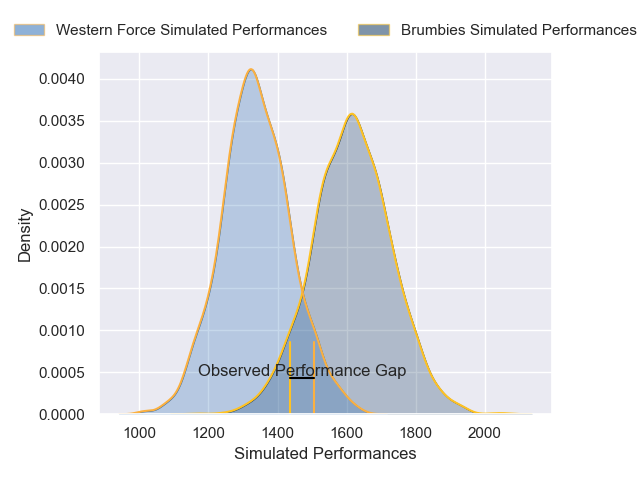
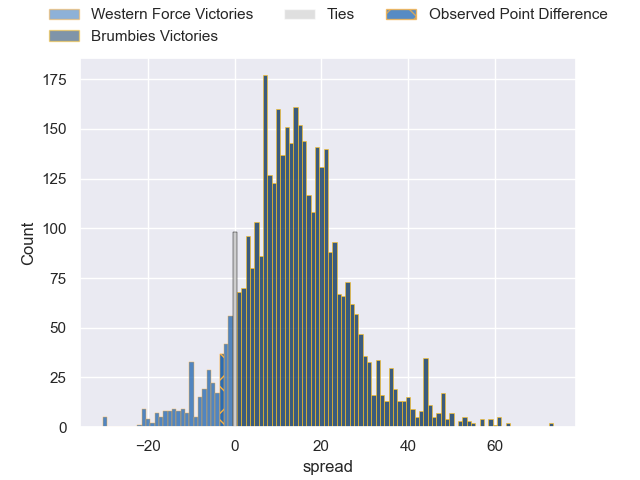
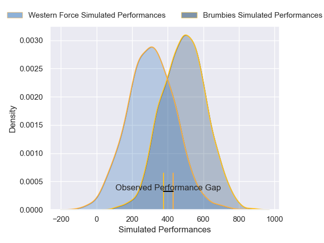
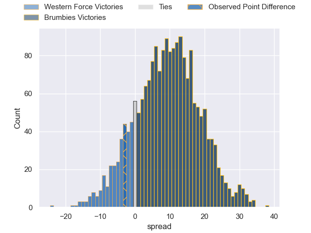

---  
layout: page  
title: Western Force at Brumbies; 45-42  
date: 2025-02-22 18:00:00 -0500  
categories: "Super Rugby Pacific 2025" match review  
---
# Western Force at Brumbies; 45-42

# Club Level Predictions

The first set of predictions treats a club as the smallest object, as the club develops its members, organizes a gameplan, and deploys its players as needed for each match. This club model has a prediction of 0.824, which translates to predicting Brumbies to win by 14.1.

Our Over/Under is 41.5 - and combined with the spread above, we have a predicted scoreline of 14 to 28

Each club has a rating and a rating deviation (similar to a Glicko rating), and expected performances can be generated. This allows for simulated matches and spreads like the ones below.
## Projected Performances - Club Model

## Projected Spreads - Club Model

## Projected Results - Club Model

# Player Level Predictions

Treating teams instead as an entity made up of the currently active players, I have ratings for each player in an altogether different system. These can be combined to form team ratings once teamsheets are announced, weighting starters a bit higher than the reserves. After the match is played, players can be weighted by their minutes on the field, allowing for an accurate measure of the team's composition. With these compiled team ratings, we can make predictions, measure inaccuracy, and update the individual player ratings.
## Prediction without Player Minutes: Brumbies by 13.2

Brumbies by 4.8 on a neutral pitch

## Projected Performances - Player Model

## Projected Spreads - Player Model

## Projected Results - Player Model

|   Away Minutes | Away Player                    |   Away Percentile |   Number |   Home Percentile | Home Player          |   Home Minutes |
|---------------:|:-------------------------------|------------------:|---------:|------------------:|:---------------------|---------------:|
|             50 | Marley Pearce                  |             43.02 |        1 |             91.57 | James Slipper        |             64 |
|             50 | Marley Pearce                  |             43.02 |        1 |             91.57 | James Slipper        |             81 |
|             33 | Nic Dolly                      |             84.11 |        2 |             79.1  | Billy Pollard        |             31 |
|             81 | Tom Robertson                  |             96.87 |        3 |             96.63 | Allan Alaalatoa      |             48 |
|             80 | Jeremy Williams                |             22.59 |        4 |             42.06 | Nick Frost           |             70 |
|             19 | Darcy Swain                    |             65.97 |        5 |             99.43 | Cadeyrn Neville      |             10 |
|             40 | Nicholas Champion de Crespigny |             57.09 |        6 |             33.74 | Tom Hooper           |             76 |
|             69 | Carlo Tizzano                  |              9.36 |        7 |             47.73 | Luke Reimer          |             31 |
|             80 | Reed Prinsep                   |             93.75 |        8 |             56.25 | Charlie Cale         |             17 |
|             50 | Nic White                      |             98.97 |        9 |             92.25 | Ryan Lonergan        |             10 |
|             50 | Ben Donaldson                  |             45.15 |       10 |             33.54 | Declan Meredith      |             60 |
|             31 | Dylan Pietsch                  |             72.52 |       11 |             64.15 | Corey Toole          |             31 |
|             71 | Hamish Stewart                 |             93.98 |       12 |             81.84 | Ollie Sapsford       |             50 |
|             81 | Hamish Stewart                 |             93.98 |       12 |             81.84 | Ollie Sapsford       |             50 |
|             51 | Sio Tomkinson                  |             87.96 |       13 |             72.26 | Len Ikitau           |             81 |
|             10 | Harry Potter                   |             55.06 |       14 |             93.29 | Andy Muirhead        |             76 |
|             81 | Mac Grealy                     |             85.37 |       15 |             69.11 | Tom Wright           |             68 |
|             24 | Brandon Paenga-Amosa           |             83.44 |       16 |             11.54 | Lachlan Lonergan     |             17 |
|             58 | Ryan Coxon                     |             52.49 |       17 |             61.64 | Blake Schoupp        |              5 |
|             80 | Joshua Smith                   |            nan    |       18 |            nan    | Rhys Van Nek         |             81 |
|             22 | Sam Carter                     |             94.99 |       19 |             35.73 | Lachlan Shaw         |             50 |
|             13 | Will Harris                    |             78.26 |       20 |            nan    | Judah Qoro Saumaisue |             50 |
|             74 | Issak Fines-Leleiwasa          |             30.29 |       21 |             26.33 | Harrison Goddard     |             81 |
|             51 | Max Burey                      |              3.59 |       22 |             76.16 | Jack Debreczeni      |             50 |
|             51 | George Poolman                 |             56.07 |       23 |             64.76 | Hudson Creighton     |             11 |

