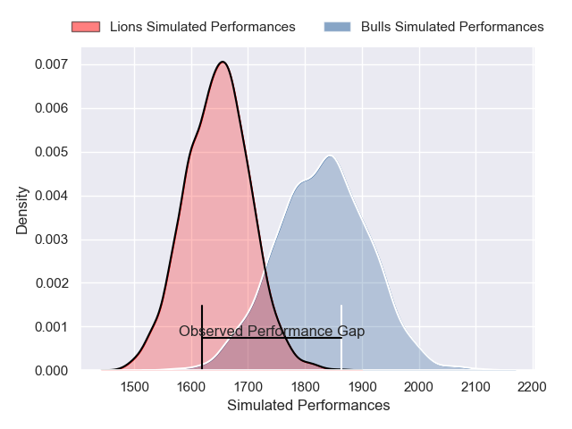
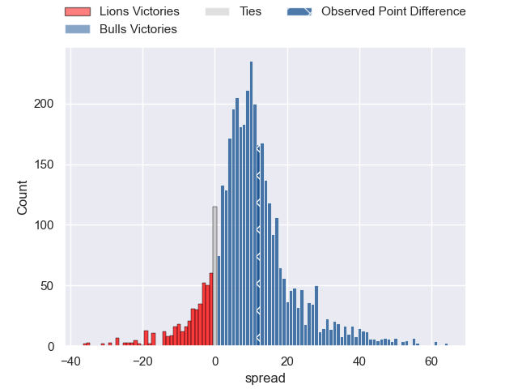
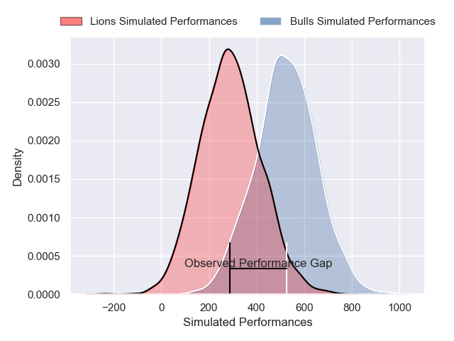
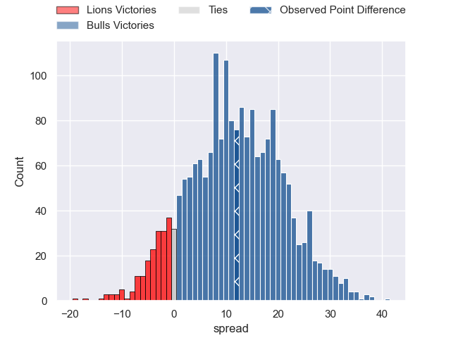

---  
layout: page  
title: Lions at Bulls; 19-31  
date: 2025-02-22 18:00:00 -0500  
categories: "United Rugby Championship 24/25" match review  
---
# Lions at Bulls; 19-31

# Club Level Predictions

The first set of predictions treats a club as the smallest object, as the club develops its members, organizes a gameplan, and deploys its players as needed for each match. This club model has a prediction of 0.738, which translates to predicting Bulls to win by 9.2.

Our Over/Under is 55.5 - and combined with the spread above, we have a predicted scoreline of 23 to 33

Each club has a rating and a rating deviation (similar to a Glicko rating), and expected performances can be generated. This allows for simulated matches and spreads like the ones below.
## Projected Performances - Club Model

## Projected Spreads - Club Model

## Projected Results - Club Model

# Player Level Predictions

Treating teams instead as an entity made up of the currently active players, I have ratings for each player in an altogether different system. These can be combined to form team ratings once teamsheets are announced, weighting starters a bit higher than the reserves. After the match is played, players can be weighted by their minutes on the field, allowing for an accurate measure of the team's composition. With these compiled team ratings, we can make predictions, measure inaccuracy, and update the individual player ratings.
## Prediction without Player Minutes: Bulls by 12.8

Bulls by 4.5 on a neutral pitch

## Projected Performances - Player Model

## Projected Spreads - Player Model

## Projected Results - Player Model

|   Away Minutes | Away Player            |   Away Percentile |   Number |   Home Percentile | Home Player         |   Home Minutes |
|---------------:|:-----------------------|------------------:|---------:|------------------:|:--------------------|---------------:|
|             40 | Juan Schoeman          |             62.04 |        1 |             85.07 | Gerhard Steenekamp  |             18 |
|             81 | PJ Botha               |             84.78 |        2 |             91.14 | Johan Grobbelaar    |             64 |
|             81 | Asenathi Ntlabakanye   |             72.63 |        3 |             98.88 | Wilco Louw          |             10 |
|             81 | Etienne Oosthuizen     |             90.83 |        4 |             95.37 | Cobus Wiese         |             20 |
|             19 | Darrien-Lane Landsberg |             72.4  |        5 |              6.43 | JF van Heerden      |             81 |
|             81 | Darrien-Lane Landsberg |             72.4  |        5 |              6.43 | JF van Heerden      |             81 |
|             36 | Jarod Cairns           |             24.48 |        6 |             89.79 | Marco van Staden    |             81 |
|             34 | Ruan Venter            |             91.21 |        7 |             57.37 | Reinhardt Ludwig    |             64 |
|             28 | Francke Horn           |             98.63 |        8 |             11.72 | Mpilo Gumede        |             71 |
|             20 | Morne van den Berg     |             89.67 |        9 |             91.74 | Embrose Papier      |             81 |
|             10 | Gianni Lombard         |             88.4  |       10 |             95.15 | Willie le Roux      |             34 |
|             18 | Edwill van der Merwe   |             94.58 |       11 |             99.63 | Canan Moodie        |             15 |
|             18 | Marius Louw            |             94.87 |       12 |             75.81 | David Kriel         |             20 |
|             40 | Henco van Wyk          |             72.56 |       13 |             88.35 | Stedman Gans        |             41 |
|             61 | Richard Kriel          |             54.69 |       14 |             92.65 | Sebastian de Klerk  |             81 |
|             63 | Quan Horn              |             96.54 |       15 |             89.63 | Devon Williams      |             81 |
|             28 | Jaco Visagie           |             91.47 |       16 |             27.69 | Jan-Hendrik Wessels |             62 |
|             17 | Morgan Naude           |             68.22 |       17 |             44.7  | Alulutho Tshakweni  |             47 |
|             67 | Conraad van Vuuren     |             63.96 |       18 |             16.05 | Francois Klopper    |             71 |
|             53 | Ruan Delport           |             58.03 |       19 |              1.42 | Ruan Vermaak        |             81 |
|             67 | Sibabalo Qoma          |            nan    |       20 |             97.46 | Nizaam Carr         |             81 |
|             63 | Renzo Du Plessis       |            nan    |       21 |             93.8  | Zak Burger          |             63 |
|             81 | Nico Steyn             |             71.43 |       22 |             11.6  | Keagan Johannes     |             66 |
|             13 | Manuel Rass            |             18.16 |       23 |             96.05 | Sergeal Petersen    |             81 |
|             47 | Manuel Rass            |             18.16 |       23 |             96.05 | Sergeal Petersen    |             81 |

