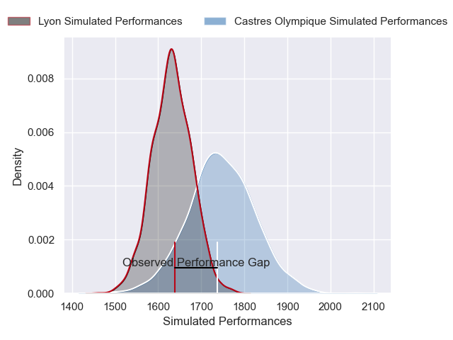
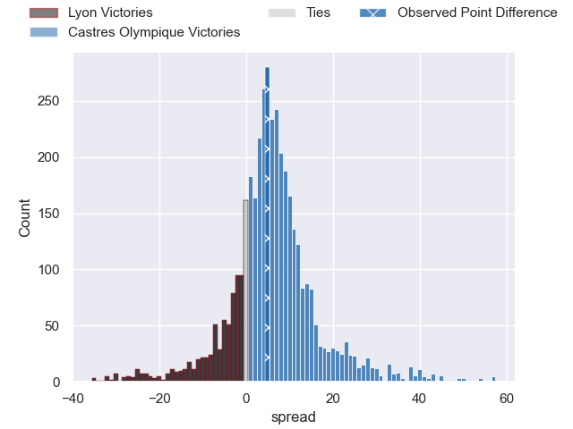
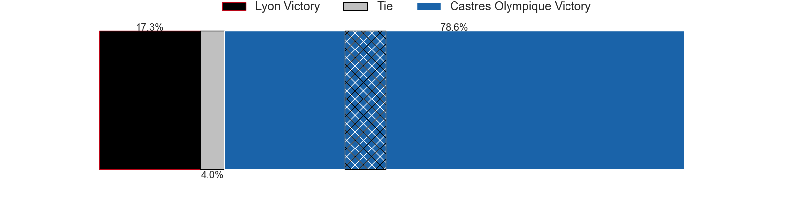
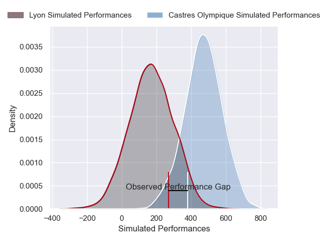
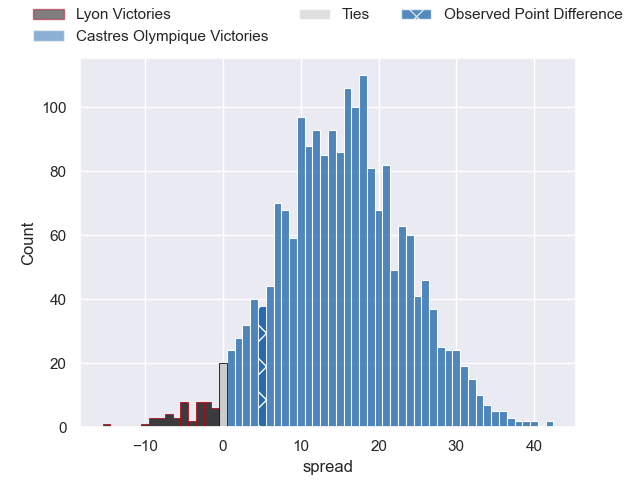
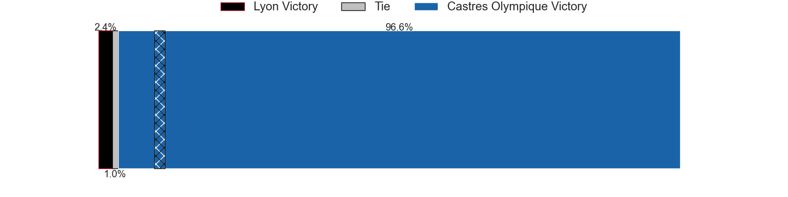

---  
layout: page  
title: Lyon at Castres Olympique; 25-30  
date: 2025-02-22 18:00:00 -0500  
categories: "Top 14 Orange 24/25" match review  
---
# Lyon at Castres Olympique; 25-30

# Club Level Predictions

The first set of predictions treats a club as the smallest object, as the club develops its members, organizes a gameplan, and deploys its players as needed for each match. This club model has a prediction of 0.657, which translates to predicting Castres Olympique to win by 5.7.

Our Over/Under is 49.5 - and combined with the spread above, we have a predicted scoreline of 22 to 27

Each club has a rating and a rating deviation (similar to a Glicko rating), and expected performances can be generated. This allows for simulated matches and spreads like the ones below.
## Projected Performances - Club Model

## Projected Spreads - Club Model

## Projected Results - Club Model

# Player Level Predictions

Treating teams instead as an entity made up of the currently active players, I have ratings for each player in an altogether different system. These can be combined to form team ratings once teamsheets are announced, weighting starters a bit higher than the reserves. After the match is played, players can be weighted by their minutes on the field, allowing for an accurate measure of the team's composition. With these compiled team ratings, we can make predictions, measure inaccuracy, and update the individual player ratings.
## Prediction without Player Minutes: Castres Olympique by 20.9

Castres Olympique by 6.6 on a neutral pitch

## Projected Performances - Player Model

## Projected Spreads - Player Model

## Projected Results - Player Model

|   Away Minutes | Away Player          |   Away Percentile |   Number |   Home Percentile | Home Player          |   Home Minutes |
|---------------:|:---------------------|------------------:|---------:|------------------:|:---------------------|---------------:|
|             28 | Sebastien Taofifenua |             12.35 |        1 |             68.6  | Quentin Walcker      |             24 |
|             36 | Guillaume Marchand   |             51.79 |        2 |             77    | Pierre Colonna       |             29 |
|              0 | Irakli Aptsiauri     |             81.93 |        3 |             33.2  | Nicolas Corato       |             81 |
|             31 | Felix Lambey         |             77.47 |        4 |             29.69 | Guillaume Ducat      |             41 |
|             81 | Alban Roussel        |             86.99 |        5 |             96.61 | Leone Nakarawa       |             17 |
|             17 | Theo William         |             24.23 |        6 |             41.31 | Mathieu Babillot     |             45 |
|             80 | Beka Saginadze       |             57.93 |        7 |              2.54 | Gauthier Maravat     |             68 |
|             36 | Maxime Gouzou        |             58.01 |        8 |             75.05 | Tyler Ardron         |             81 |
|             81 | Baptiste Couilloud   |             94.32 |        9 |             87.26 | Jeremy Fernandez     |             40 |
|             81 | Martin Meliande      |              5.25 |       10 |             69.96 | Julien Dumora        |             14 |
|             34 | Alfred Parisien      |             73.65 |       11 |             95.32 | Remy Baget           |              0 |
|             53 | Theo Millet          |             77.56 |       12 |             96.24 | Jack Goodhue         |             19 |
|             13 | Thibaut Regard       |             45.48 |       13 |             82.34 | Vilimoni Botitu      |             24 |
|             80 | Davit Niniashvili    |             95.59 |       14 |             98.35 | Geoffrey Palis       |             40 |
|             63 | Davit Niniashvili    |             95.59 |       14 |             98.35 | Geoffrey Palis       |             40 |
|             28 | Alexandre Tchaptchet |             65.5  |       15 |             69.61 | Theo Chabouni        |             81 |
|             80 | Yanis Charcosset     |             24.87 |       16 |             34.07 | Loris Zarantonello   |             81 |
|             80 | Hamza Kaabeche       |             19.71 |       17 |             85.45 | Antoine Tichit       |             81 |
|              5 | Arno Botha           |             89.66 |       18 |             85.77 | Florent Vanverberghe |             53 |
|             53 | Steeve Blanc-Mappaz  |              9.3  |       19 |             15.62 | Abraham Papali'i     |             64 |
|             80 | Josiah Maraku        |             10.25 |       20 |             54.97 | Feibyan Tukino       |             64 |
|             17 | Semi Radradra        |             99.29 |       21 |             85.89 | Santiago Arata       |             28 |
|              5 | Beka Shvangiradze    |             26.57 |       22 |             83.96 | Adrea Cocagi         |             67 |
|             27 | Cedate Gomes Sa      |             76.7  |       23 |             61.65 | Aurelien Azar        |             47 |

