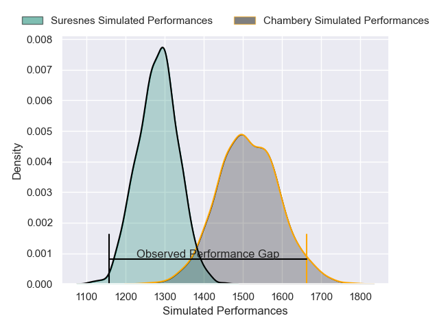
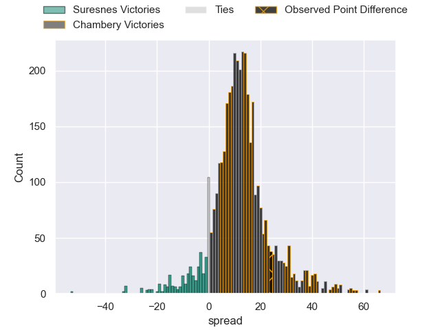
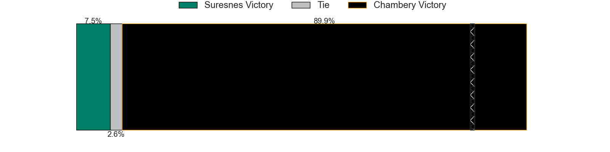
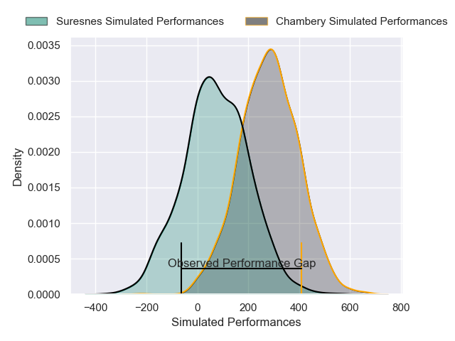
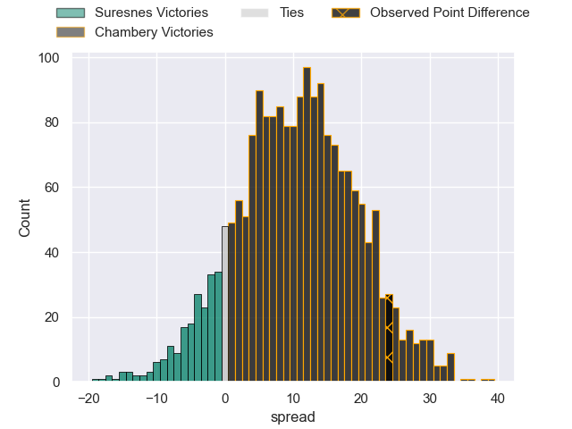
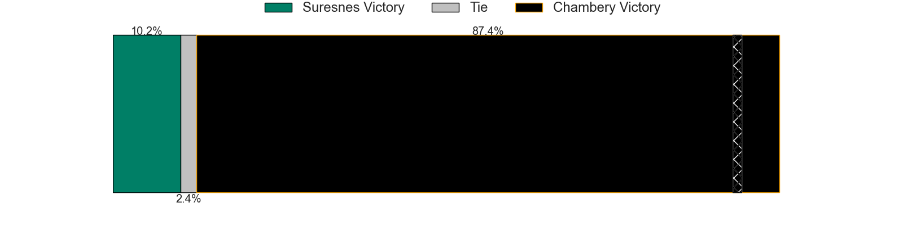

---  
layout: page  
title: Suresnes at Chambery; 10-34  
date: 2025-02-22 18:00:00 -0500  
categories: "Nationale 24/25" match review  
---
# Suresnes at Chambery; 10-34

# Club Level Predictions

The first set of predictions treats a club as the smallest object, as the club develops its members, organizes a gameplan, and deploys its players as needed for each match. This club model has a prediction of 0.791, which translates to predicting Chambery to win by 11.7.

Our Over/Under is 44.5 - and combined with the spread above, we have a predicted scoreline of 17 to 28

Each club has a rating and a rating deviation (similar to a Glicko rating), and expected performances can be generated. This allows for simulated matches and spreads like the ones below.
## Projected Performances - Club Model

## Projected Spreads - Club Model

## Projected Results - Club Model

# Player Level Predictions

Treating teams instead as an entity made up of the currently active players, I have ratings for each player in an altogether different system. These can be combined to form team ratings once teamsheets are announced, weighting starters a bit higher than the reserves. After the match is played, players can be weighted by their minutes on the field, allowing for an accurate measure of the team's composition. With these compiled team ratings, we can make predictions, measure inaccuracy, and update the individual player ratings.
## Prediction without Player Minutes: Chambery by 11.9

Chambery by 8.4 on a neutral pitch

## Projected Performances - Player Model

## Projected Spreads - Player Model

## Projected Results - Player Model

|   Away Minutes | Away Player             |   Away Percentile |   Number |   Home Percentile | Home Player              |   Home Minutes |
|---------------:|:------------------------|------------------:|---------:|------------------:|:-------------------------|---------------:|
|             11 | Yanis Trabelsi          |             23.39 |        1 |             88.06 | Nugzar Somkhishvili      |             17 |
|             32 | Gauthier Brute de Remur |             76.83 |        2 |             58.77 | Quentin Beaudaux         |             17 |
|             75 | Guiterembi Vickos       |             23.06 |        3 |             85.69 | Lasha Tabidze            |             58 |
|             29 | Damien Bozic            |             62.96 |        4 |             73.23 | Ahmed Tidiane Kane       |             22 |
|             16 | Sacha Yahi              |             24.13 |        5 |             74.55 | Taniela Matakaiongo      |             80 |
|             80 | Florian Desbordes       |             10.61 |        6 |             87.23 | Matheo Triki             |             80 |
|             26 | Wian Vosloo             |             74.27 |        7 |             77.37 | Colin Lebian             |             80 |
|             60 | Brandon Dayoro          |             33.67 |        8 |             77.08 | Tui Uru                  |             80 |
|             15 | Thomas Lacroix          |              9.64 |        9 |              2.75 | Sonatane Takulua         |             54 |
|             67 | Jean Chezeau            |             68.28 |       10 |             47.27 | Arwel Robson             |             48 |
|             63 | Alexis Clement          |             11.11 |       11 |             91.09 | Arthur Nennig            |             48 |
|             19 | Victor Barnier          |             78.07 |       12 |             73.81 | Bastien Reymond          |             71 |
|             80 | Gauthier Wolf           |             34.82 |       13 |             39.29 | Maewen Sao               |             38 |
|             80 | Petero Tuwai            |             67.4  |       14 |             70.43 | Va'aufauese Apelu Maliko |             38 |
|             12 | Goulwen Gueho           |              3.08 |       15 |             56.47 | Enzo Marzocca            |             80 |
|             46 | Nikita Bekov            |             84.45 |       16 |             62.3  | Fabien Witz              |             80 |
|             80 | Elias Coulibaly         |             68.19 |       17 |            nan    | Julien Pierdomenico      |             81 |
|             80 | Nail Audoire            |             25.18 |       18 |             53.8  | Pierre-Nicolas Dance     |             29 |
|             61 | Jean-Étienne Lesueur    |             16.87 |       19 |             66.27 | Aubin Eymeri             |             52 |
|             80 | JJ Taulagi              |              1.12 |       20 |             59.29 | Joseph Exshaw            |             32 |
|             80 | Tanguy Lacoste          |             55.46 |       21 |             40.56 | Gela Murusidze           |             55 |
|             80 | Leo Vallee              |             46.94 |       22 |            nan    | Baptiste Collet          |             32 |
|             80 | Germain de Borda        |             42    |       23 |            nan    | nan                      |            nan |

