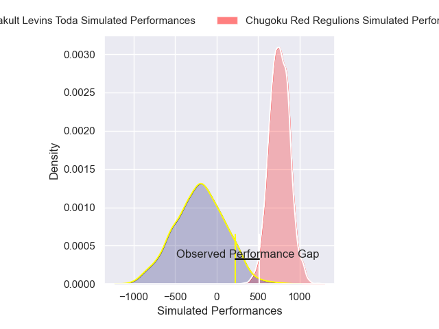
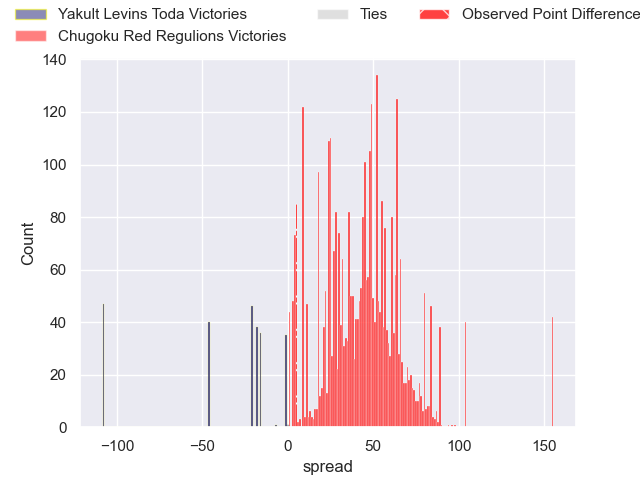
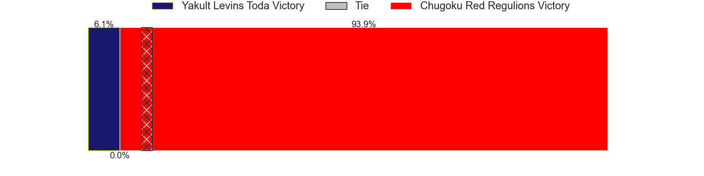
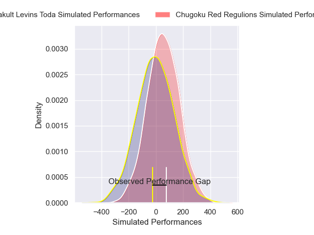
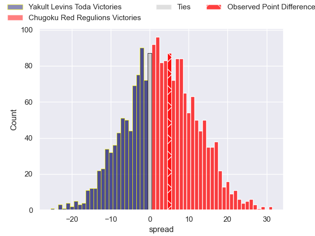
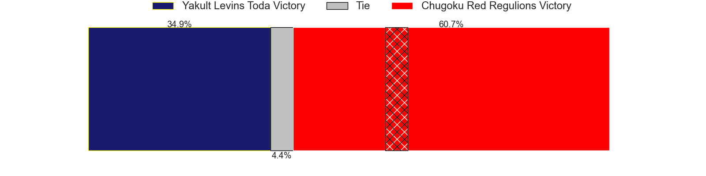

---  
layout: page  
title: Yakult Levins Toda at Chugoku Red Regulions; 18-23  
date: 2025-02-22 18:00:00 -0500  
categories: "Japan Rugby League One D3 24/25" match review  
---
# Yakult Levins Toda at Chugoku Red Regulions; 18-23

# Club Level Predictions

The first set of predictions treats a club as the smallest object, as the club develops its members, organizes a gameplan, and deploys its players as needed for each match. This club model has a prediction of 0.98, which translates to predicting Chugoku Red Regulions to win by 48.0.

Our Over/Under is 63.5 - and combined with the spread above, we have a predicted scoreline of 8 to 56

Each club has a rating and a rating deviation (similar to a Glicko rating), and expected performances can be generated. This allows for simulated matches and spreads like the ones below.
## Projected Performances - Club Model

## Projected Spreads - Club Model

## Projected Results - Club Model

# Player Level Predictions

Treating teams instead as an entity made up of the currently active players, I have ratings for each player in an altogether different system. These can be combined to form team ratings once teamsheets are announced, weighting starters a bit higher than the reserves. After the match is played, players can be weighted by their minutes on the field, allowing for an accurate measure of the team's composition. With these compiled team ratings, we can make predictions, measure inaccuracy, and update the individual player ratings.
## Prediction without Player Minutes: Chugoku Red Regulions by 0.8

Yakult Levins Toda by 2.0 on a neutral pitch

## Projected Performances - Player Model

## Projected Spreads - Player Model

## Projected Results - Player Model

|   Away Minutes | Away Player          |   Away Percentile |   Number |   Home Percentile | Home Player          |   Home Minutes |
|---------------:|:---------------------|------------------:|---------:|------------------:|:---------------------|---------------:|
|              9 | Iori Nozaki          |             12.76 |        1 |             16.19 | Kojiro Arito         |             80 |
|              9 | Shunsuke Tani        |             36.12 |        2 |             27.6  | Kentaro Iwanaga      |             80 |
|              9 | Atsushi Furuya       |             35.16 |        3 |             41.86 | Haruki Miyata        |             80 |
|             69 | Daisuke Yokoyama     |             12.16 |        4 |              0.47 | Taro Nishikawa       |              5 |
|             80 | James Tucker         |             91.42 |        5 |             53.44 | Kota Moriyama        |              7 |
|             80 | Masaya Makino        |             36.43 |        6 |              9.86 | Shintaro Matsuda     |             16 |
|             67 | Kosuke Urabe         |             32.49 |        7 |             77.46 | Hayato Moriyama      |             57 |
|             11 | Jaycob Matiu         |              4.67 |        8 |              1.22 | Ed Quirk             |             75 |
|             73 | Ippei Oshima         |             10.15 |        9 |             36.49 | Atsushi Mizofuchi    |              5 |
|             11 | Nick Evemy           |             12.82 |       10 |             80.25 | Hayato Miyazaki      |             69 |
|             80 | Shun Sawamura        |             14.69 |       11 |             48.85 | Kennta Kitayama      |             75 |
|             80 | Antonio Mikaele-Tu'u |              4.06 |       12 |             21.02 | Hashizo Yoshida      |             69 |
|             80 | Atomu Shirai         |             16.65 |       13 |             38.07 | Syougo Azuma         |             75 |
|             40 | Kagechika Ota        |             22.59 |       14 |             21.49 | Kentaro Fujii        |             80 |
|             69 | Masatoshi Doi        |             14.17 |       15 |             24.44 | Sebastian Sialau     |              5 |
|             80 | Rikiya Oishi         |            nan    |       16 |            nan    | Ishiwatari Kengo     |             80 |
|             80 | Junpei Tada          |             13.43 |       17 |            nan    | Riku Iwai            |             80 |
|             63 | Takumi Hurukawa      |             30.86 |       18 |             20.51 | Shinya Hirayama      |             40 |
|             69 | Daichi Kono          |            nan    |       19 |             77.34 | Yuta Nishihama       |             80 |
|             71 | Genki Tokushige      |            nan    |       20 |              4.3  | Shohei Tsukamoto     |             53 |
|             80 | Yuto Usuda           |             22.16 |       21 |            nan    | Taiki Washiya        |             13 |
|              9 | Hikaru Ishikawa      |            nan    |       22 |             18.64 | Hirofumi Higashikawa |             13 |
|             80 | Kosetu Kawachi       |             34.75 |       23 |            nan    | Toshiyuki Ohki       |             13 |

