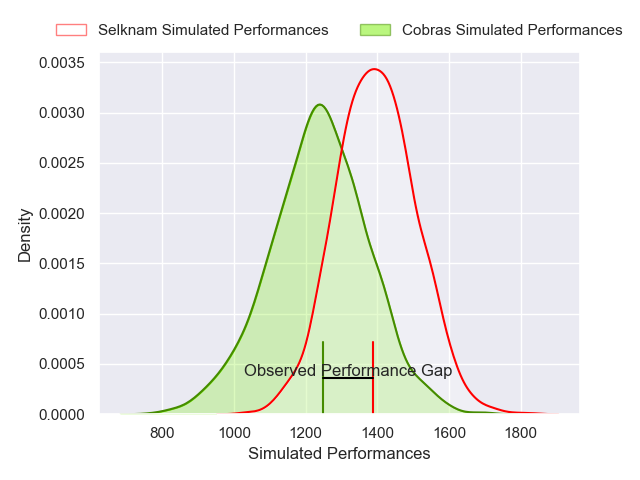
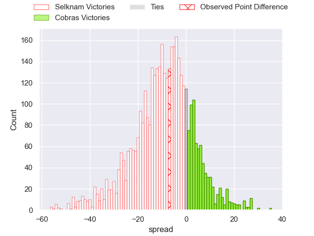
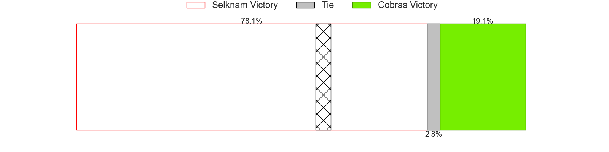
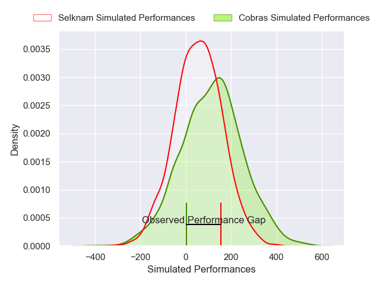
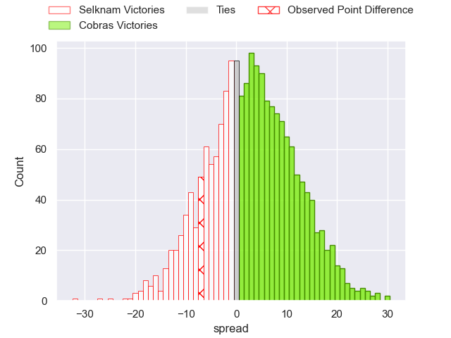
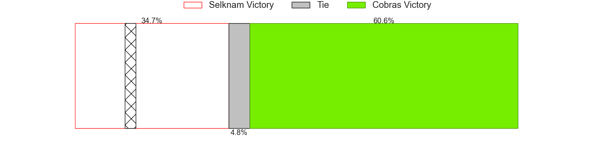

---  
layout: page  
title: Selknam at Cobras; 28-21  
date: 2025-02-22 18:00:00 -0500  
categories: "Super Rugby Americas 2025" match review  
---
# Selknam at Cobras; 28-21

# Club Level Predictions

The first set of predictions treats a club as the smallest object, as the club develops its members, organizes a gameplan, and deploys its players as needed for each match. This club model has a prediction of 0.294, which translates to predicting Selknam to win by 8.1.

Our Over/Under is 52.5 - and combined with the spread above, we have a predicted scoreline of 30 to 22

Each club has a rating and a rating deviation (similar to a Glicko rating), and expected performances can be generated. This allows for simulated matches and spreads like the ones below.
## Projected Performances - Club Model

## Projected Spreads - Club Model

## Projected Results - Club Model

# Player Level Predictions

Treating teams instead as an entity made up of the currently active players, I have ratings for each player in an altogether different system. These can be combined to form team ratings once teamsheets are announced, weighting starters a bit higher than the reserves. After the match is played, players can be weighted by their minutes on the field, allowing for an accurate measure of the team's composition. With these compiled team ratings, we can make predictions, measure inaccuracy, and update the individual player ratings.
## Prediction without Player Minutes: Cobras by 0.6

Selknam by 1.9 on a neutral pitch

## Projected Performances - Player Model

## Projected Spreads - Player Model

## Projected Results - Player Model

|   Away Minutes | Away Player             |   Away Percentile |   Number |   Home Percentile | Home Player               |   Home Minutes |
|---------------:|:------------------------|------------------:|---------:|------------------:|:--------------------------|---------------:|
|             80 | Javier Carrasco         |             80.62 |        1 |             22    | Aquiles Schulter          |             80 |
|             80 | Raimundo Martinez Amar  |             31.69 |        2 |             10.56 | Henrique Ribeiro Ferreira |             80 |
|             62 | Inaki Gurruchaga Suarez |             49.06 |        3 |             41.78 | Javier Angel Coronel      |             80 |
|             28 | Santiago Pedrero Poduje |             75.59 |        4 |              4.71 | Cleber Dias               |             80 |
|              7 | Agustin Toth            |              0.38 |        5 |             35.25 | Helder Brian Souza Lucio  |             60 |
|              7 | Martin Sigren           |             35.77 |        6 |             50.14 | Manuel Todaro             |             80 |
|             12 | Alfonso Escobar Alvarez |             89.86 |        7 |             56.71 | Adrio Melo                |             62 |
|             18 | Joaquin Milesi          |             66.33 |        8 |              5.07 | Andre Arruda              |             68 |
|             51 | Benjamin Videla         |             56.97 |        9 |             21.34 | Rodrigo Santos            |             80 |
|             60 | Juan Cruz Reyes         |             52.73 |       10 |             23.74 | Augusto Guillamondegui    |             80 |
|             51 | Felipe Mendez           |             56.66 |       11 |              6.34 | Robert Tenorio            |             80 |
|             10 | Nicolas Saab            |             61.52 |       12 |             31.37 | Lorenzo Temer Massari     |             29 |
|             52 | Domingo Saavedra        |             23.65 |       13 |             30.76 | Fernando Dario Luna       |             80 |
|             46 | Frederico Kennedy       |             55.92 |       14 |              3.95 | Daniel Lima               |             80 |
|             29 | Tomas Salas Walther     |             56.67 |       15 |             60.16 | Joao Amaral               |             50 |
|             29 | Nahuel Debiassi         |            nan    |       16 |             21.77 | Gabriel Oliveira          |             54 |
|             80 | Bruno Saez              |            nan    |       17 |              6.78 | Lucas Tranquez            |             12 |
|             20 | Jorge Delgado           |            nan    |       18 |             21.59 | Brendon Alves             |             80 |
|             60 | Andres Kuzmanic         |            nan    |       19 |             11.24 | Endy Willian              |             18 |
|             47 | Norman Aguayo           |            nan    |       20 |             62.13 | Felipe Goncalves Cunha    |             30 |
|             80 | Marcelo Torrealba       |            nan    |       21 |            nan    | Vicente Galvao            |             51 |
|            nan | nan                     |            nan    |       22 |            nan    | Rodolfo Martins           |             80 |
|            nan | nan                     |            nan    |       23 |             25.35 | Ben Donald                |             80 |

