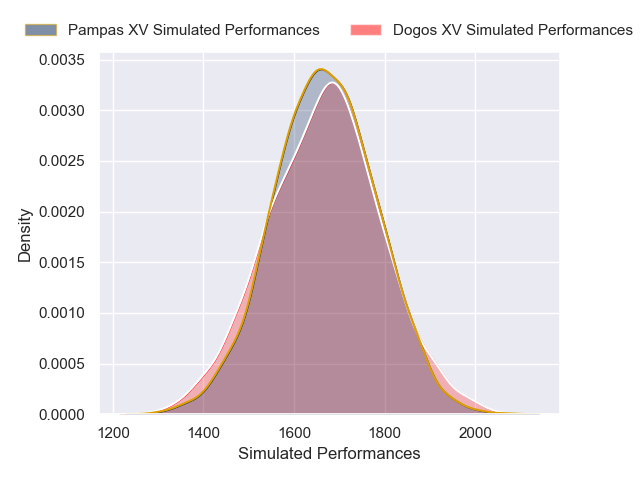
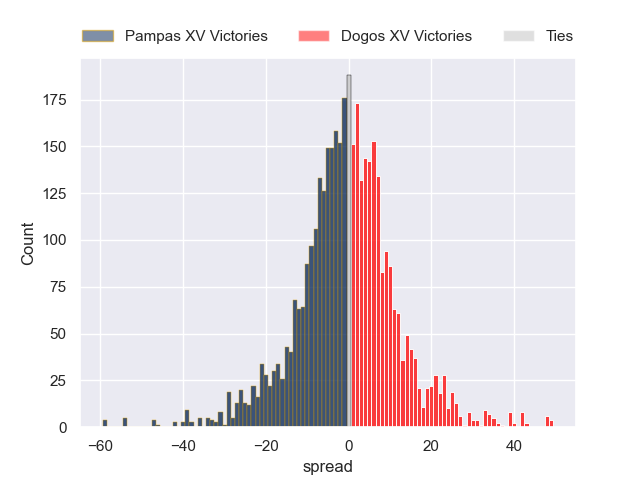
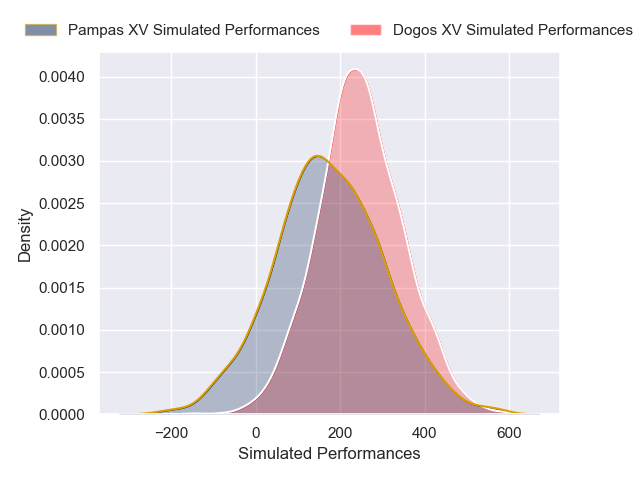
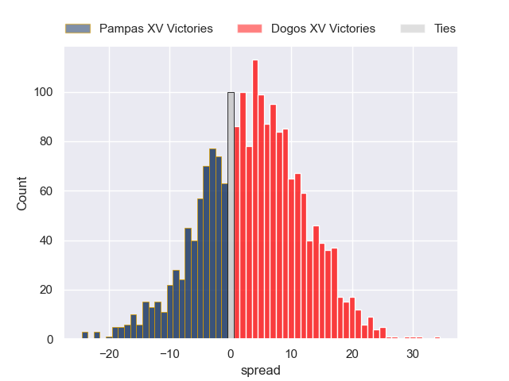

---  
layout: page  
title: Pampas XV at Dogos XV; 20-20  
date: 2025-02-22 18:00:00 -0500  
categories: "Super Rugby Americas 2025" match review  
---
# Pampas XV at Dogos XV; 20-20

# Club Level Predictions

The first set of predictions treats a club as the smallest object, as the club develops its members, organizes a gameplan, and deploys its players as needed for each match. This club model has a prediction of 0.486, which translates to predicting Pampas XV to win by 0.5.

Our Over/Under is 52.5 - and combined with the spread above, we have a predicted scoreline of 27 to 26

Each club has a rating and a rating deviation (similar to a Glicko rating), and expected performances can be generated. This allows for simulated matches and spreads like the ones below.
## Projected Performances - Club Model

## Projected Spreads - Club Model

## Projected Results - Club Model

# Player Level Predictions

Treating teams instead as an entity made up of the currently active players, I have ratings for each player in an altogether different system. These can be combined to form team ratings once teamsheets are announced, weighting starters a bit higher than the reserves. After the match is played, players can be weighted by their minutes on the field, allowing for an accurate measure of the team's composition. With these compiled team ratings, we can make predictions, measure inaccuracy, and update the individual player ratings.
## Prediction without Player Minutes: Dogos XV by 8.5

Dogos XV by 6.2 on a neutral pitch

## Projected Performances - Player Model

## Projected Spreads - Player Model

## Projected Results - Player Model

|   Away Minutes | Away Player               |   Away Percentile |   Number |   Home Percentile | Home Player               |   Home Minutes |
|---------------:|:--------------------------|------------------:|---------:|------------------:|:--------------------------|---------------:|
|             63 | Matias Medrano            |             84.67 |        1 |             87.08 | Boris Wenger              |             20 |
|             55 | Ramiro Gurovich           |             36.29 |        2 |             75.08 | Leonel Oviedo             |             22 |
|             28 | Tomas Rapetti             |             77.29 |        3 |             67.34 | Pedro Delgado             |             25 |
|             26 | Franco Carrera            |             71.27 |        4 |             81.29 | Lautaro Simes             |             80 |
|             46 | Federico Ignacio Lavanini |             15.97 |        5 |             46.69 | Federico Albrisi          |             30 |
|             80 | Manuel Bernstein          |             69.57 |        6 |             60.87 | Aitor Bildosola           |             34 |
|             80 | Nicolas Damorim           |             76.75 |        7 |             74.95 | Valentin Cabral           |             12 |
|             30 | Joaquin Moro              |             60.16 |        8 |             36.13 | Gennaro Fissore           |             80 |
|             80 | Eliseo Morales Abraham    |             24.44 |        9 |             84.51 | Agustin Moyano            |             60 |
|             40 | Estanislao Renthel        |             12.03 |       10 |             77.43 | Julian Ignacio Hernandez  |             10 |
|             80 | Alfonso Latorre           |             70.4  |       11 |             39.43 | Bautista Lescano          |             60 |
|             63 | Justo Piccardo            |             91.51 |       12 |             88.15 | Faustino Sánchez Valarolo |             50 |
|             80 | Juan Pablo Castro Collado |             87.07 |       13 |             85.49 | Agustin Segura            |             34 |
|             80 | Ramon Fuentes             |             81.89 |       14 |             74.54 | Ernesto Giudice           |             80 |
|             40 | Francisco Quinn           |             15.04 |       15 |             73.78 | Mateo Soler               |             80 |
|             40 | Bruno Heit                |             53.11 |       16 |             68.9  | Felipe Mallia             |             20 |
|             66 | Ignacio Inchauspe         |             57.83 |       17 |            nan    | Juan Baronio              |             20 |
|             80 | Javier Corvalan           |             12.6  |       18 |             86.92 | Octavio Filippa           |             25 |
|             67 | Juan Cruz Perez Rachel    |             15.41 |       19 |             68.71 | Lorenzo Colidio           |             46 |
|             40 | Emir Gael Galvan          |             60.27 |       20 |            nan    | Ignacio Jose Gandini      |             51 |
|             80 | Jeronimo Solveyra         |            nan    |       21 |            nan    | Gaston Revol              |             29 |
|             47 | Ignacio Bottazzini        |             55.69 |       22 |            nan    | Juan Lovell               |             80 |
|             33 | Leo Mazzini               |            nan    |       23 |            nan    | nan                       |            nan |

