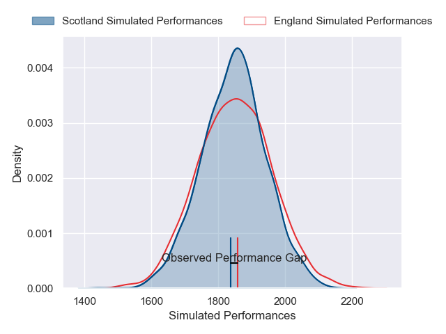
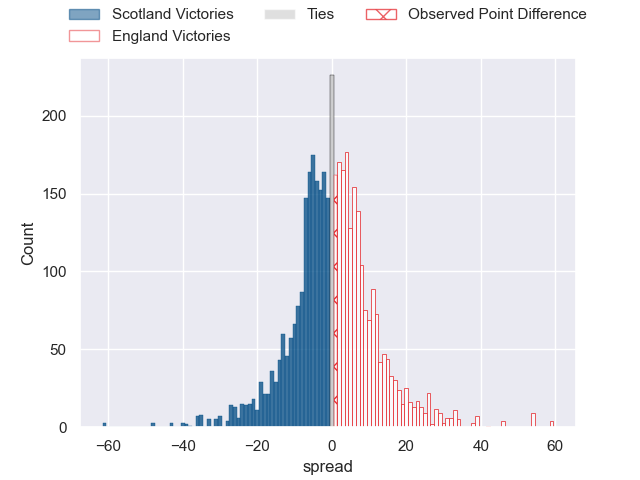
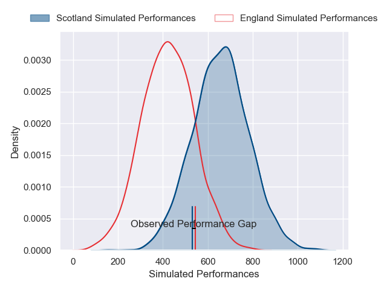
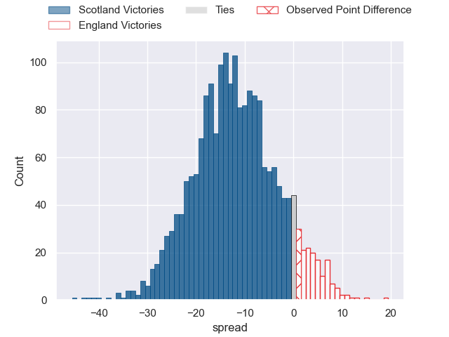

---  
layout: page  
title: Scotland at England; 15-16  
date: 2025-02-22 18:00:00 -0500  
categories: "Six Nations Championship 2025" match review  
---
# Scotland at England; 15-16

# Club Level Predictions

The first set of predictions treats a club as the smallest object, as the club develops its members, organizes a gameplan, and deploys its players as needed for each match. This club model has a prediction of 0.503, which translates to predicting England to win by 0.1.

Our Over/Under is 30.5 - and combined with the spread above, we have a predicted scoreline of 15 to 15

Each club has a rating and a rating deviation (similar to a Glicko rating), and expected performances can be generated. This allows for simulated matches and spreads like the ones below.
## Projected Performances - Club Model

## Projected Spreads - Club Model

## Projected Results - Club Model

# Player Level Predictions

Treating teams instead as an entity made up of the currently active players, I have ratings for each player in an altogether different system. These can be combined to form team ratings once teamsheets are announced, weighting starters a bit higher than the reserves. After the match is played, players can be weighted by their minutes on the field, allowing for an accurate measure of the team's composition. With these compiled team ratings, we can make predictions, measure inaccuracy, and update the individual player ratings.
## Prediction without Player Minutes: Scotland by 9.0

Scotland by 15.0 on a neutral pitch

## Projected Performances - Player Model

## Projected Spreads - Player Model

## Projected Results - Player Model

|   Away Minutes | Away Player         |   Away Percentile |   Number |   Home Percentile | Home Player               |   Home Minutes |
|---------------:|:--------------------|------------------:|---------:|------------------:|:--------------------------|---------------:|
|             80 | Pierre Schoeman     |             74.24 |        1 |             89.86 | Ellis Genge               |             80 |
|             22 | Dave Cherry         |             75.47 |        2 |              0.17 | Luke Cowan-Dickie         |             25 |
|             80 | Zander Fagerson     |             99.75 |        3 |             82.42 | Will Stuart               |             77 |
|             62 | Jonny Gray          |             91.8  |        4 |             99.34 | Maro Itoje                |             18 |
|             25 | Grant Gilchrist     |             96.32 |        5 |             78.51 | Ollie Chessum             |              9 |
|             32 | Jamie Ritchie       |             99.81 |        6 |             90.52 | Tom Curry                 |             71 |
|             34 | Rory Darge          |             91.74 |        7 |             99.91 | Ben Earl                  |             35 |
|             80 | Jack Dempsey        |             62.27 |        8 |             91.89 | Tom Willis                |             80 |
|             32 | Ben White           |             95.18 |        9 |             97.76 | Alex Mitchell             |             47 |
|             80 | Finn Russell        |             99.37 |       10 |             82.35 | Fin Smith                 |             80 |
|             80 | Duhan van der Merwe |             85.67 |       11 |              1.56 | Ollie Sleightholme        |             37 |
|             33 | Tom Jordan          |             43.65 |       12 |             98.38 | Henry Slade               |             35 |
|              3 | Huw Jones           |             81.32 |       13 |             80.3  | Ollie Lawrence            |             71 |
|             55 | Kyle Rowe           |             79.71 |       14 |             92.47 | Tommy Freeman             |             33 |
|             80 | Blair Kinghorn      |             99.59 |       15 |             83.78 | Marcus Smith              |             71 |
|             20 | Ewan Ashman         |             66.95 |       16 |             99.83 | Jamie George              |             65 |
|             21 | Jamie Bhatti        |             97.06 |       17 |              2.78 | Fin Baxter                |             80 |
|             38 | Will Hurd           |             49.55 |       18 |             92.31 | Joe Heyes                 |              0 |
|             80 | Sam Skinner         |             92.93 |       19 |             86.95 | Ted Hill                  |             80 |
|             55 | Gregor Brown        |             71.44 |       20 |             68.54 | Chandler Cunningham-South |             80 |
|             62 | Matt Fagerson       |             96.96 |       21 |             67.61 | Ben Curry                 |             15 |
|             65 | Jamie Dobie         |             84.51 |       22 |             95.35 | Harry Randall             |             22 |
|             80 | Stafford McDowall   |             90.86 |       23 |             92.81 | Elliot Daly               |              9 |

