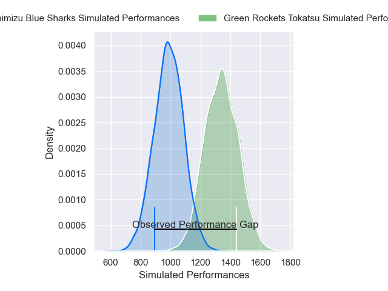
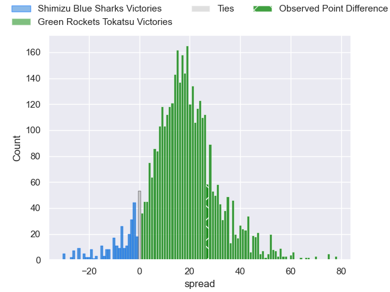
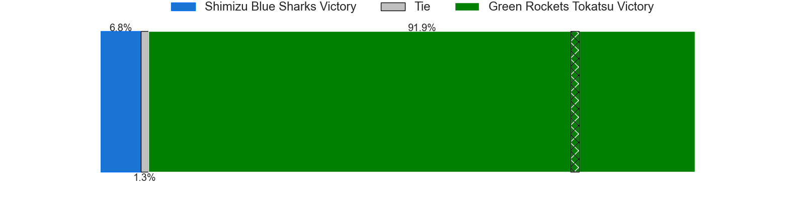
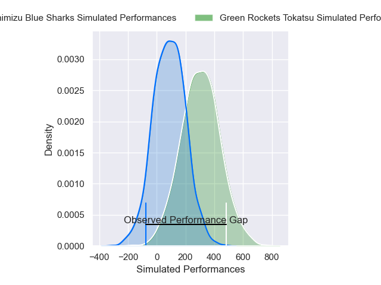
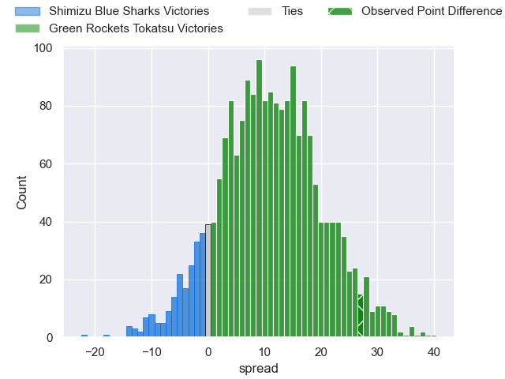
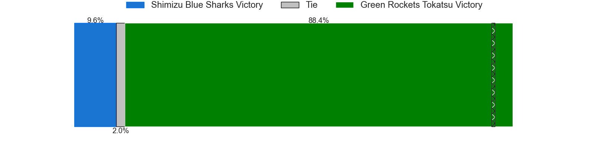

---  
layout: page  
title: Shimizu Blue Sharks at Green Rockets Tokatsu; 23-50  
date: 2025-02-22 18:00:00 -0500  
categories: "Japan Rugby League One D2 24/25" match review  
---
# Shimizu Blue Sharks at Green Rockets Tokatsu; 23-50

# Club Level Predictions

The first set of predictions treats a club as the smallest object, as the club develops its members, organizes a gameplan, and deploys its players as needed for each match. This club model has a prediction of 0.875, which translates to predicting Green Rockets Tokatsu to win by 17.7.

Our Over/Under is 66.5 - and combined with the spread above, we have a predicted scoreline of 24 to 42

Each club has a rating and a rating deviation (similar to a Glicko rating), and expected performances can be generated. This allows for simulated matches and spreads like the ones below.
## Projected Performances - Club Model

## Projected Spreads - Club Model

## Projected Results - Club Model

# Player Level Predictions

Treating teams instead as an entity made up of the currently active players, I have ratings for each player in an altogether different system. These can be combined to form team ratings once teamsheets are announced, weighting starters a bit higher than the reserves. After the match is played, players can be weighted by their minutes on the field, allowing for an accurate measure of the team's composition. With these compiled team ratings, we can make predictions, measure inaccuracy, and update the individual player ratings.
## Prediction without Player Minutes: Green Rockets Tokatsu by 9.5

Green Rockets Tokatsu by 5.0 on a neutral pitch

## Projected Performances - Player Model

## Projected Spreads - Player Model

## Projected Results - Player Model

|   Away Minutes | Away Player         |   Away Percentile |   Number |   Home Percentile | Home Player           |   Home Minutes |
|---------------:|:--------------------|------------------:|---------:|------------------:|:----------------------|---------------:|
|             70 | Sanshiro Nomura     |             49.37 |        1 |             52.27 | Kosei Yamamoto        |              8 |
|             33 | Naomichi Tatekawa   |             55.22 |        2 |              6.63 | Ren Osawa             |             64 |
|              9 | Uha Lee             |             69.48 |        3 |             72.77 | Keisuke Kikuta        |             15 |
|             80 | Suguru Hidaka       |             43.63 |        4 |             66.92 | Daiki Yamagiwa        |             55 |
|             71 | Sosiceni Tokoqio    |             10.27 |        5 |             95.82 | Pari Pari Parkinson   |             80 |
|             67 | Josh Basham         |             27.26 |        6 |             47.19 | Viliami Lutua Ahofono |             72 |
|              7 | Murphy Taramai      |              3.43 |        7 |             77.98 | Ryoi Kamei            |             80 |
|              9 | Michael Va'a Toloke |              9.32 |        8 |             70.39 | Aseri Masivou         |             72 |
|              9 | Reijiro Usui        |             16.55 |        9 |              7.59 | Tatsuya Fujii         |             80 |
|             10 | Lima Sopoaga        |             94.32 |       10 |             96.84 | Rhys Patchell         |             80 |
|             72 | Yushi Takai         |             32.1  |       11 |             88.68 | Kenta Omata           |             25 |
|             11 | Soichiro Kuwata     |             11.67 |       12 |              6.32 | Orbyn Leger           |             16 |
|             80 | Noah Foster         |             14.59 |       13 |              4.96 | Maritino Nemani       |             65 |
|              9 | Naoki Moriya        |              2.32 |       14 |              6.4  | Teruya Goto           |             80 |
|             11 | Coenie van Wyk      |             69.09 |       15 |             48.76 | Keagan Faria          |             80 |
|             56 | Hayden Cripps       |             73.68 |       16 |            nan    | Koichi Matsura        |             37 |
|             13 | Tatsuya Fujioka     |            nan    |       17 |            nan    | Geoff Cridge          |             80 |
|             11 | Shinya Nara         |             24.65 |       18 |             12    | Ko Yoshimura          |             73 |
|             80 | Yasuyuki Yamamoto   |            nan    |       19 |             76.17 | Mitieli Tuinakauvadra |             80 |
|             18 | Takatoshi Sugawara  |            nan    |       20 |            nan    | Yoshiki Yoshioka      |             80 |
|             71 | Koyo Adachi         |             66.35 |       21 |            nan    | Suguru Kubo           |             64 |
|             80 | Tatsuya Kanetsuki   |             15.34 |       22 |             83.58 | Myuu Arai             |             69 |
|             80 | Haruki Matsudo      |             72.64 |       23 |            nan    | Shotaro Kameyama      |             80 |

