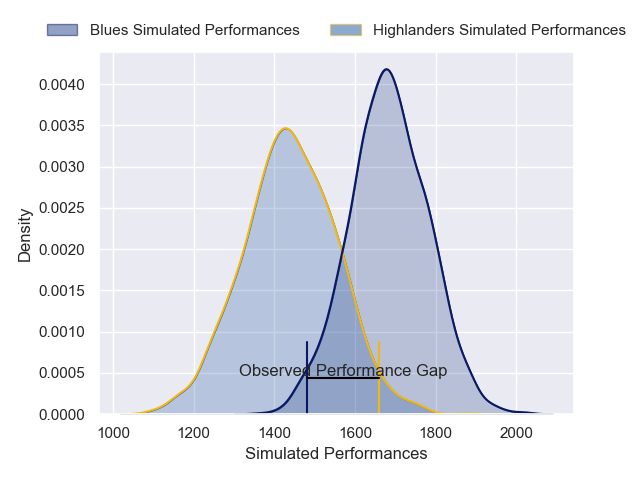
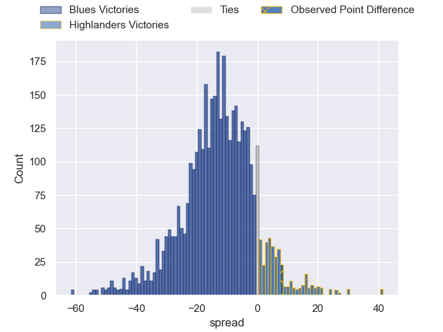
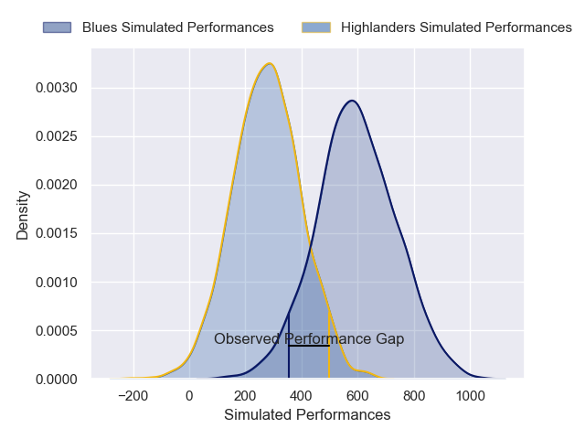
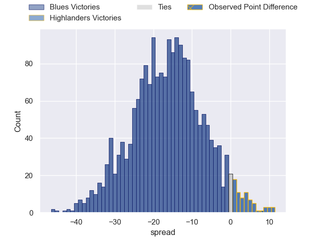

---  
layout: page  
title: Blues at Highlanders; 21-29  
date: 2025-02-22 18:00:00 -0500  
categories: "Super Rugby Pacific 2025" match review  
---
# Blues at Highlanders; 21-29

# Club Level Predictions

The first set of predictions treats a club as the smallest object, as the club develops its members, organizes a gameplan, and deploys its players as needed for each match. This club model has a prediction of 0.208, which translates to predicting Blues to win by 12.1.

Our Over/Under is 45.5 - and combined with the spread above, we have a predicted scoreline of 29 to 17

Each club has a rating and a rating deviation (similar to a Glicko rating), and expected performances can be generated. This allows for simulated matches and spreads like the ones below.
## Projected Performances - Club Model

## Projected Spreads - Club Model

## Projected Results - Club Model

# Player Level Predictions

Treating teams instead as an entity made up of the currently active players, I have ratings for each player in an altogether different system. These can be combined to form team ratings once teamsheets are announced, weighting starters a bit higher than the reserves. After the match is played, players can be weighted by their minutes on the field, allowing for an accurate measure of the team's composition. With these compiled team ratings, we can make predictions, measure inaccuracy, and update the individual player ratings.
## Prediction without Player Minutes: Blues by 17.4

Blues by 25.3 on a neutral pitch

## Projected Performances - Player Model

## Projected Spreads - Player Model

## Projected Results - Player Model

|   Away Minutes | Away Player        |   Away Percentile |   Number |   Home Percentile | Home Player          |   Home Minutes |
|---------------:|:-------------------|------------------:|---------:|------------------:|:---------------------|---------------:|
|             16 | Ofa Tu'ungafasi    |             98.39 |        1 |             23.19 | Ethan de Groot       |             13 |
|             63 | Ricky Riccitelli   |             67.73 |        2 |             89.8  | Soane Vikena         |             81 |
|             27 | Marcel Renata      |             81.06 |        3 |             27.45 | Saula Ma'u           |             12 |
|             81 | Patrick Tuipulotu  |             76.28 |        4 |             87.81 | Fabian Holland       |             81 |
|              2 | Patrick Tuipulotu  |             76.28 |        4 |             87.81 | Fabian Holland       |             81 |
|              3 | Laghlan McWhannell |             96.6  |        5 |             93.76 | Mitchell Dunshea     |             21 |
|             79 | Cameron Suafoa     |             69.19 |        6 |             57.28 | Sean Withy           |             71 |
|             81 | Dalton Papalii     |             98.77 |        7 |             70.89 | Veveni Lasaqa        |             53 |
|             81 | Hoskins Sotutu     |             98.24 |        8 |             27.73 | Hugh Renton          |             81 |
|             16 | Finlay Christie    |             69.54 |        9 |             90.88 | Folau Fakatava       |             81 |
|              8 | Harry Plummer      |             91.77 |       10 |             55.06 | Taine Robinson       |             20 |
|             28 | Caleb Clarke       |             72.7  |       11 |             82.26 | Caleb Tangitau       |             81 |
|             29 | AJ Lam             |             65.65 |       12 |             87.17 | Timoci Tavatavanawai |             71 |
|             28 | Rieko Ioane        |             77.3  |       13 |             26.55 | Tanielu Tele'a       |             53 |
|             12 | Mark Tele'a        |             79.6  |       14 |             68.7  | Sam Gilbert          |             81 |
|             61 | Mark Tele'a        |             79.6  |       14 |             68.7  | Sam Gilbert          |             81 |
|             81 | Mark Tele'a        |             79.6  |       14 |             68.7  | Sam Gilbert          |             81 |
|             81 | Beauden Barrett    |             99.8  |       15 |             54.88 | Finn Hurley          |             81 |
|             19 | James Mullan       |             39.3  |       16 |             60.03 | Jack Taylor          |             38 |
|             10 | Josh Fusitu'a      |             74.16 |       17 |            nan    | Daniel Lienert-Brown |              5 |
|              8 | Angus Ta'avao      |             93.34 |       18 |             59.71 | Sefo Kautai          |             43 |
|             81 | Josh Beehre        |             49.43 |       19 |             41.68 | Will Stodart         |             64 |
|             81 | Adrian Choat       |             49.15 |       20 |             77.73 | Nikora Broughton     |             44 |
|             81 | Taufa Funaki       |             40.62 |       21 |             69.36 | Nathan Hastie        |             37 |
|             81 | Corey Evans        |             83.22 |       22 |             67.3  | Cameron Millar       |             81 |
|             62 | Cole Forbes        |             85.98 |       23 |             49.34 | Lui Naeata           |             81 |

