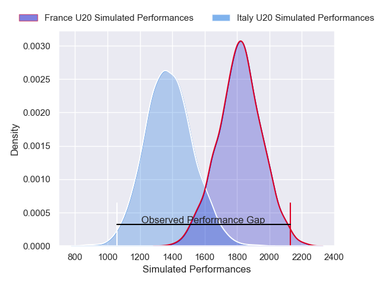
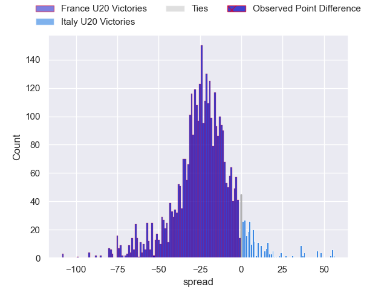
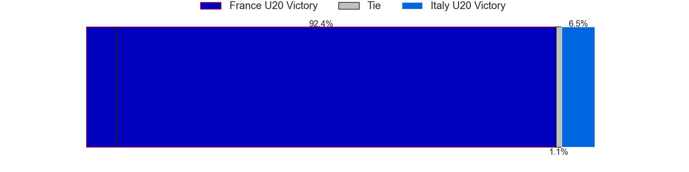
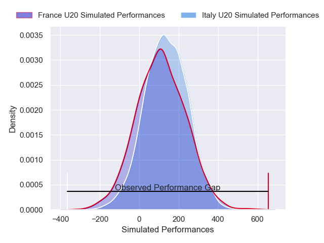
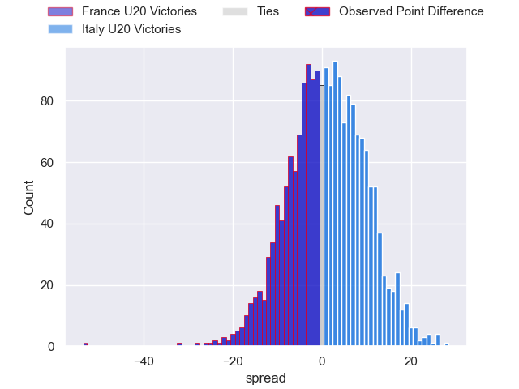

---  
layout: page  
title: France U20 at Italy U20; 58-5  
date: 2025-02-22 18:00:00 -0500  
categories: "U20 Six Nations Championship 2025" match review  
---
# France U20 at Italy U20; 58-5

# Club Level Predictions

The first set of predictions treats a club as the smallest object, as the club develops its members, organizes a gameplan, and deploys its players as needed for each match. This club model has a prediction of 0.094, which translates to predicting France U20 to win by 21.5.

Our Over/Under is 44.5 - and combined with the spread above, we have a predicted scoreline of 33 to 12

Each club has a rating and a rating deviation (similar to a Glicko rating), and expected performances can be generated. This allows for simulated matches and spreads like the ones below.
## Projected Performances - Club Model

## Projected Spreads - Club Model

## Projected Results - Club Model

# Player Level Predictions

Treating teams instead as an entity made up of the currently active players, I have ratings for each player in an altogether different system. These can be combined to form team ratings once teamsheets are announced, weighting starters a bit higher than the reserves. After the match is played, players can be weighted by their minutes on the field, allowing for an accurate measure of the team's composition. With these compiled team ratings, we can make predictions, measure inaccuracy, and update the individual player ratings.
## Prediction without Player Minutes: Italy U20 by 1.5

France U20 by 0.7 on a neutral pitch

## Projected Performances - Player Model

## Projected Spreads - Player Model

## Projected Results - Player Model

|   Away Minutes | Away Player                 |   Away Percentile |   Number |   Home Percentile | Home Player           |   Home Minutes |
|---------------:|:----------------------------|------------------:|---------:|------------------:|:----------------------|---------------:|
|             80 | Samuel Jean-Christophe      |             79.39 |        1 |             21.18 | Cristian Brasini      |             59 |
|             51 | Lyam Akrab                  |             82.96 |        2 |             19.93 | Alessio Caïolo        |             80 |
|             62 | Mohamed Megherbi            |             75.14 |        3 |             23.3  | Bruno Vallesi         |             50 |
|             80 | Charles Kanté-Samba         |             70.31 |        4 |             21.96 | Tommaso Redondi       |             80 |
|             66 | Corentin Mezou              |             83.41 |        5 |             29.41 | Enoch Opoku-Gyamfi    |             50 |
|             80 | Noa Traversier              |             71.17 |        6 |             26.29 | Antony Miranda        |             50 |
|             62 | Sialevailea Tolofua         |             72.68 |        7 |             29.3  | Nelson Casartelli     |             40 |
|             40 | Raphaël Darquier            |             59.23 |        8 |             18.66 | Giacomo Milano        |             18 |
|             80 | Baptiste Tilloles           |             74.35 |        9 |             32.7  | Giulio Sari           |             24 |
|             80 | Luka Keletaona              |             67.23 |       10 |             31.3  | Roberto Fasti         |             21 |
|             21 | Melvyn Rates                |             56.29 |       11 |             23.42 | Malik Faissal         |             74 |
|             31 | Simeli Daunivucu            |             47.92 |       12 |             41.73 | Edoardo Todaro        |              0 |
|             11 | Oliver Cowie                |             48.83 |       13 |             29.95 | Federico Zanandrea    |             28 |
|             32 | Tom Lévêque                 |             60.24 |       14 |             39.49 | Jules Ducros          |             18 |
|             48 | Mathis Ibo                  |             55.85 |       15 |             19.51 | Pietro Celi           |             69 |
|             52 | Quentin Algay               |            nan    |       16 |            nan    | Giacomo Casiraghi     |             43 |
|             62 | Édouard-Junior Jabea Njocke |            nan    |       17 |             43.09 | Sergio Pelliccioli    |             41 |
|             63 | Jean-Yves Liufau            |            nan    |       18 |            nan    | Nicola Bolognini      |             80 |
|             80 | Jacques Nguimbous           |            nan    |       19 |            nan    | Mattia Midena         |             50 |
|             40 | Elyjah Ibsaiene             |             45.44 |       20 |            nan    | Carlo Antonio Bianchi |             29 |
|             30 | Martin Blum                 |            nan    |       21 |            nan    | Matteo Bellotto       |             18 |
|             30 | Jean Cotarmanac'h           |             39.08 |       22 |            nan    | Giacomo Ndoumbe-Lobe  |             80 |
|             21 | Lucas Vigneres              |             55.53 |       23 |            nan    | Riccardo Ioannucci    |             40 |

