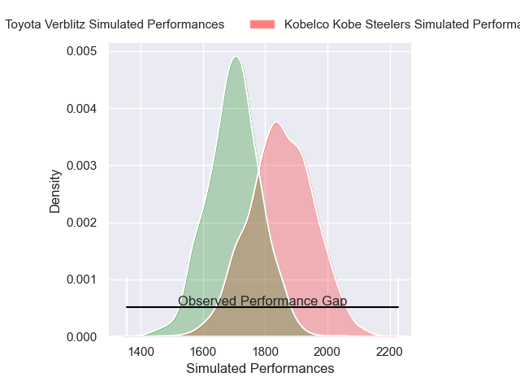
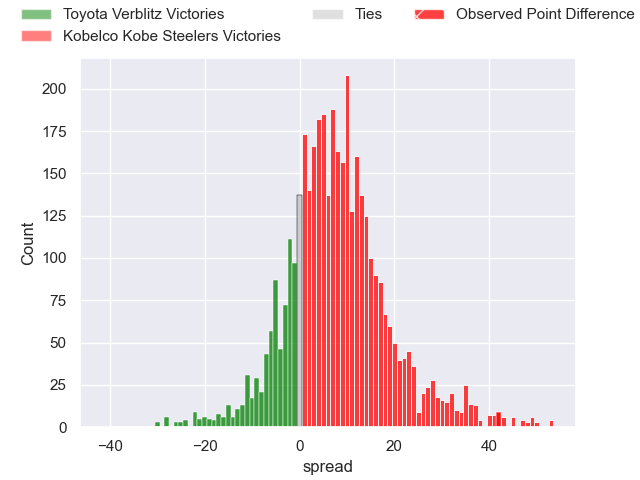
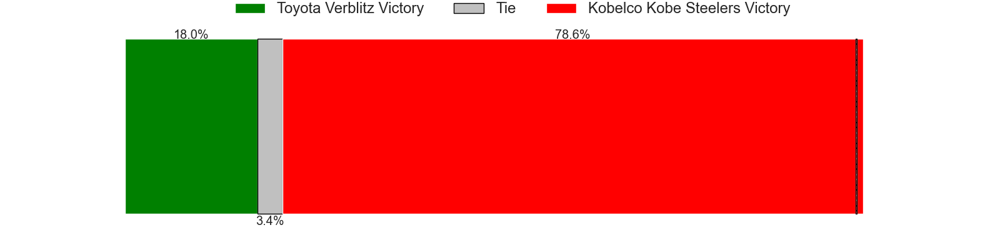
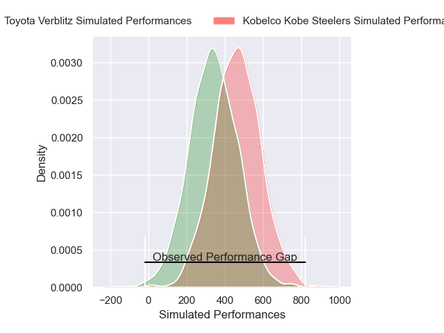
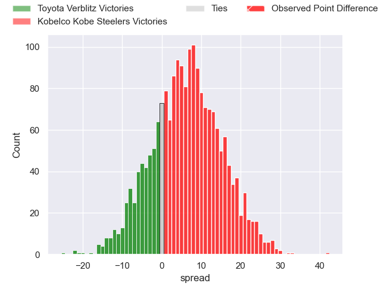
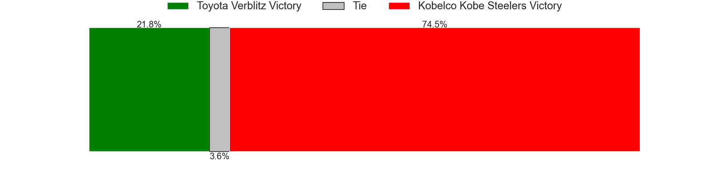

---  
layout: page  
title: Toyota Verblitz at Kobelco Kobe Steelers; 21-63  
date: 2025-02-22 18:00:00 -0500  
categories: "Japan Rugby League One 24/25" match review  
---
# Toyota Verblitz at Kobelco Kobe Steelers; 21-63

# Club Level Predictions

The first set of predictions treats a club as the smallest object, as the club develops its members, organizes a gameplan, and deploys its players as needed for each match. This club model has a prediction of 0.699, which translates to predicting Kobelco Kobe Steelers to win by 7.6.

Our Over/Under is 66.5 - and combined with the spread above, we have a predicted scoreline of 29 to 37

Each club has a rating and a rating deviation (similar to a Glicko rating), and expected performances can be generated. This allows for simulated matches and spreads like the ones below.
## Projected Performances - Club Model

## Projected Spreads - Club Model

## Projected Results - Club Model

# Player Level Predictions

Treating teams instead as an entity made up of the currently active players, I have ratings for each player in an altogether different system. These can be combined to form team ratings once teamsheets are announced, weighting starters a bit higher than the reserves. After the match is played, players can be weighted by their minutes on the field, allowing for an accurate measure of the team's composition. With these compiled team ratings, we can make predictions, measure inaccuracy, and update the individual player ratings.
## Prediction without Player Minutes: Kobelco Kobe Steelers by 5.5

Kobelco Kobe Steelers by 0.7 on a neutral pitch

## Projected Performances - Player Model

## Projected Spreads - Player Model

## Projected Results - Player Model

|   Away Minutes | Away Player         |   Away Percentile |   Number |   Home Percentile | Home Player              |   Home Minutes |
|---------------:|:--------------------|------------------:|---------:|------------------:|:-------------------------|---------------:|
|             56 | Shogo Miura         |             82.17 |        1 |             62.63 | Shigure Takao            |             57 |
|             17 | Yoshikatsu Hikosaka |             93.7  |        2 |             41.23 | Kenta Matsuoka           |             20 |
|             33 | Genki Sudo          |             81.68 |        3 |             94.93 | Hiroshi Yamashita        |             63 |
|             33 | Richie Gray         |             69.93 |        4 |             89.26 | Gerard Cowley-Tuioti     |             80 |
|             28 | Josh Dickson        |             63.9  |        5 |            100    | Brodie Retallick         |             80 |
|             31 | Lautaimi Fetuani    |             42.44 |        6 |             76.53 | Tiennan Costley          |             52 |
|             80 | Michael Hooper      |             99.62 |        7 |             38.31 | Willie Potgieter         |             80 |
|             63 | Akito Okui          |             21.3  |        8 |             72.41 | Waisake Raratubua        |             47 |
|             81 | Ryang Jong Chu      |             29.26 |        9 |             91.91 | Atsushi Hiwasa           |             53 |
|             12 | Rikiya Matsuda      |             97.06 |       10 |             92.23 | Bryn Gatland             |             42 |
|              3 | Siosaia Fifita      |              0.46 |       11 |             57.67 | Kenta Matsunaga          |             34 |
|             81 | Nicholas McCurran   |             72.69 |       12 |              2.44 | Seungsin Lee             |             47 |
|             81 | Joseph Manu         |             13.3  |       13 |             56.35 | Michael Little           |             27 |
|             81 | Shuhei Yamaguchi    |             24.98 |       14 |             28.1  | Ataata Moeakiola         |             57 |
|             69 | Matt McGahan        |             63.24 |       15 |             89.73 | Rakuhei Yamashita        |             20 |
|             61 | Dick Wilson         |             21.97 |       16 |             30.99 | Sho Maeda                |             60 |
|             61 | Aaron Smith         |             96.21 |       17 |             83.13 | Takuya Kitade            |             80 |
|             66 | Daichi Akiyama      |             78.13 |       18 |            nan    | Isileli Nakajima Vakauta |             80 |
|             66 | Ryusei Koike        |             66.76 |       19 |             44.75 | Daiki Nakajima           |             60 |
|             60 | Shunsuke Asaoka     |             42.68 |       20 |             53.24 | Takara Imamura           |             80 |
|             20 | Ryunosuke Momoji    |             29.19 |       21 |             86.29 | Ngani Laumape            |             80 |
|             80 | Taiga Kawasaki      |            nan    |       22 |            nan    | Solomone Funaki          |             28 |
|             29 | Yuki Okada          |             90.96 |       23 |            nan    | Inoke Burua              |             80 |

