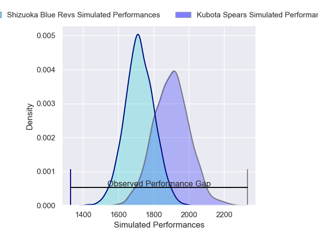
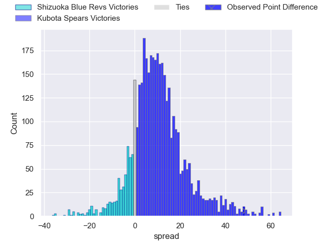
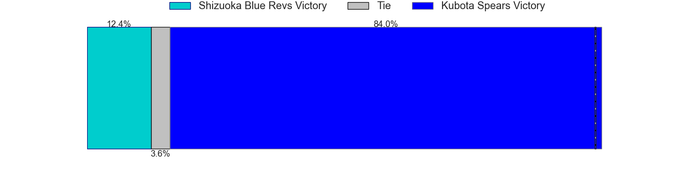
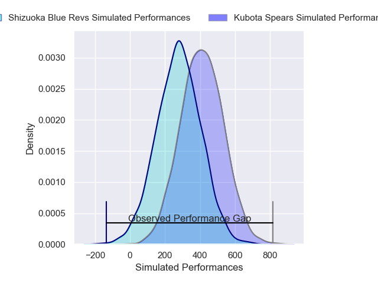
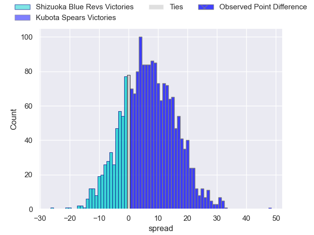
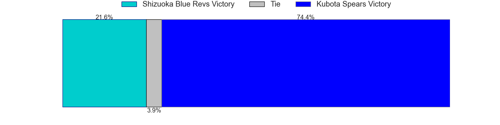

---  
layout: page  
title: Shizuoka Blue Revs at Kubota Spears; 14-62  
date: 2025-02-22 18:00:00 -0500  
categories: "Japan Rugby League One 24/25" match review  
---
# Shizuoka Blue Revs at Kubota Spears; 14-62

# Club Level Predictions

The first set of predictions treats a club as the smallest object, as the club develops its members, organizes a gameplan, and deploys its players as needed for each match. This club model has a prediction of 0.73, which translates to predicting Kubota Spears to win by 8.9.

Our Over/Under is 55.5 - and combined with the spread above, we have a predicted scoreline of 23 to 32

Each club has a rating and a rating deviation (similar to a Glicko rating), and expected performances can be generated. This allows for simulated matches and spreads like the ones below.
## Projected Performances - Club Model

## Projected Spreads - Club Model

## Projected Results - Club Model

# Player Level Predictions

Treating teams instead as an entity made up of the currently active players, I have ratings for each player in an altogether different system. These can be combined to form team ratings once teamsheets are announced, weighting starters a bit higher than the reserves. After the match is played, players can be weighted by their minutes on the field, allowing for an accurate measure of the team's composition. With these compiled team ratings, we can make predictions, measure inaccuracy, and update the individual player ratings.
## Prediction without Player Minutes: Kubota Spears by 9.5

Kubota Spears by 5.4 on a neutral pitch

## Projected Performances - Player Model

## Projected Spreads - Player Model

## Projected Results - Player Model

|   Away Minutes | Away Player             |   Away Percentile |   Number |   Home Percentile | Home Player            |   Home Minutes |
|---------------:|:------------------------|------------------:|---------:|------------------:|:-----------------------|---------------:|
|             56 | Kenta Yamashita         |             68.14 |        1 |             73.68 | Yota Kamimori          |             29 |
|             33 | Takeshi Hino            |             96.82 |        2 |            100    | Malcolm Marx           |             22 |
|             62 | Bunkei Kaku             |             16.13 |        3 |             89.73 | Opeti Helu             |             61 |
|             80 | Jack Wright             |             22.68 |        4 |             65.03 | David Van Zeeland      |             40 |
|             27 | Murray Douglas          |             85.63 |        5 |             89.13 | David Bulbring         |             40 |
|             68 | Vueti Tupou             |             28.73 |        6 |             93.57 | Lappies Labuschagne    |              2 |
|             52 | Kwagga Smith            |             92.25 |        7 |             94.33 | Takeo Suenaga          |             80 |
|             33 | Malgene Ilaua           |             16.99 |        8 |             92.38 | Faulua Makisi          |             51 |
|             28 | Shuntaro Kitamura       |             37.35 |        9 |             67.99 | Shinobu Fujiwara       |             67 |
|             32 | Sam Greene              |              8.44 |       10 |             72.57 | Atsushi Oshikawa       |             78 |
|             31 | Malo Tuitama            |             89.43 |       11 |             97.06 | Gerhard van den Heever |             80 |
|             80 | Viliami Tahitu'a        |             75.12 |       12 |             90.52 | Harumichi Tatekawa     |             80 |
|             51 | Sylvian Mahuza          |             33.66 |       13 |             54    | Rikus Pretorius        |             61 |
|             51 | Valynce Te Whare-Crosby |             73.71 |       14 |             90.72 | Halatoa Vailea         |             80 |
|             19 | Kakeru Okumura          |             20.33 |       15 |             86.18 | Shaun Stevenson        |             64 |
|             49 | Kazuhiro Kawata         |            nan    |       16 |             87.15 | Finau Tupa             |             13 |
|             80 | Sean Vete               |             59.23 |       17 |             97.07 | Bryn Hall              |             71 |
|             80 | Shunsuke Sakuta         |            nan    |       18 |             57.16 | Yuya Hirose            |             80 |
|             80 | Sione Vuna              |             56.64 |       19 |             90.21 | Kota Kaishi            |             80 |
|             80 | Yuya Odo                |             96.69 |       20 |             69.4  | Hayate Era             |             13 |
|             80 | Kenta Iemura            |             66.03 |       21 |            nan    | Ougi Yanamoto          |             80 |
|             18 | Kodai Okazaki           |             53.18 |       22 |            nan    | Yuki Aoki              |             21 |
|             11 | Hironori Yatomi         |            nan    |       23 |            nan    | Esi Sword              |             27 |

