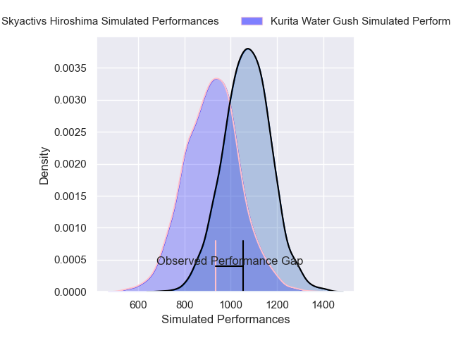
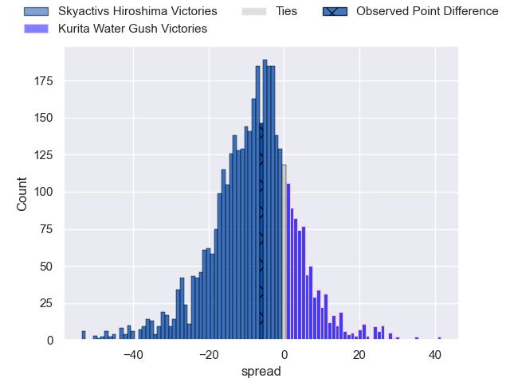
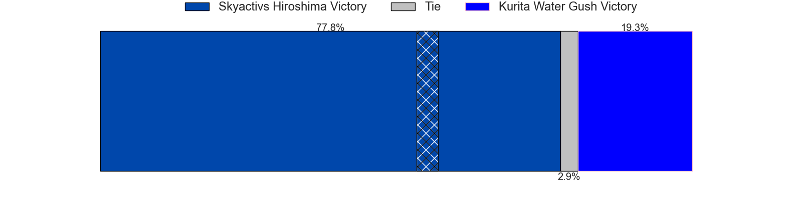
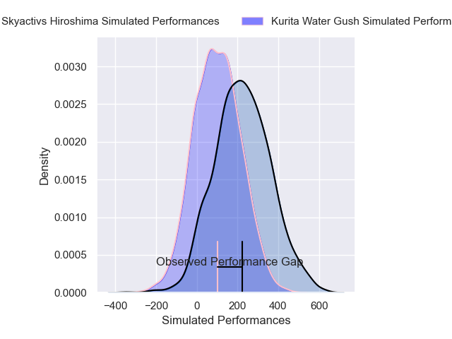
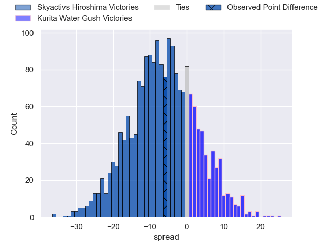
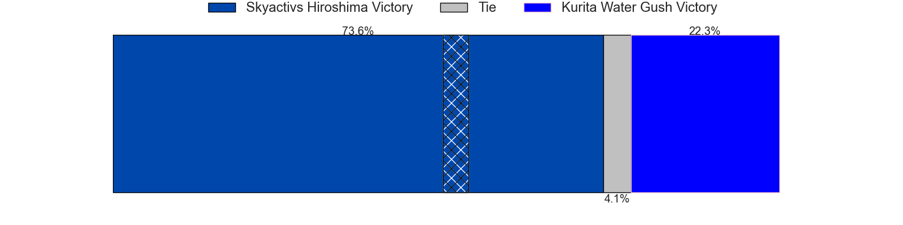

---  
layout: page  
title: Skyactivs Hiroshima at Kurita Water Gush; 22-16  
date: 2025-02-22 18:00:00 -0500  
categories: "Japan Rugby League One D3 24/25" match review  
---
# Skyactivs Hiroshima at Kurita Water Gush; 22-16

# Club Level Predictions

The first set of predictions treats a club as the smallest object, as the club develops its members, organizes a gameplan, and deploys its players as needed for each match. This club model has a prediction of 0.303, which translates to predicting Skyactivs Hiroshima to win by 7.6.

Our Over/Under is 45.5 - and combined with the spread above, we have a predicted scoreline of 27 to 19

Each club has a rating and a rating deviation (similar to a Glicko rating), and expected performances can be generated. This allows for simulated matches and spreads like the ones below.
## Projected Performances - Club Model

## Projected Spreads - Club Model

## Projected Results - Club Model

# Player Level Predictions

Treating teams instead as an entity made up of the currently active players, I have ratings for each player in an altogether different system. These can be combined to form team ratings once teamsheets are announced, weighting starters a bit higher than the reserves. After the match is played, players can be weighted by their minutes on the field, allowing for an accurate measure of the team's composition. With these compiled team ratings, we can make predictions, measure inaccuracy, and update the individual player ratings.
## Prediction without Player Minutes: Kurita Water Gush by 2.5

Skyactivs Hiroshima by 0.3 on a neutral pitch

## Projected Performances - Player Model

## Projected Spreads - Player Model

## Projected Results - Player Model

|   Away Minutes | Away Player        |   Away Percentile |   Number |   Home Percentile | Home Player          |   Home Minutes |
|---------------:|:-------------------|------------------:|---------:|------------------:|:---------------------|---------------:|
|             53 | Koshi Kato         |              2.81 |        1 |             72.47 | Kei Takusagawa       |             80 |
|             80 | Taichi Yoko        |             91.81 |        2 |             66.56 | Kota Hojo            |             61 |
|             80 | Tomoya Otake       |              2.73 |        3 |             74.4  | Rui Kuriyama         |             72 |
|             61 | Rame Sato          |             70.23 |        4 |              3.69 | Kota Nakamura        |             25 |
|             80 | Andrew Davidson    |             81.47 |        5 |              1.32 | Daymon Leasuasu      |             24 |
|             53 | Tevin Ferris       |             14.46 |        6 |             92.06 | Harrison Brewer      |             13 |
|             53 | Tomoki Ashida      |              4.44 |        7 |             51.04 | Taisei Nakao         |             55 |
|             80 | Jackson Pugh       |             82.42 |        8 |             68.95 | Tevita Oto           |             13 |
|             80 | Syoya Maeda        |             88.64 |        9 |             74.18 | Ren Shinwada         |             13 |
|             62 | Issen Kano         |             78.9  |       10 |             18.35 | Piers Francis        |              9 |
|              8 | Kouhei Kamei       |              6.07 |       11 |             31.43 | Koshi Emoto          |             71 |
|             16 | Clinton Knox       |              9.28 |       12 |             66.44 | Leo Gordon           |             53 |
|             19 | Shuhei Lee         |              0.2  |       13 |             48.96 | So Matsushima        |             80 |
|             80 | Yuto Nakamura      |             53.77 |       14 |              3.68 | Kentaro Sugimori     |             33 |
|             12 | Ginjiro Sakiguchi  |              0.2  |       15 |             70.53 | Yuta Sugiyama        |             40 |
|             72 | Yutaro Tanaka      |             73.91 |       16 |             36.52 | Teariki Ben-Nicholas |             40 |
|             80 | Jacob Abel         |             87.36 |       17 |             41.26 | Katsuki Ishizuka     |             27 |
|             72 | Haruki Umemoto     |             91.97 |       18 |            nan    | Takuro Hayashida     |             80 |
|             80 | Yusuke Kitabayashi |             85.62 |       19 |             19.18 | Kei Shibuya          |              9 |
|             80 | Tadatsugu Kanayama |             90.13 |       20 |             74.72 | Issa Hosoya          |             73 |
|             80 | Kotaro Tatsuno     |             70.91 |       21 |             59.74 | Yoji Shiina          |             80 |
|            nan | nan                |            nan    |       22 |             25.82 | Kakeru Sugihara      |             80 |
|            nan | nan                |            nan    |       23 |            nan    | Jun Kaneko           |             80 |

