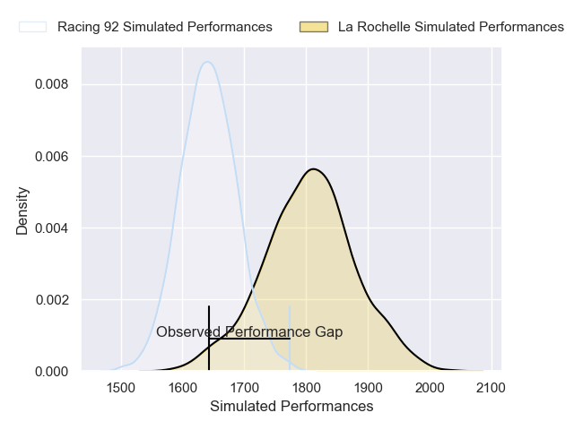
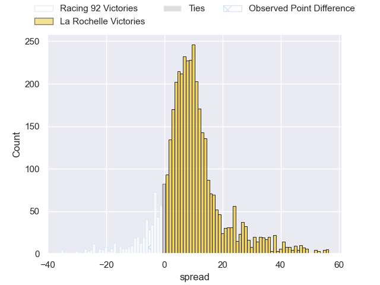
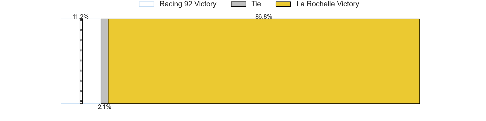
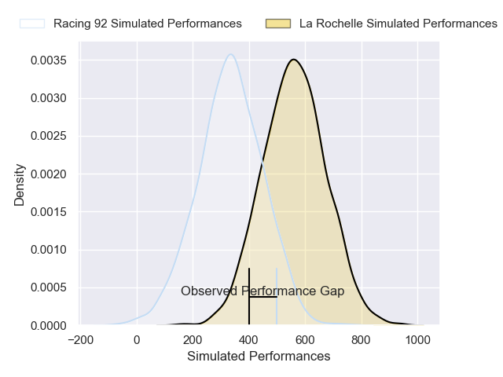
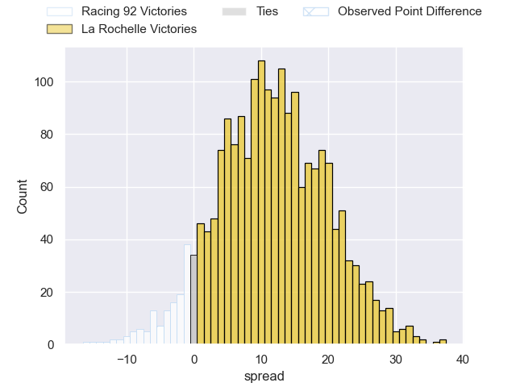
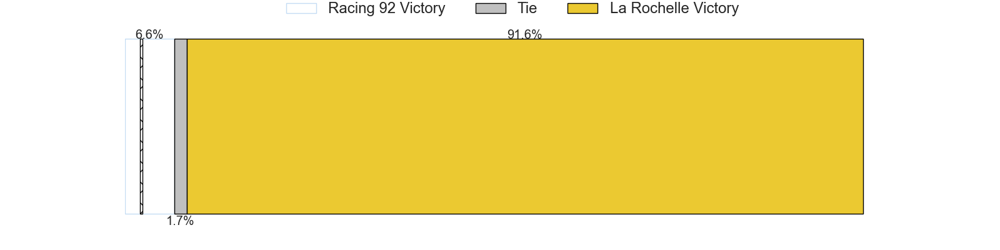

---  
layout: page  
title: Racing 92 at La Rochelle; 26-21  
date: 2025-02-22 18:00:00 -0500  
categories: "Top 14 Orange 24/25" match review  
---
# Racing 92 at La Rochelle; 26-21

# Club Level Predictions

The first set of predictions treats a club as the smallest object, as the club develops its members, organizes a gameplan, and deploys its players as needed for each match. This club model has a prediction of 0.714, which translates to predicting La Rochelle to win by 8.0.

Our Over/Under is 45.5 - and combined with the spread above, we have a predicted scoreline of 19 to 27

Each club has a rating and a rating deviation (similar to a Glicko rating), and expected performances can be generated. This allows for simulated matches and spreads like the ones below.
## Projected Performances - Club Model

## Projected Spreads - Club Model

## Projected Results - Club Model

# Player Level Predictions

Treating teams instead as an entity made up of the currently active players, I have ratings for each player in an altogether different system. These can be combined to form team ratings once teamsheets are announced, weighting starters a bit higher than the reserves. After the match is played, players can be weighted by their minutes on the field, allowing for an accurate measure of the team's composition. With these compiled team ratings, we can make predictions, measure inaccuracy, and update the individual player ratings.
## Prediction without Player Minutes: La Rochelle by 21.3

La Rochelle by 9.6 on a neutral pitch

## Projected Performances - Player Model

## Projected Spreads - Player Model

## Projected Results - Player Model

|   Away Minutes | Away Player         |   Away Percentile |   Number |   Home Percentile | Home Player            |   Home Minutes |
|---------------:|:--------------------|------------------:|---------:|------------------:|:-----------------------|---------------:|
|             20 | Guram Gogichashvili |             62.92 |        1 |             92.38 | Reda Wardi             |             81 |
|             38 | Diego Escobar       |             59.03 |        2 |             29.6  | Quentin Lespiaucq      |             82 |
|             44 | Gia Kharaishvili    |             54.57 |        3 |             69.5  | Joel Sclavi            |             57 |
|             82 | Boris Palu          |             88.66 |        4 |             83.55 | Thomas Lavault         |             64 |
|             82 | Jordan Joseph       |             90.64 |        5 |             97.54 | Will Skelton           |             45 |
|             37 | Maxime Baudonne     |             59.26 |        6 |             14.93 | Judicael Cancoriet     |             15 |
|             41 | Shingarai Manyarara |             59.64 |        7 |             19.94 | Lucas Andjisseramatchi |             72 |
|             82 | Cameron Woki        |             96.48 |        8 |             37.11 | Matthias Haddad        |             76 |
|             32 | Kleo Labarbe        |             63.17 |        9 |             97.93 | Tawera Kerr-Barlow     |             81 |
|             31 | Tristan Tedder      |             14.77 |       10 |             62.03 | Antoine Hastoy         |              6 |
|             38 | Max Spring          |              5.06 |       11 |             26.29 | Hoani Bosmorin         |              6 |
|             31 | Vinaya Habosi       |             20.14 |       12 |             69.6  | Ulupano Seuteni        |             61 |
|             81 | Henry Chavancy      |             99.9  |       13 |             40.28 | Teddy Thomas           |             75 |
|             26 | Nolann Donguy       |             55.51 |       14 |             95.96 | Jack Nowell            |             18 |
|             81 | Sam James           |             92.89 |       15 |             98.78 | Brice Dulin            |             20 |
|             37 | Feleti Kaitu'u      |              5.85 |       16 |             82.27 | Pierre Bourgarit       |             50 |
|             45 | Hassane Kolingar    |             16.37 |       17 |             42.62 | Alexandre Kaddouri     |             81 |
|             62 | Fabien Sanconnie    |             24.2  |       18 |             83.08 | Kane Douglas           |             80 |
|             82 | Hacjivah Dayimani   |             83.4  |       19 |             85.95 | Tolu Latu              |             12 |
|             50 | Antoine Gibert      |             95.36 |       20 |             85.03 | Thomas Berjon          |             19 |
|             25 | Dan Lancaster       |              1.48 |       21 |             49.16 | Ihaia West             |             32 |
|             81 | Gael Fickou         |             97.53 |       22 |             92.79 | Jonathan Danty         |             32 |
|             25 | Lucio Sordoni       |             98.15 |       23 |             46.71 | Aleksandre Kuntelia    |             81 |

