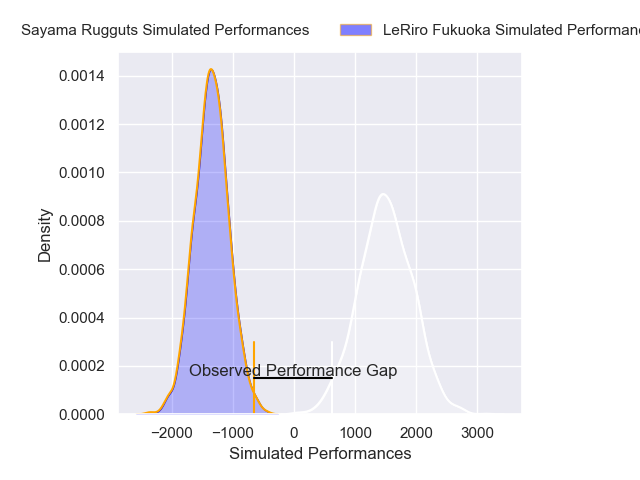
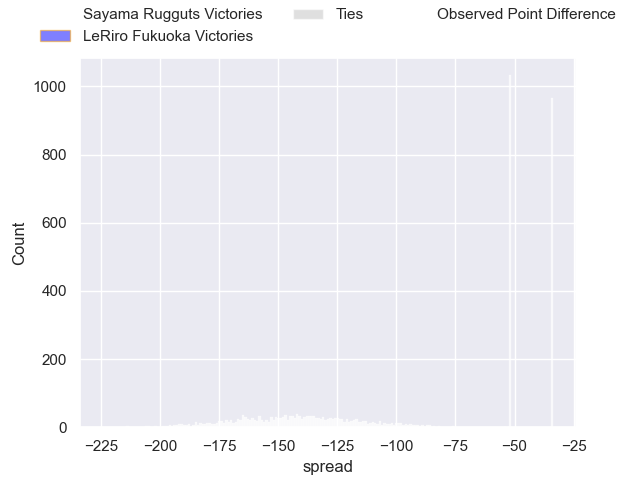
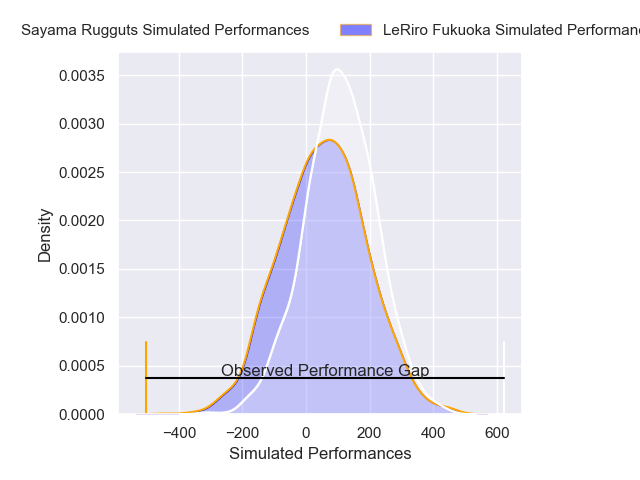
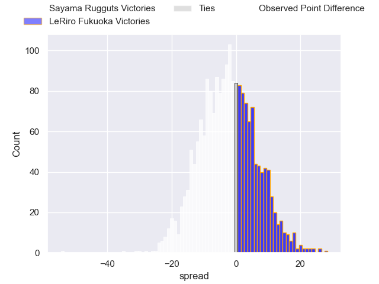
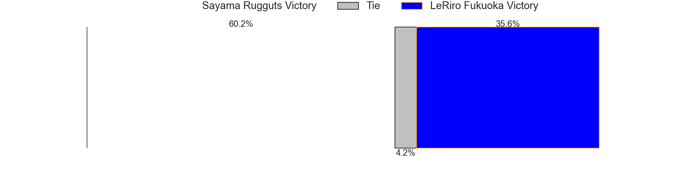

---  
layout: page  
title: Sayama Rugguts at LeRiro Fukuoka; 57-3  
date: 2025-02-22 18:00:00 -0500  
categories: "Japan Rugby League One D3 24/25" match review  
---
# Sayama Rugguts at LeRiro Fukuoka; 57-3

# Club Level Predictions

The first set of predictions treats a club as the smallest object, as the club develops its members, organizes a gameplan, and deploys its players as needed for each match. This club model has a prediction of 0.0, which translates to predicting Sayama Rugguts to win by 142.2.

Our Over/Under is 58.5 - and combined with the spread above, we have a predicted scoreline of 100 to -42

Each club has a rating and a rating deviation (similar to a Glicko rating), and expected performances can be generated. This allows for simulated matches and spreads like the ones below.
## Projected Performances - Club Model

## Projected Spreads - Club Model

## Projected Results - Club Model

# Player Level Predictions

Treating teams instead as an entity made up of the currently active players, I have ratings for each player in an altogether different system. These can be combined to form team ratings once teamsheets are announced, weighting starters a bit higher than the reserves. After the match is played, players can be weighted by their minutes on the field, allowing for an accurate measure of the team's composition. With these compiled team ratings, we can make predictions, measure inaccuracy, and update the individual player ratings.
## Prediction without Player Minutes: Sayama Rugguts by 3.4

Sayama Rugguts by 5.6 on a neutral pitch

## Projected Performances - Player Model

## Projected Spreads - Player Model

## Projected Results - Player Model

|   Away Minutes | Away Player       |   Away Percentile |   Number |   Home Percentile | Home Player         |   Home Minutes |
|---------------:|:------------------|------------------:|---------:|------------------:|:--------------------|---------------:|
|           50   | Toshiki Sato      |             53.21 |        1 |             13.48 | Keita Kimura        |             56 |
|           80   | Shota Okuno       |             63.88 |        2 |              8.7  | Taiyou Minami       |             80 |
|           43   | Motoki Kaneko     |             59.39 |        3 |              4.33 | Rintarou Noda       |             80 |
|           80   | Itsuki Fujii      |             60.59 |        4 |              8.7  | Keita Terada        |             80 |
|           52   | Troy Callander    |             60.02 |        5 |             15.31 | Finau Makavaha      |             51 |
|           52   | Ash Parker        |             58.98 |        6 |             43.95 | Kenta Ueda          |              6 |
|           15   | Kento Mizutani    |             43.01 |        7 |             30.53 | Chikamasa Yana      |             50 |
|           28   | Whetu Douglas     |             47.07 |        8 |             25    | Kouta Nishimura     |             41 |
|           37   | Kanaru Takahashi  |             47.85 |        9 |             13.77 | Hisanori Mimata     |             18 |
|           21   | Shota Kutsuna     |             45.78 |       10 |             24.89 | Shotaro Matsuo      |             59 |
|           80   | Tuiaki Fisipuna   |             66.91 |       11 |             10.66 | Tsuyoshi Hasegawa   |             59 |
|            7   | Tj Faiane         |             41.66 |       12 |             14.91 | Rinto Kagawa        |             80 |
|           11   | Haruya Nakasu     |             36.53 |       13 |             17.28 | Masakazu Yatsumonji |             59 |
|           21   | Yushi Okuda       |             53.49 |       14 |             13.33 | Amanaki Lisala      |             62 |
|           32   | Chase Tiatia      |             67.07 |       15 |             22.56 | Hibiki Nakazawa     |             80 |
|           73   | Tatsuki Tanina    |             41.3  |       16 |            nan    | Atsuro Nakamura     |             80 |
|           25   | Kentaro Ueno      |             42.78 |       17 |             26.16 | Tomoki Nobeta       |             48 |
|           27   | Yuto Takano       |            nan    |       18 |            nan    | Iosefatu Mareko     |             80 |
|           67   | Shigeto Yamashita |            nan    |       19 |            nan    | Syuuta Takami       |             69 |
|           36.5 | Yosuke Okuma      |            nan    |       20 |             38.8  | Kentaro Kamata      |             49 |
|           36.5 | Eito Tsutsumi     |            nan    |       21 |            nan    | Syuuhei Harada      |             80 |
|           80   | Shoki Morimoto    |            nan    |       22 |            nan    | Issei Shige         |             80 |
|           80   | Ayumu Sawada      |            nan    |       23 |             19.05 | Karne Hesketh       |             59 |

