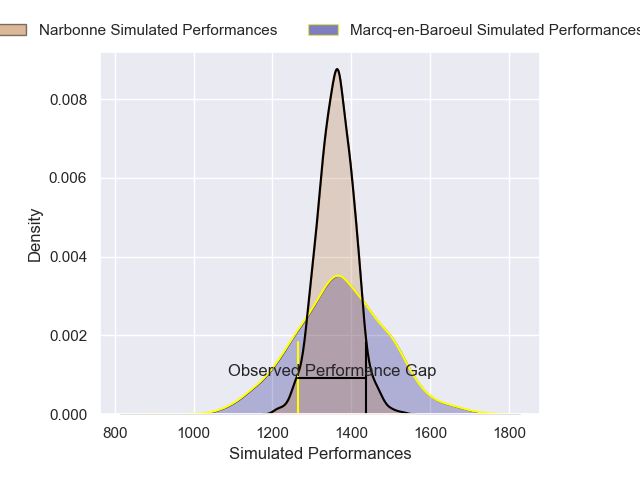
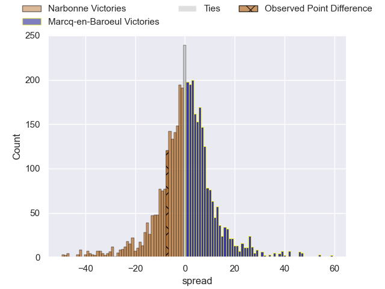
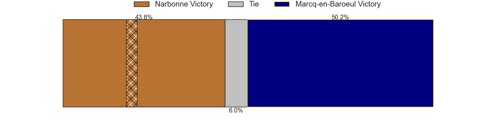
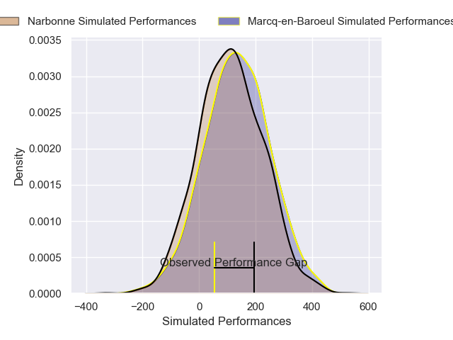
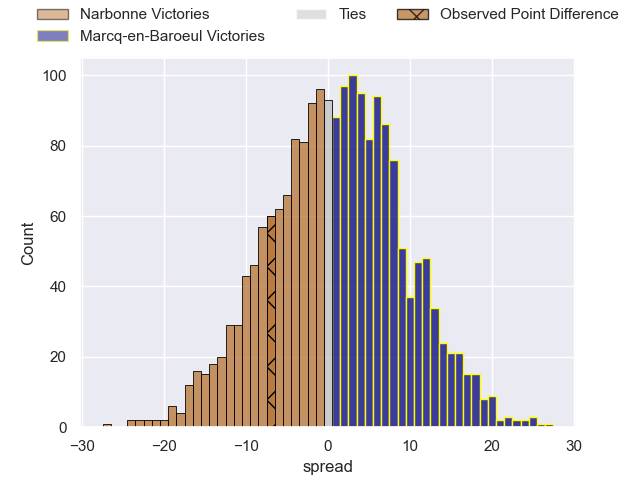
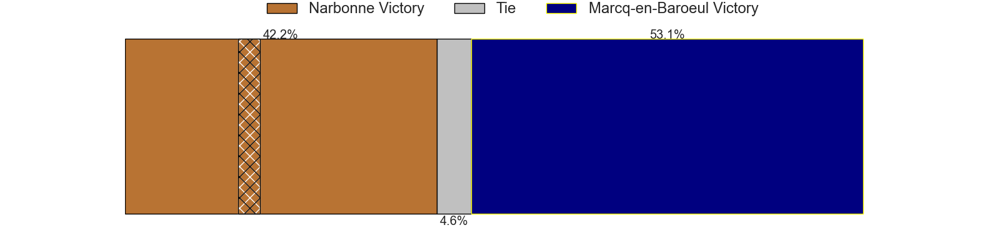

---  
layout: page  
title: Narbonne at Marcq-en-Baroeul; 21-14  
date: 2025-02-22 18:00:00 -0500  
categories: "Nationale 24/25" match review  
---
# Narbonne at Marcq-en-Baroeul; 21-14

# Club Level Predictions

The first set of predictions treats a club as the smallest object, as the club develops its members, organizes a gameplan, and deploys its players as needed for each match. This club model has a prediction of 0.518, which translates to predicting Marcq-en-Baroeul to win by 0.6.

Our Over/Under is 41.5 - and combined with the spread above, we have a predicted scoreline of 20 to 21

Each club has a rating and a rating deviation (similar to a Glicko rating), and expected performances can be generated. This allows for simulated matches and spreads like the ones below.
## Projected Performances - Club Model

## Projected Spreads - Club Model

## Projected Results - Club Model

# Player Level Predictions

Treating teams instead as an entity made up of the currently active players, I have ratings for each player in an altogether different system. These can be combined to form team ratings once teamsheets are announced, weighting starters a bit higher than the reserves. After the match is played, players can be weighted by their minutes on the field, allowing for an accurate measure of the team's composition. With these compiled team ratings, we can make predictions, measure inaccuracy, and update the individual player ratings.
## Prediction without Player Minutes: Narbonne by 0.6

Narbonne by 2.8 on a neutral pitch

## Projected Performances - Player Model

## Projected Spreads - Player Model

## Projected Results - Player Model

|   Away Minutes | Away Player        |   Away Percentile |   Number |   Home Percentile | Home Player              |   Home Minutes |
|---------------:|:-------------------|------------------:|---------:|------------------:|:-------------------------|---------------:|
|             49 | Théo Castinel      |             46.28 |        1 |             28.29 | Eli Serra-Miglietti      |             80 |
|             80 | Mehdi Boundjema    |             88.93 |        2 |             23.17 | Santiago Iglesias Valdez |             19 |
|             10 | Mohammed Loukia    |             22.08 |        3 |             47.51 | Lewys Jones              |             49 |
|             40 | Darrell Dyer       |             91.61 |        4 |             62.21 | Antoine Delaporte        |             49 |
|             80 | Marius Antonescu   |             74.18 |        5 |             25.45 | Lucio Anconetani         |             80 |
|             80 | Arthur Christienne |             71.83 |        6 |             40.94 | Cedric Yonkeu            |             40 |
|             33 | Paul Belzons       |             15.77 |        7 |             53.62 | Arthur Bruges            |             40 |
|             33 | Lopeti Timani      |             83.37 |        8 |              6.49 | Otilo Kafotamaki         |             31 |
|             31 | Pierrick Nova      |             11.36 |        9 |             69.71 | Dylan Nocete             |             31 |
|             28 | Tom Chauvet        |             57.14 |       10 |             48.11 | Paul Decavel             |             28 |
|             28 | Clément Clavières  |             81.82 |       11 |             32.32 | Jeannick Ouassiero       |             15 |
|             25 | Peter Betham       |             98.88 |       12 |             35.23 | Mark Erasmus             |             15 |
|             80 | Pierre Nueno       |             42.54 |       13 |             61.22 | Louis Decavel            |             15 |
|             62 | Étienne Ducom      |             34.25 |       14 |              7.71 | Dany Antunes             |             52 |
|             47 | Thibault Santoro   |             50.72 |       15 |             37.17 | Patrick Fleming Dewhirst |             80 |
|             55 | Morgan Maga        |             43.73 |       16 |             72.01 | Maxime Danton            |             80 |
|             65 | Avto Gogiashvili   |            nan    |       17 |             47.89 | Joachim Beaumont         |             70 |
|             50 | Clément Esteriola  |             19.59 |       18 |             30.42 | Bruno Vliegen            |             58 |
|             52 | Pablo Barbaste     |             69.88 |       19 |              8.32 | Hugo Detre               |             80 |
|             80 | Grégoire Labit     |             64.1  |       20 |             37.65 | Joseph Reynaud           |             80 |
|             55 | Jamie Hagan        |             59.44 |       21 |             63.51 | Geoffrey Cazanave        |             47 |
|             67 | Gilles Bosch       |             18.28 |       22 |             32.96 | Thomas Simonet           |             80 |
|            nan | nan                |            nan    |       23 |             57.48 | Victor-Fy Balas Burel    |             61 |

