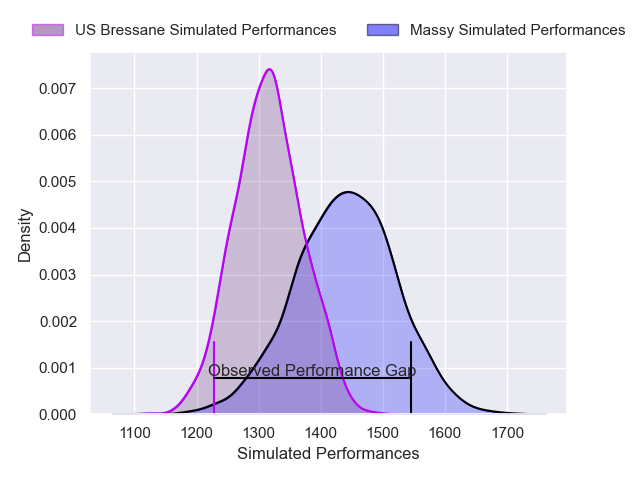
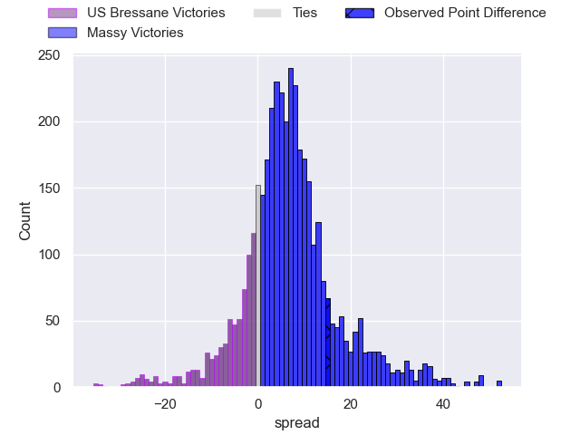
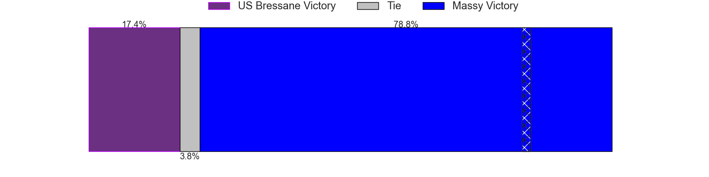
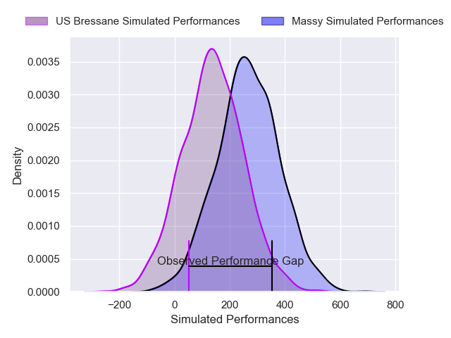
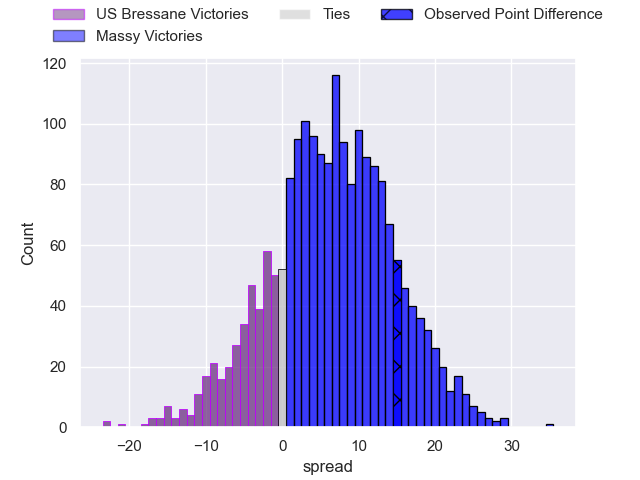
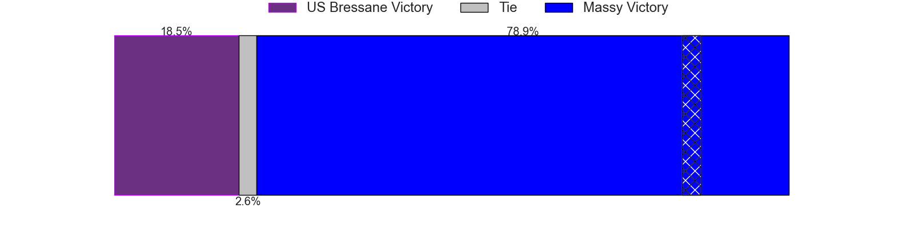

---  
layout: page  
title: US Bressane at Massy; 20-35  
date: 2025-02-22 18:00:00 -0500  
categories: "Nationale 24/25" match review  
---
# US Bressane at Massy; 20-35

# Club Level Predictions

The first set of predictions treats a club as the smallest object, as the club develops its members, organizes a gameplan, and deploys its players as needed for each match. This club model has a prediction of 0.671, which translates to predicting Massy to win by 6.3.

Our Over/Under is 34.5 - and combined with the spread above, we have a predicted scoreline of 14 to 20

Each club has a rating and a rating deviation (similar to a Glicko rating), and expected performances can be generated. This allows for simulated matches and spreads like the ones below.
## Projected Performances - Club Model

## Projected Spreads - Club Model

## Projected Results - Club Model

# Player Level Predictions

Treating teams instead as an entity made up of the currently active players, I have ratings for each player in an altogether different system. These can be combined to form team ratings once teamsheets are announced, weighting starters a bit higher than the reserves. After the match is played, players can be weighted by their minutes on the field, allowing for an accurate measure of the team's composition. With these compiled team ratings, we can make predictions, measure inaccuracy, and update the individual player ratings.
## Prediction without Player Minutes: Massy by 9.3

Massy by 3.1 on a neutral pitch

## Projected Performances - Player Model

## Projected Spreads - Player Model

## Projected Results - Player Model

|   Away Minutes | Away Player        |   Away Percentile |   Number |   Home Percentile | Home Player            |   Home Minutes |
|---------------:|:-------------------|------------------:|---------:|------------------:|:-----------------------|---------------:|
|             40 | Erich de Jager     |             46.87 |        1 |             43.97 | Siegfried Fisi'ihoi    |             40 |
|             28 | Arnaud Feltrin     |              7.96 |        2 |             90.88 | Pierre Trassoudaine    |             30 |
|             17 | Vazha Kapanadze    |             21.83 |        3 |             48.59 | Nolan Pienaar          |             80 |
|             31 | Quentin Witt       |              7.89 |        4 |             76.05 | Saba Pesvianidze       |             20 |
|             31 | Josh Peters        |              4.47 |        5 |             55.32 | Andrei Mahu            |             31 |
|             52 | Nail Ait Naceur    |             62.73 |        6 |             49.09 | Tony Tissot            |             13 |
|             28 | Thomas Déliance    |             42.52 |        7 |             83.41 | Alexandre Loubiere     |             52 |
|             55 | Lucas Lyons        |             85.71 |        8 |             88.41 | Yohann Gbizie          |             49 |
|             49 | Jeremy Valencot    |             68.97 |        9 |             72.24 | Julien Blanc           |             61 |
|             66 | Fred Zeilinga      |             88.84 |       10 |             39.79 | Gonzalo Lopez Bontempo |             15 |
|             40 | Élie De Fleurian   |             22.08 |       11 |             64.94 | Ilian El Yahyaoui      |             55 |
|             13 | Aaron Stafford     |             39.79 |       12 |             81.42 | Luca Mignot            |             80 |
|             40 | Joe Margetts       |             42.7  |       13 |             29.86 | Tom Cusson             |             26 |
|             40 | Dimitri Doucet     |             62.99 |       14 |             13.36 | Giorgi Gogoladze       |             80 |
|             80 | Jules Margarit     |             39.83 |       15 |             22.41 | Alexandre Borie        |             62 |
|             28 | Teo Bordenave      |             23.79 |       16 |             66.83 | Adrien Sonzogni        |             40 |
|             80 | Loic Baradel       |             85.92 |       17 |             72.22 | Nicolas Ferrer         |             80 |
|             53 | Alexandre Badet    |             19.55 |       18 |             35.92 | Robin Poipy            |             55 |
|             80 | Nathan Azais       |             30.32 |       19 |            nan    | Koen Bloemen           |             80 |
|             17 | Louis Dasalmartini |             27.2  |       20 |            nan    | Giani Gamba            |             33 |
|             80 | Nicolas Lemaire    |             56.89 |       21 |             42.24 | Lucas Rubio            |             21 |
|             80 | Wael May           |             78.26 |       22 |            nan    | Anthony Favier         |             80 |
|             25 | Mathis Charvet     |            nan    |       23 |             83.58 | Alex Preira            |             80 |

