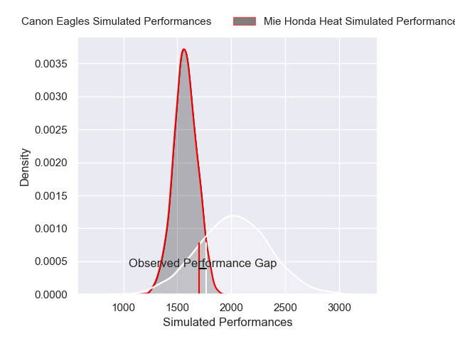
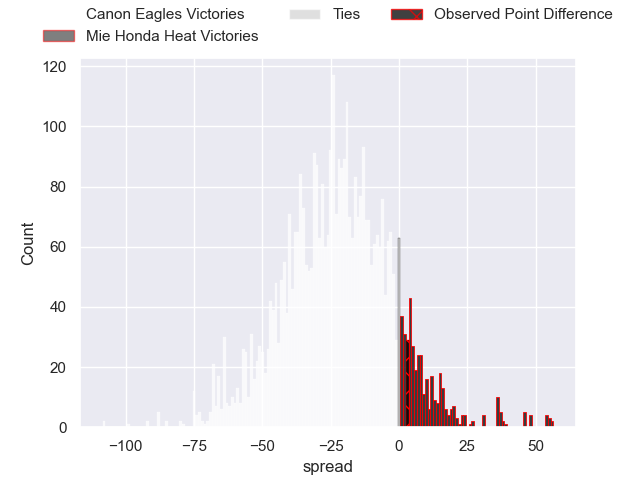
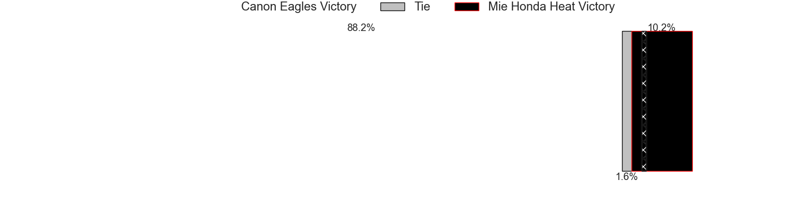
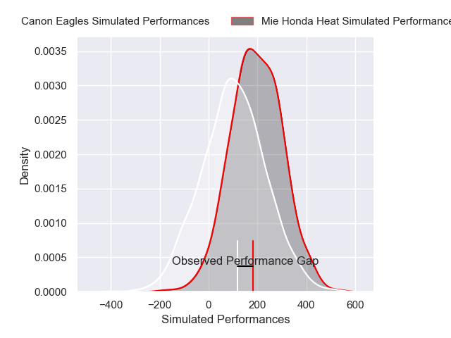
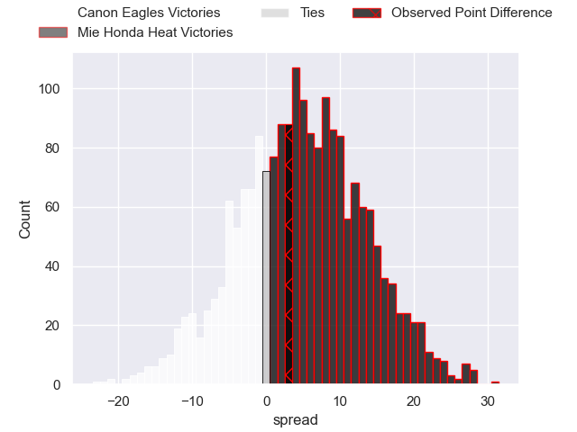
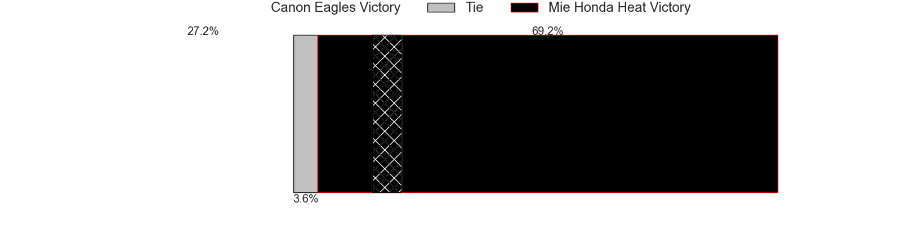

---  
layout: page  
title: Canon Eagles at Mie Honda Heat; 17-20  
date: 2025-02-22 18:00:00 -0500  
categories: "ALL.RUGBY 2025" match review  
---
# Canon Eagles at Mie Honda Heat; 17-20

# Club Level Predictions

The first set of predictions treats a club as the smallest object, as the club develops its members, organizes a gameplan, and deploys its players as needed for each match. This club model has a prediction of 0.143, which translates to predicting Canon Eagles to win by 22.4.

Our Over/Under is 30.5 - and combined with the spread above, we have a predicted scoreline of 26 to 4

Each club has a rating and a rating deviation (similar to a Glicko rating), and expected performances can be generated. This allows for simulated matches and spreads like the ones below.
## Projected Performances - Club Model

## Projected Spreads - Club Model

## Projected Results - Club Model

# Player Level Predictions

Treating teams instead as an entity made up of the currently active players, I have ratings for each player in an altogether different system. These can be combined to form team ratings once teamsheets are announced, weighting starters a bit higher than the reserves. After the match is played, players can be weighted by their minutes on the field, allowing for an accurate measure of the team's composition. With these compiled team ratings, we can make predictions, measure inaccuracy, and update the individual player ratings.
## Prediction without Player Minutes: Mie Honda Heat by 8.8

Mie Honda Heat by 5.3 on a neutral pitch

## Projected Performances - Player Model

## Projected Spreads - Player Model

## Projected Results - Player Model

|   Away Minutes | Away Player        |   Away Percentile |   Number |   Home Percentile | Home Player             |   Home Minutes |
|---------------:|:-------------------|------------------:|---------:|------------------:|:------------------------|---------------:|
|             33 | Takato Okabe       |             34.98 |        1 |             18.62 | Tatsuhiko Tsurukawa     |             17 |
|             47 | Shunta Nakamura    |             46.93 |        2 |             19.9  | Koki Hida               |             17 |
|             51 | Tatsuro Sugimoto   |             47.97 |        3 |             18.47 | Feinga Fakai            |             25 |
|             62 | Cormac Daly        |             25.67 |        4 |             35.17 | Mark Abbott             |             14 |
|             56 | Matt Philip        |             49.62 |        5 |             84.7  | Janko Swanepoel         |             14 |
|             59 | Billy Harmon       |             31.94 |        6 |             96.09 | Franco Mostert          |             14 |
|             50 | Naoto Shimada      |             48.71 |        7 |             99.52 | Pablo Matera            |             30 |
|             11 | Amanaki Mafi       |             40.37 |        8 |             20.08 | Talifolofola Tangipa    |             80 |
|             80 | Kazufumi Yamasuga  |             48.1  |        9 |             20.52 | Azuma Doei              |             69 |
|             47 | Yu Tamura          |             44.21 |       10 |             27.37 | Hayata Nakao            |             80 |
|             80 | Masayoshi Takezawa |             50.83 |       11 |             46.01 | Tevita Li               |             17 |
|             80 | Yusuke Kajimura    |             69.26 |       12 |             34.92 | Fraser Quirk            |             83 |
|             62 | Ryo Tabata         |             48.93 |       13 |             22.47 | Kyogo Okano             |             69 |
|             29 | Kippei Ishida      |             48.33 |       14 |             45.55 | Larry Sulunga           |             53 |
|             33 | Brendan Owen       |             68.88 |       15 |             40.25 | Gwangtee Oh             |             80 |
|             18 | Yusuke Niwai       |            nan    |       16 |            nan    | Ikuma Yamada            |             37 |
|             24 | Tomoki Minami      |            nan    |       17 |            nan    | Takumi Fujii            |             80 |
|             74 | Ryosuke Iwaihara   |            nan    |       18 |             35.21 | Katsuyuki Hoshino       |             30 |
|             18 | Liaki Moli         |            nan    |       19 |            nan    | Ryo Furuta              |             39 |
|              0 | Masato Furukawa    |            nan    |       20 |            nan    | Waimana Riedlinger-Kapa |             80 |
|             29 | Faf de Klerk       |             92.76 |       21 |            nan    | Taichi Takenaka         |             21 |
|              6 | Viliame Takayawa   |            nan    |       22 |            nan    | Dawid Kellerman         |             80 |
|             80 | Jumpei Ogura       |            nan    |       23 |            nan    | Naoki Motomura          |             31 |

