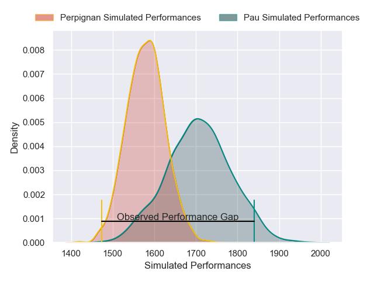
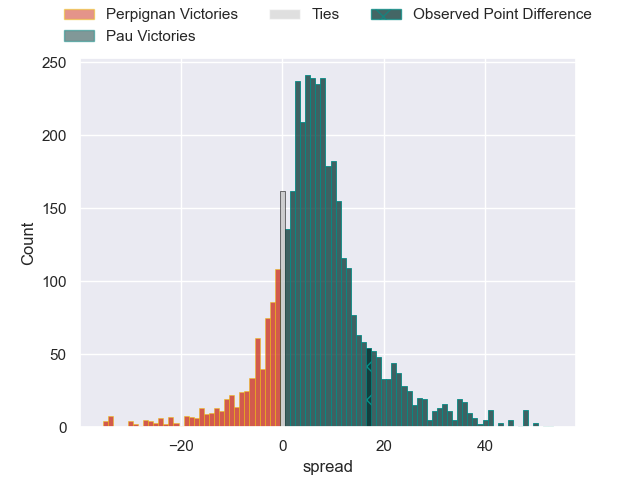
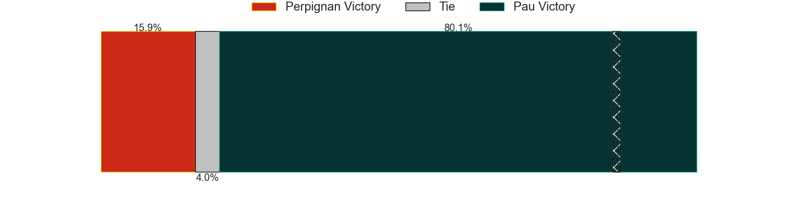
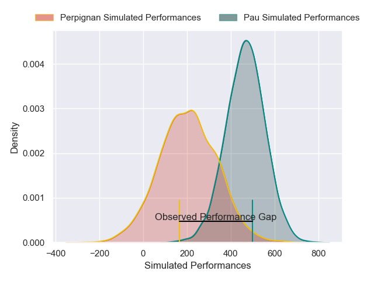
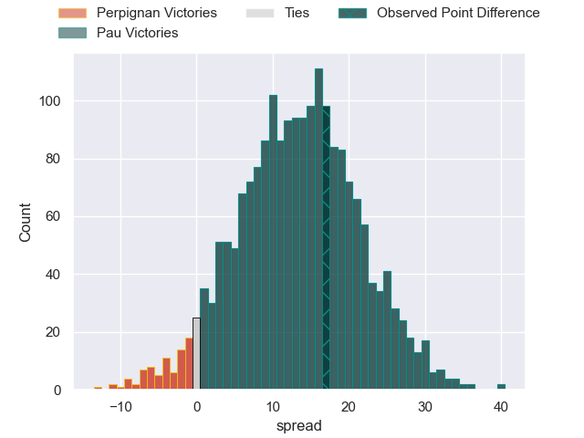
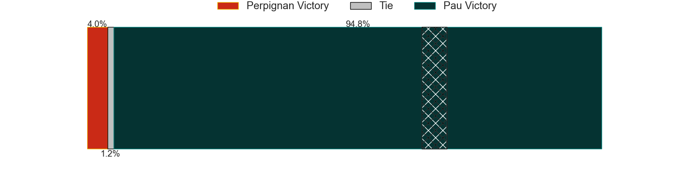

---  
layout: page  
title: Perpignan at Pau; 6-23  
date: 2025-02-22 18:00:00 -0500  
categories: "Top 14 Orange 24/25" match review  
---
# Perpignan at Pau; 6-23

# Club Level Predictions

The first set of predictions treats a club as the smallest object, as the club develops its members, organizes a gameplan, and deploys its players as needed for each match. This club model has a prediction of 0.668, which translates to predicting Pau to win by 6.1.

Our Over/Under is 56.5 - and combined with the spread above, we have a predicted scoreline of 25 to 31

Each club has a rating and a rating deviation (similar to a Glicko rating), and expected performances can be generated. This allows for simulated matches and spreads like the ones below.
## Projected Performances - Club Model

## Projected Spreads - Club Model

## Projected Results - Club Model

# Player Level Predictions

Treating teams instead as an entity made up of the currently active players, I have ratings for each player in an altogether different system. These can be combined to form team ratings once teamsheets are announced, weighting starters a bit higher than the reserves. After the match is played, players can be weighted by their minutes on the field, allowing for an accurate measure of the team's composition. With these compiled team ratings, we can make predictions, measure inaccuracy, and update the individual player ratings.
## Prediction without Player Minutes: Pau by 15.2

Pau by 1.8 on a neutral pitch

## Projected Performances - Player Model

## Projected Spreads - Player Model

## Projected Results - Player Model

|   Away Minutes | Away Player          |   Away Percentile |   Number |   Home Percentile | Home Player         |   Home Minutes |
|---------------:|:---------------------|------------------:|---------:|------------------:|:--------------------|---------------:|
|             25 | Giorgi Beria         |             91.09 |        1 |             32.79 | Ignacio Calles      |             31 |
|             80 | Ignacio Ruiz         |             90.46 |        2 |             60.31 | Romain Ruffenach    |             41 |
|             45 | Kieran Brookes       |              7.11 |        3 |             94.6  | Harry Williams      |             41 |
|             45 | Tristan Labouteley   |             12.91 |        4 |             36.1  | Hugo Auradou        |             26 |
|             80 | Mathieu Tanguy       |             72.67 |        5 |             64.28 | Lekima Tagitagivalu |             54 |
|             58 | Alessandro Ortombina |             65.82 |        6 |             97.75 | Luke Whitelock      |             61 |
|             15 | Alessandro Ortombina |             65.82 |        6 |             97.75 | Luke Whitelock      |             61 |
|             43 | Noe Della Schiava    |             35.12 |        7 |             10.42 | Loic Credoz         |             50 |
|              9 | So'otala Fa'aso'o    |             94.73 |        8 |             77.89 | Carwyn Tuipulotu    |             81 |
|             57 | James Hall           |             88.47 |        9 |             88.98 | Thibault Daubagna   |             18 |
|             82 | Valentin Delpy       |             88.66 |       10 |             76.68 | Joe Simmonds        |             33 |
|             82 | Jefferson Joseph     |             56.84 |       11 |             58.77 | Aaron Grandidier    |             26 |
|             82 | Apisai Naqalevu      |             62.74 |       12 |             80.2  | Fabien Brau Boirie  |             15 |
|             50 | Alivereti Duguivalu  |              6.29 |       13 |             31.07 | Eliott Roudil       |             45 |
|             62 | Tavite Veredamu      |             82    |       14 |             98.71 | Clement Laporte     |             29 |
|             37 | Louis Dupichot       |             69.4  |       15 |             13.35 | Aymeric Luc         |             56 |
|             80 | Seilala Lam          |             58.6  |       16 |             67.63 | Youri Delhommel     |             80 |
|             23 | Giorgi Tetrashvili   |              1.31 |       17 |              6.05 | Daniel Bibi Biziwu  |             12 |
|             80 | Adrien Warion        |             26.01 |       18 |             28.28 | Remi Picquette      |             19 |
|             25 | Lucas Velarte        |             16.53 |       19 |             63.85 | Joel Kpoku          |             32 |
|             82 | Gela Aprasidze       |             67.47 |       20 |             98.97 | Dan Robson          |             32 |
|             41 | Eneriko Buliruarua   |              5.89 |       21 |             73.1  | Nathan Decron       |             20 |
|             28 | Jean Pascal Barraque |             24.16 |       22 |             90.55 | Axel Desperes       |             82 |
|             59 | Pietro Ceccarelli    |             54.95 |       23 |             19.46 | Jon Zabala          |             20 |

