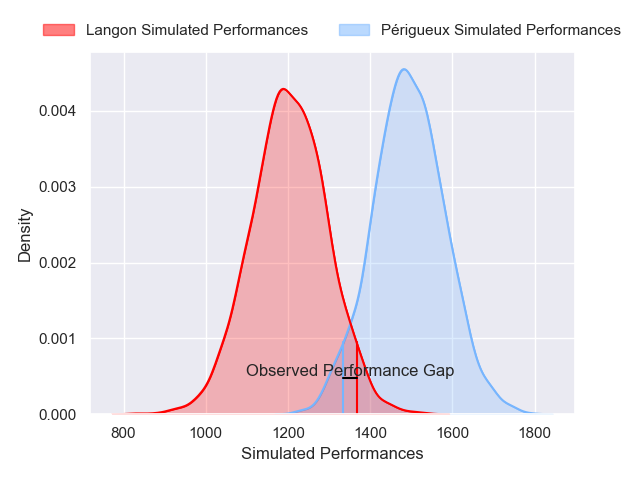
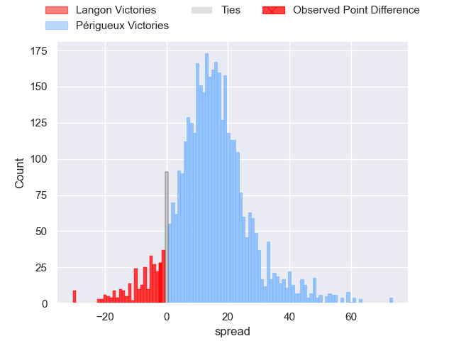
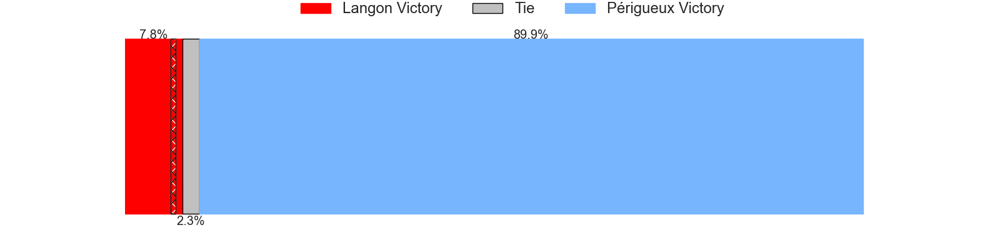
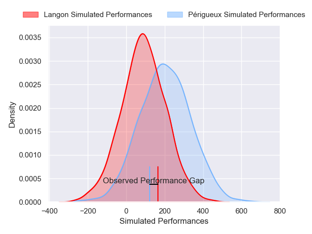
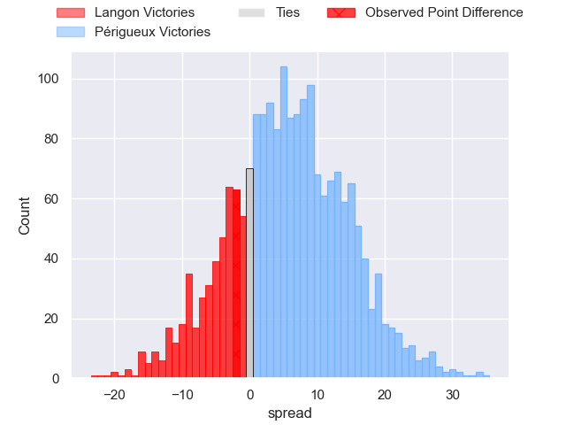
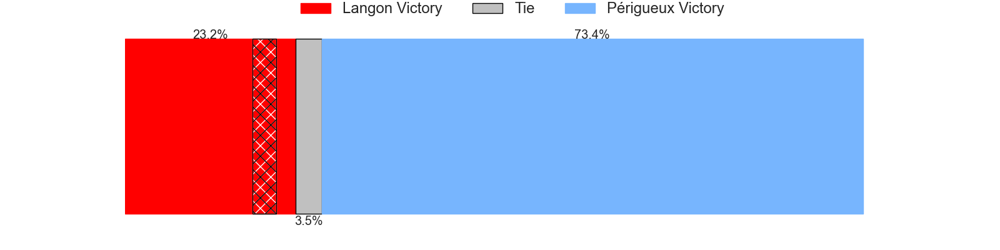

---  
layout: page  
title: Langon at Perigueux; 21-19  
date: 2025-02-22 18:00:00 -0500  
categories: "Nationale 24/25" match review  
---
# Langon at Perigueux; 21-19

# Club Level Predictions

The first set of predictions treats a club as the smallest object, as the club develops its members, organizes a gameplan, and deploys its players as needed for each match. This club model has a prediction of 0.836, which translates to predicting Périgueux to win by 14.7.

Our Over/Under is 28.5 - and combined with the spread above, we have a predicted scoreline of 7 to 22

Each club has a rating and a rating deviation (similar to a Glicko rating), and expected performances can be generated. This allows for simulated matches and spreads like the ones below.
## Projected Performances - Club Model

## Projected Spreads - Club Model

## Projected Results - Club Model

# Player Level Predictions

Treating teams instead as an entity made up of the currently active players, I have ratings for each player in an altogether different system. These can be combined to form team ratings once teamsheets are announced, weighting starters a bit higher than the reserves. After the match is played, players can be weighted by their minutes on the field, allowing for an accurate measure of the team's composition. With these compiled team ratings, we can make predictions, measure inaccuracy, and update the individual player ratings.
## Prediction without Player Minutes: Périgueux by 5.5

Périgueux by 2.5 on a neutral pitch

## Projected Performances - Player Model

## Projected Spreads - Player Model

## Projected Results - Player Model

|   Away Minutes | Away Player              |   Away Percentile |   Number |   Home Percentile | Home Player         |   Home Minutes |
|---------------:|:-------------------------|------------------:|---------:|------------------:|:--------------------|---------------:|
|             17 | Ratu Nailoma Vatubua     |             17.84 |        1 |             20.97 | Jason Tindiliere    |             63 |
|             80 | Maxime Lancon            |             68.49 |        2 |              1    | Manu Leiataua       |             67 |
|             42 | Maxime Gau               |              6.1  |        3 |             37.87 | Kalaveti Tawake     |             67 |
|             19 | Thomas Geffré            |             24.33 |        4 |             66.16 | Raphaël Vieilledent |             80 |
|             80 | Isikili Seva Davetawalu  |             25.76 |        5 |             69.68 | Mathieu Pace        |             80 |
|             80 | Thomas Bishop            |             63.68 |        6 |             35.56 | Bastien Gest        |             80 |
|             19 | Jules Depoortere         |             54.15 |        7 |             52.24 | Clement Lanen       |             63 |
|             80 | Thomas Mendy             |             63.56 |        8 |             29.61 | Nahum Merigan       |             68 |
|             13 | Paul Castera             |             57.41 |        9 |             35    | Max Green           |             80 |
|             17 | Baptiste Castanier       |             26.74 |       10 |             28.21 | Anderson Neisen     |             81 |
|             25 | Sionasa Vunisa           |             84.88 |       11 |             79.96 | Tim Giresse         |             61 |
|             18 | Aurelien Tamagnan        |             45.53 |       12 |             15.56 | Nicolas Piaton      |             64 |
|             13 | Yul Charrier             |             37.26 |       13 |             71.6  | Dorian Lavernhe     |             23 |
|             16 | Abdoul Gafour Karembiri  |             49.17 |       14 |             83.67 | Vincent Fouillade   |             80 |
|             42 | Nathan Gagnac            |             57.47 |       15 |             38.38 | Yon Camou           |             80 |
|             16 | Lucas Hernandez          |             38.58 |       16 |             79.26 | Emilien Borges      |             80 |
|             80 | Baptiste Tisne Cardeneau |             54.83 |       17 |             39.97 | Lucas Marijon       |             80 |
|             80 | Simon Zubizarreta        |             18.68 |       18 |             28.8  | Richard Fourcade    |             38 |
|             48 | Julien Graffouillère     |             67.99 |       19 |             40.87 | Damien Lavergne     |             13 |
|             64 | Clement Renaud           |             19.07 |       20 |             65.42 | Karl Lambert        |             58 |
|             67 | Ludovic Sempé            |             41.28 |       21 |             19.85 | Paul Piveteau       |             76 |
|             80 | Helmi Mimouna            |             63.69 |       22 |             32.16 | Martin Augeix       |             13 |
|             63 | Jone Daunivucu           |            nan    |       23 |            nan    | nan                 |            nan |

