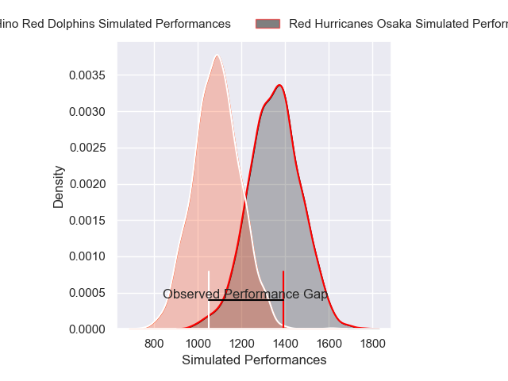
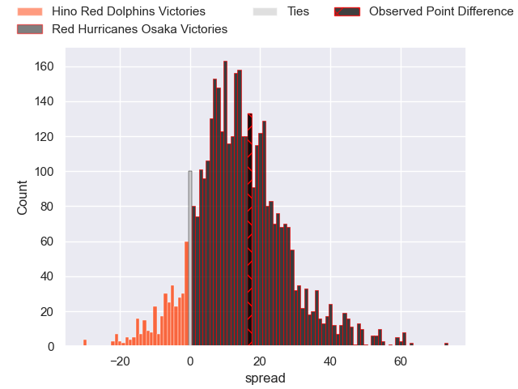
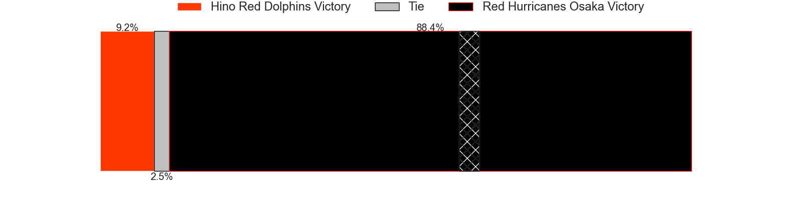
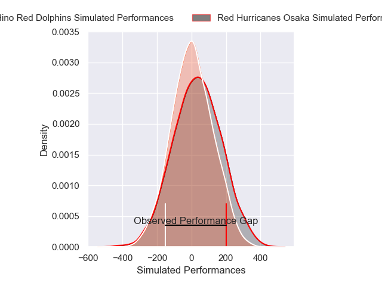
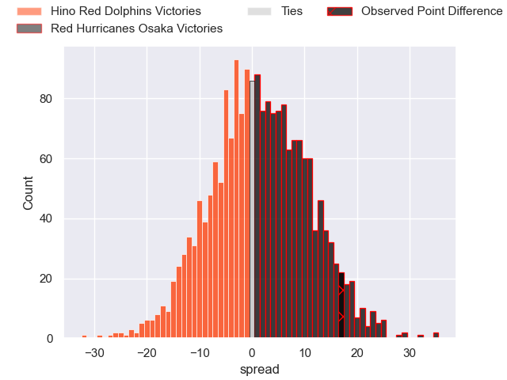

---  
layout: page  
title: Hino Red Dolphins at Red Hurricanes Osaka; 8-25  
date: 2025-02-22 18:00:00 -0500  
categories: "Japan Rugby League One D2 24/25" match review  
---
# Hino Red Dolphins at Red Hurricanes Osaka; 8-25

# Club Level Predictions

The first set of predictions treats a club as the smallest object, as the club develops its members, organizes a gameplan, and deploys its players as needed for each match. This club model has a prediction of 0.808, which translates to predicting Red Hurricanes Osaka to win by 13.2.

Our Over/Under is 59.5 - and combined with the spread above, we have a predicted scoreline of 23 to 36

Each club has a rating and a rating deviation (similar to a Glicko rating), and expected performances can be generated. This allows for simulated matches and spreads like the ones below.
## Projected Performances - Club Model

## Projected Spreads - Club Model

## Projected Results - Club Model

# Player Level Predictions

Treating teams instead as an entity made up of the currently active players, I have ratings for each player in an altogether different system. These can be combined to form team ratings once teamsheets are announced, weighting starters a bit higher than the reserves. After the match is played, players can be weighted by their minutes on the field, allowing for an accurate measure of the team's composition. With these compiled team ratings, we can make predictions, measure inaccuracy, and update the individual player ratings.
## Prediction without Player Minutes: Hino Red Dolphins by 0.6

Hino Red Dolphins by 4.4 on a neutral pitch

## Projected Performances - Player Model

## Projected Spreads - Player Model

## Projected Results - Player Model

|   Away Minutes | Away Player     |   Away Percentile |   Number |   Home Percentile | Home Player         |   Home Minutes |
|---------------:|:----------------|------------------:|---------:|------------------:|:--------------------|---------------:|
|             71 | Yuto Tokuda     |             30.09 |        1 |              9.65 | Hiromichi Sakamoto  |             80 |
|             67 | Towa Taniguchi  |             22.83 |        2 |             43.27 | Hisamitsu Shimada   |             28 |
|             67 | Shosuke Funaki  |             10.71 |        3 |              5.97 | Hiroshi Kitajima    |             60 |
|             67 | Noah Tovio      |             17.62 |        4 |             12.54 | Michael Allardice   |             80 |
|              7 | Rory Arnold     |             93.78 |        5 |             87.28 | Elliott Stooke      |             80 |
|             24 | Shun Nakashika  |             34.65 |        6 |             66.95 | Taro Sato           |             64 |
|             27 | Shun Tomonaga   |             37.65 |        7 |             83.38 | Blake Gibson        |             80 |
|             80 | Kyosuke Horie   |             43    |        8 |             46.45 | Hiroki Hanada       |             80 |
|             61 | Kotaro Hatada   |             16.35 |        9 |             58.86 | Tatsuya Hamano      |             73 |
|             12 | Simon Hickey    |             85.08 |       10 |              1.89 | Bryce Hegarty       |             71 |
|             80 | Moeki Fukushi   |             33.33 |       11 |             60.7  | Yuki Ishii          |             71 |
|             18 | Augustine Pulu  |             16.45 |       12 |             19.49 | Daisuke Iba         |             11 |
|              6 | Murray Koster   |             28.53 |       13 |             29.64 | Henry Taefu         |             57 |
|             80 | Sora Ouchi      |             19.19 |       14 |              1.47 | Taichi Yoshizawa    |             80 |
|             80 | Kyoji Takano    |              6.57 |       15 |             50.51 | Taiki Yamaguchi     |             19 |
|             80 | Taiga Yamaguchi |             47.75 |       16 |              9.81 | Akira Inoue         |             70 |
|             80 | Taroma Togo     |             34.72 |       17 |            nan    | Shota Takai         |             15 |
|             80 | Josh Fenner     |              3.65 |       18 |            nan    | Yo Sato             |             71 |
|              9 | AJ Wolf         |             41.18 |       19 |              6.5  | Tatsunari Fujita    |             80 |
|            nan | nan             |            nan    |       20 |            nan    | Kaoru Tsuruta       |             80 |
|            nan | nan             |            nan    |       21 |            nan    | Shinnosuke Toyonaga |             80 |
|            nan | nan             |            nan    |       22 |              5.82 | Toru Sugishita      |             80 |
|            nan | nan             |            nan    |       23 |             11.48 | Kouki Shigeno       |             71 |

