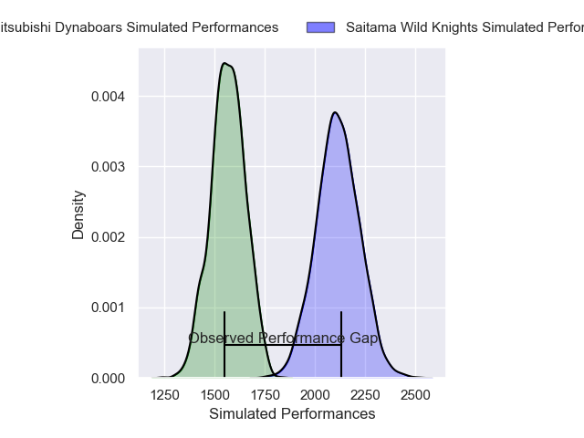
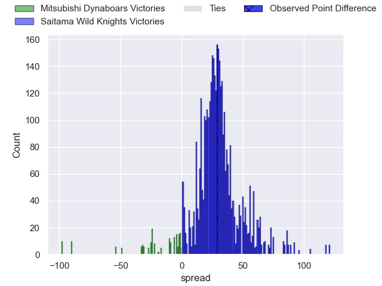
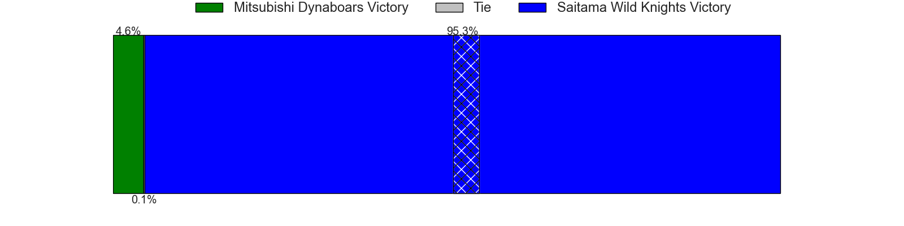
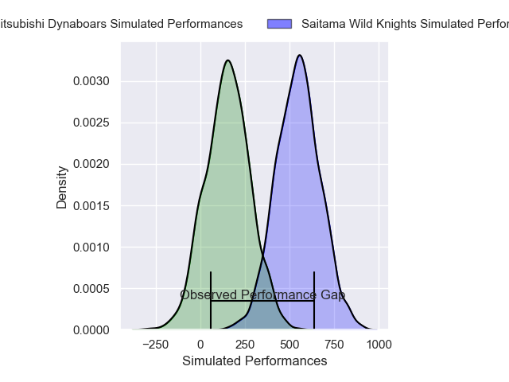
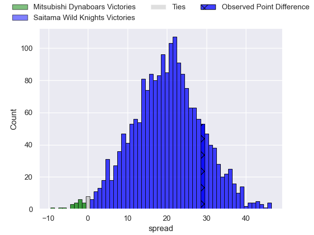
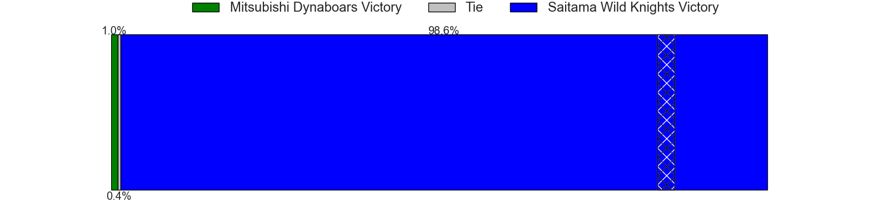

---  
layout: page  
title: Mitsubishi Dynaboars at Saitama Wild Knights; 10-39  
date: 2025-02-22 18:00:00 -0500  
categories: "Japan Rugby League One 24/25" match review  
---
# Mitsubishi Dynaboars at Saitama Wild Knights; 10-39

# Club Level Predictions

The first set of predictions treats a club as the smallest object, as the club develops its members, organizes a gameplan, and deploys its players as needed for each match. This club model has a prediction of 0.954, which translates to predicting Saitama Wild Knights to win by 27.2.

Our Over/Under is 52.5 - and combined with the spread above, we have a predicted scoreline of 13 to 40

Each club has a rating and a rating deviation (similar to a Glicko rating), and expected performances can be generated. This allows for simulated matches and spreads like the ones below.
## Projected Performances - Club Model

## Projected Spreads - Club Model

## Projected Results - Club Model

# Player Level Predictions

Treating teams instead as an entity made up of the currently active players, I have ratings for each player in an altogether different system. These can be combined to form team ratings once teamsheets are announced, weighting starters a bit higher than the reserves. After the match is played, players can be weighted by their minutes on the field, allowing for an accurate measure of the team's composition. With these compiled team ratings, we can make predictions, measure inaccuracy, and update the individual player ratings.
## Prediction without Player Minutes: Saitama Wild Knights by 26.4

Saitama Wild Knights by 21.8 on a neutral pitch

## Projected Performances - Player Model

## Projected Spreads - Player Model

## Projected Results - Player Model

|   Away Minutes | Away Player         |   Away Percentile |   Number |   Home Percentile | Home Player     |   Home Minutes |
|---------------:|:--------------------|------------------:|---------:|------------------:|:----------------|---------------:|
|             54 | Chang Ho Ahn        |             58.27 |        1 |             54.98 | Sho Furuhata    |             80 |
|             60 | Seung Hyok Lee      |             44.15 |        2 |             45.99 | Kenji Sato      |             80 |
|             80 | Kanzo Schinckel     |             17.42 |        3 |             90.93 | Taiki Fujii     |             17 |
|             81 | Lewis Chessum       |             26.94 |        4 |             85.07 | Liam Mitchell   |             38 |
|             81 | Epineri Uluiviti    |              4.82 |        5 |             97.92 | Lood de Jager   |             20 |
|             69 | Kyo Yoshida         |             65.31 |        6 |             96.12 | Ben Gunter      |             18 |
|             66 | Kohki Sato          |             54.25 |        7 |             99.34 | Lachlan Boshier |             15 |
|              3 | Jackson Hemopo      |             58.01 |        8 |             97.27 | Jack Cornelsen  |             80 |
|             52 | Kota Iwamura        |             71.94 |        9 |             95.87 | Taiki Koyama    |             80 |
|             80 | James Grayson       |             40.08 |       10 |             86.5  | Kyohei Yamasawa |             60 |
|             29 | Honeti Taumoha'apai |             73.53 |       11 |             37.41 | Tomoki Osada    |             41 |
|             81 | Charlie Lawrence    |             91.41 |       12 |             78.08 | Vince Aso       |             80 |
|             62 | Curtis Rona         |             82.53 |       13 |             98.22 | Dylan Riley     |             20 |
|             51 | Naco Joape          |             44.12 |       14 |             98.71 | Koki Takeyama   |             80 |
|             80 | Matt Vaega          |             21.54 |       15 |             98.37 | Ryuji Noguchi   |             60 |
|             14 | Yuki Miyazato       |             30.94 |       16 |            nan    | Takaya Saito    |             80 |
|             23 | Daniel Linde        |             22.97 |       17 |             86.11 | Esei Ha'angana  |             53 |
|             23 | Tomoaki Ishii       |             97.35 |       18 |             90.45 | Tom Parton      |             80 |
|             23 | Jack Stratton       |             92.43 |       19 |             58.03 | Craig Millar    |             51 |
|             28 | Haniteli Vailea     |            nan    |       20 |             82.11 | Atsushi Sakate  |             42 |
|             80 | Tai Dowling         |            nan    |       21 |            nan    | Taniela Vea     |             80 |
|             29 | Hayato Hosoda       |              9.23 |       22 |             64.65 | Shota Fukui     |             80 |
|            nan | nan                 |            nan    |       23 |            nan    | Yuta Takagi     |             80 |

