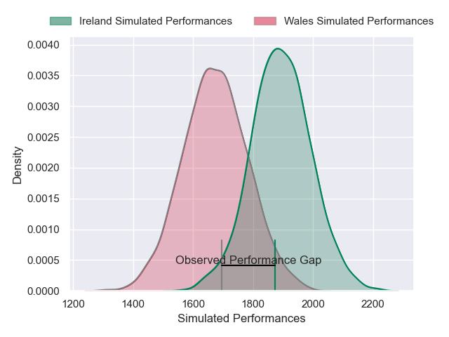
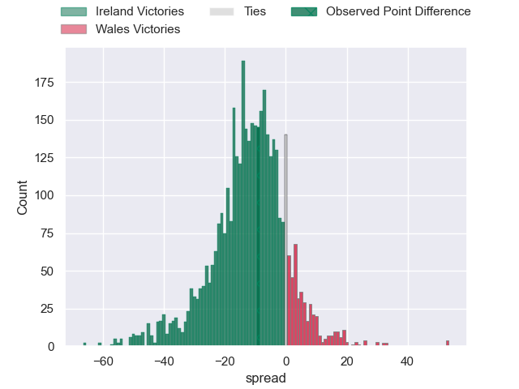
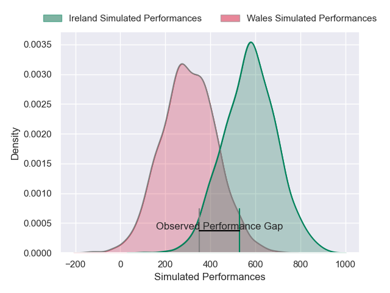
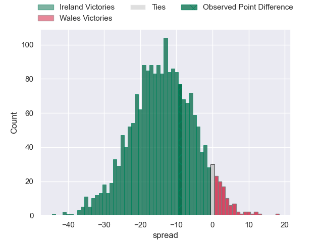

---  
layout: page  
title: Ireland at Wales; 27-18  
date: 2025-02-22 18:00:00 -0500  
categories: "Six Nations Championship 2025" match review  
---
# Ireland at Wales; 27-18

# Club Level Predictions

The first set of predictions treats a club as the smallest object, as the club develops its members, organizes a gameplan, and deploys its players as needed for each match. This club model has a prediction of 0.232, which translates to predicting Ireland to win by 10.9.

Our Over/Under is 31.5 - and combined with the spread above, we have a predicted scoreline of 21 to 10

Each club has a rating and a rating deviation (similar to a Glicko rating), and expected performances can be generated. This allows for simulated matches and spreads like the ones below.
## Projected Performances - Club Model

## Projected Spreads - Club Model

## Projected Results - Club Model

# Player Level Predictions

Treating teams instead as an entity made up of the currently active players, I have ratings for each player in an altogether different system. These can be combined to form team ratings once teamsheets are announced, weighting starters a bit higher than the reserves. After the match is played, players can be weighted by their minutes on the field, allowing for an accurate measure of the team's composition. With these compiled team ratings, we can make predictions, measure inaccuracy, and update the individual player ratings.
## Prediction without Player Minutes: Ireland by 14.4

Ireland by 21.3 on a neutral pitch

## Projected Performances - Player Model

## Projected Spreads - Player Model

## Projected Results - Player Model

|   Away Minutes | Away Player         |   Away Percentile |   Number |   Home Percentile | Home Player      |   Home Minutes |
|---------------:|:--------------------|------------------:|---------:|------------------:|:-----------------|---------------:|
|              7 | Andrew Porter       |             91.81 |        1 |             76.08 | Nicky Smith      |             36 |
|             80 | Dan Sheehan         |             50.5  |        2 |             76.25 | Elliot Dee       |             31 |
|             44 | Thomas Clarkson     |             85.79 |        3 |             82.99 | WillGriff John   |              5 |
|             63 | Joe McCarthy        |             69.94 |        4 |             19.19 | Will Rowlands    |              6 |
|             80 | Tadhg Beirne        |             99.34 |        5 |             85.82 | Dafydd Jenkins   |             80 |
|             73 | Peter O'Mahony      |             96.88 |        6 |             93.67 | Jac Morgan       |             80 |
|             80 | Josh van der Flier  |             98.39 |        7 |             83.74 | Tommy Reffell    |             28 |
|             41 | Jack Conan          |             98.44 |        8 |             81.05 | Taulupe Faletau  |             53 |
|             30 | Jamison Gibson-Park |             96.56 |        9 |             79.35 | Tomos Williams   |              1 |
|             37 | Sam Prendergast     |             23    |       10 |             57.81 | Gareth Anscombe  |             79 |
|              9 | James Lowe          |            100    |       11 |             44.67 | Ellis Mee        |             80 |
|             45 | Robbie Henshaw      |             90.42 |       12 |             51.04 | Ben Thomas       |             80 |
|             53 | Garry Ringrose      |             99.21 |       13 |             83.02 | Max Llewellyn    |             12 |
|             41 | Mack Hansen         |             83.36 |       14 |             79.04 | Tom Rogers       |             32 |
|             80 | Jamie Osborne       |             85.57 |       15 |             28.05 | Blair Murray     |             80 |
|             24 | Gus McCarthy        |             50    |       16 |             37.79 | Evan Lloyd       |             80 |
|             26 | Gus McCarthy        |             50    |       16 |             37.79 | Evan Lloyd       |             80 |
|             11 | Jack Boyle          |             53.93 |       17 |             50.48 | Gareth Thomas    |             74 |
|             33 | Finlay Bealham      |             97.99 |       18 |             44.3  | Henry Thomas     |             50 |
|             52 | James Ryan          |             94.8  |       19 |             10.11 | Teddy Williams   |             80 |
|             82 | Ryan Baird          |             82.04 |       20 |             23.05 | Aaron Wainwright |             71 |
|             82 | Conor Murray        |             99.14 |       21 |             78.83 | Rhodri Williams  |             75 |
|              9 | Jack Crowley        |             39.24 |       22 |             54.43 | Jarrod Evans     |             49 |
|              5 | Bundee Aki          |             99.61 |       23 |             42.15 | Joe Roberts      |             56 |

