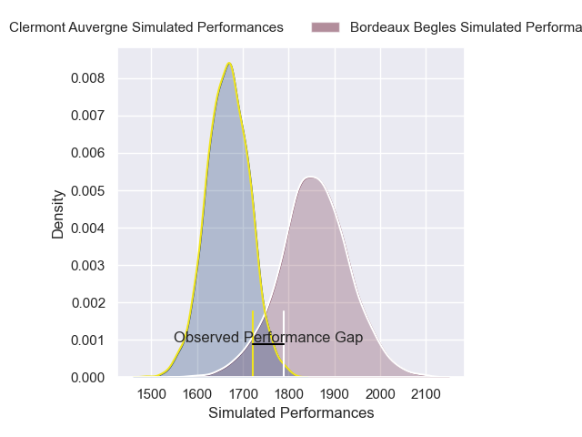
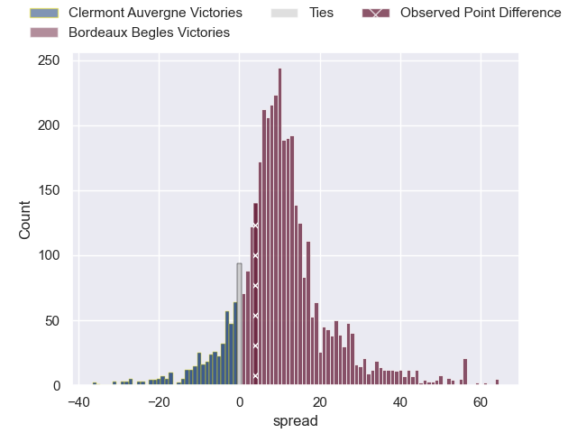
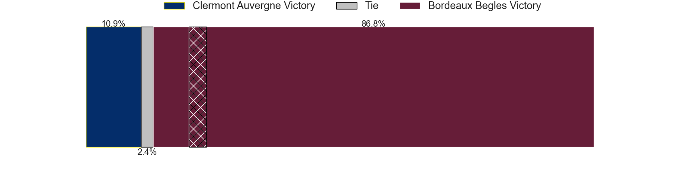
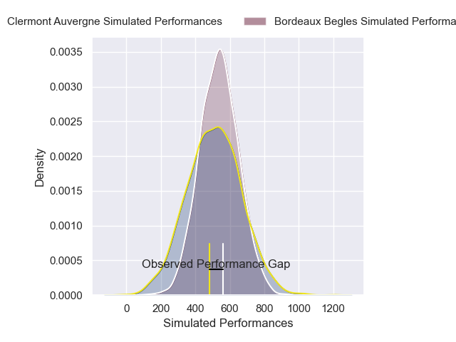
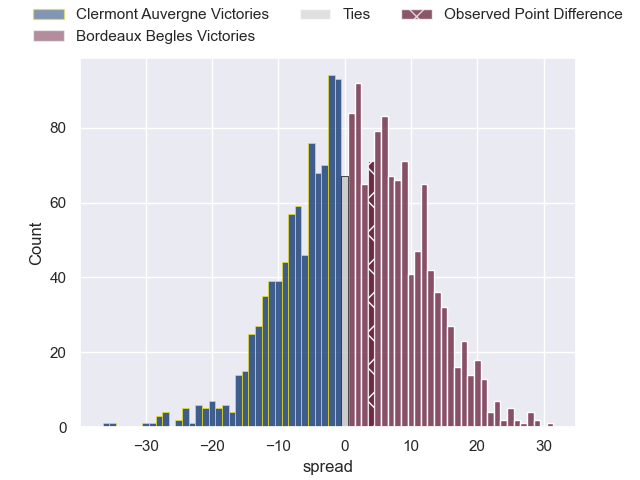

---  
layout: page  
title: Clermont Auvergne at Bordeaux Begles; 18-22  
date: 2025-02-23 18:00:00 -0500  
categories: "Top 14 Orange 24/25" match review  
---
# Clermont Auvergne at Bordeaux Begles; 18-22

# Club Level Predictions

The first set of predictions treats a club as the smallest object, as the club develops its members, organizes a gameplan, and deploys its players as needed for each match. This club model has a prediction of 0.744, which translates to predicting Bordeaux Begles to win by 9.4.

Our Over/Under is 47.5 - and combined with the spread above, we have a predicted scoreline of 19 to 28

Each club has a rating and a rating deviation (similar to a Glicko rating), and expected performances can be generated. This allows for simulated matches and spreads like the ones below.
## Projected Performances - Club Model

## Projected Spreads - Club Model

## Projected Results - Club Model

# Player Level Predictions

Treating teams instead as an entity made up of the currently active players, I have ratings for each player in an altogether different system. These can be combined to form team ratings once teamsheets are announced, weighting starters a bit higher than the reserves. After the match is played, players can be weighted by their minutes on the field, allowing for an accurate measure of the team's composition. With these compiled team ratings, we can make predictions, measure inaccuracy, and update the individual player ratings.
## Prediction without Player Minutes: Bordeaux Begles by 18.1

Bordeaux Begles by 6.2 on a neutral pitch

## Projected Performances - Player Model

## Projected Spreads - Player Model

## Projected Results - Player Model

|   Away Minutes | Away Player          |   Away Percentile |   Number |   Home Percentile | Home Player               |   Home Minutes |
|---------------:|:---------------------|------------------:|---------:|------------------:|:--------------------------|---------------:|
|             68 | Giorgi Akhaladze     |             19.74 |        1 |             85.55 | Jefferson Poirot          |             81 |
|             68 | Folau Fainga'a       |             83.95 |        2 |             43.14 | Connor Sa                 |             81 |
|             21 | Cristian Ojovan      |             37.08 |        3 |             98.23 | Ben Tameifuna             |             66 |
|             64 | Thibaud Lanen        |             80.91 |        4 |             83.84 | Guido Petti               |              4 |
|             41 | Thibaud Lanen        |             80.91 |        4 |             83.84 | Guido Petti               |              4 |
|             82 | Thibaud Lanen        |             80.91 |        4 |             83.84 | Guido Petti               |              4 |
|             44 | Thibaud Lanen        |             80.91 |        4 |             83.84 | Guido Petti               |              4 |
|             35 | Thomas Ceyte         |             67.67 |        5 |             96.98 | Cyril Cazeaux             |             81 |
|             21 | Alexandre Fischer    |             83.93 |        6 |             79.58 | Mahamadou Diaby           |              0 |
|             54 | Marcos Kremer        |             90.83 |        7 |             87.33 | Bastien Vergnes Taillefer |             44 |
|             14 | Pita Gus Sowakula    |             95.31 |        8 |             92.58 | Pete Samu                 |             81 |
|             68 | Sebastien Bezy       |             91.39 |        9 |              9.98 | Yann Lesgourgues          |             37 |
|             81 | Benjamin Urdapilleta |             90.08 |       10 |             97.47 | Matthieu Jalibert         |             15 |
|             20 | Alex Newsome         |             77.85 |       11 |             97.43 | Arthur Retiere            |             52 |
|             81 | Irae Simone          |             44.42 |       12 |             84.01 | Rohan Janse van Rensburg  |              2 |
|             26 | Mathys Belaubre      |             74.53 |       13 |             78.87 | Nicolas Depoortere        |             35 |
|             68 | Bautista Delguy      |             73.35 |       14 |             97.52 | Damian Penaud             |             60 |
|             78 | Kylan Hamdaoui       |             48.37 |       15 |             97.15 | Romain Buros              |              0 |
|             82 | Barnabe Massa        |             62.71 |       16 |             67.39 | Maxime Lamothe            |             81 |
|             73 | Etienne Falgoux      |             92.05 |       17 |             85.39 | Ugo Boniface              |             61 |
|             72 | Peceli Yato          |             67.49 |       18 |             89.51 | Alexandre Ricard          |             40 |
|             82 | Anthime Hemery       |             72.5  |       19 |             62.3  | Marko Gazzotti            |             60 |
|             32 | Baptiste Jauneau     |             87.78 |       20 |              5.67 | Lachlan Swinton           |             81 |
|             47 | Theo Giral           |            nan    |       21 |             75.11 | Joey Carbery              |             27 |
|             31 | Killian Tixeront     |             77.93 |       22 |             48.78 | Jon Echegaray             |             21 |
|             62 | Regis Montagne       |             85.23 |       23 |             86.6  | Sipili Falatea            |             82 |

