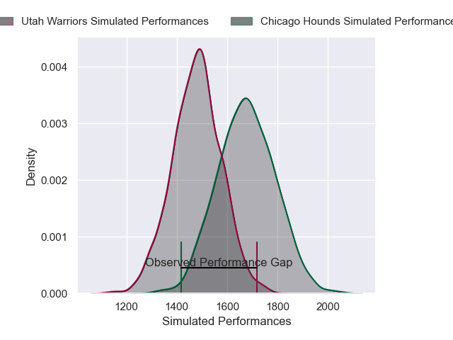
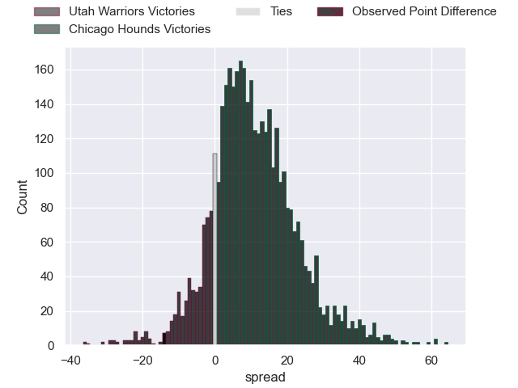
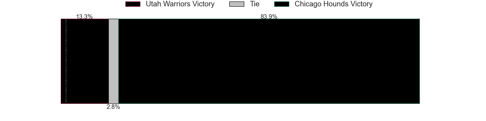
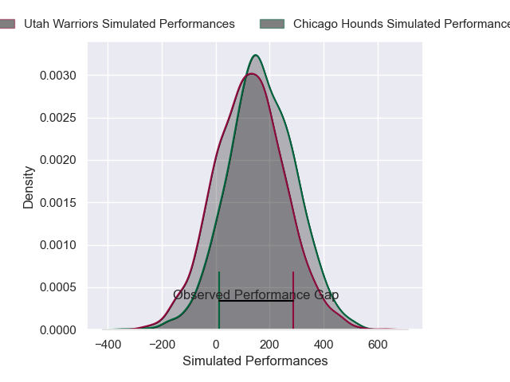
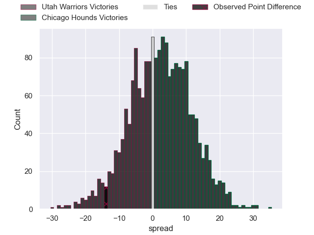

---  
layout: page  
title: Utah Warriors at Chicago Hounds; 45-31  
date: 2025-02-23 18:00:00 -0500  
categories: "Major League Rugby 2025" match review  
---
# Utah Warriors at Chicago Hounds; 45-31

# Club Level Predictions

The first set of predictions treats a club as the smallest object, as the club develops its members, organizes a gameplan, and deploys its players as needed for each match. This club model has a prediction of 0.744, which translates to predicting Chicago Hounds to win by 9.7.

Our Over/Under is 57.5 - and combined with the spread above, we have a predicted scoreline of 24 to 33

Each club has a rating and a rating deviation (similar to a Glicko rating), and expected performances can be generated. This allows for simulated matches and spreads like the ones below.
## Projected Performances - Club Model

## Projected Spreads - Club Model

## Projected Results - Club Model

# Player Level Predictions

Treating teams instead as an entity made up of the currently active players, I have ratings for each player in an altogether different system. These can be combined to form team ratings once teamsheets are announced, weighting starters a bit higher than the reserves. After the match is played, players can be weighted by their minutes on the field, allowing for an accurate measure of the team's composition. With these compiled team ratings, we can make predictions, measure inaccuracy, and update the individual player ratings.
## Prediction without Player Minutes: Chicago Hounds by 0.4

Utah Warriors by 2.0 on a neutral pitch

## Projected Performances - Player Model

## Projected Spreads - Player Model

## Projected Results - Player Model

|   Away Minutes | Away Player     |   Away Percentile |   Number |   Home Percentile | Home Player       |   Home Minutes |
|---------------:|:----------------|------------------:|---------:|------------------:|:------------------|---------------:|
|             17 | Aki Seiuli      |             11.04 |        1 |             36.63 | Faka'osi Pifeleti |             21 |
|             34 | Liam Coltman    |             84.67 |        2 |             98.47 | Dylan Fawsitt     |             27 |
|             14 | Tonga Kofe      |             52.09 |        3 |             27.06 | Charlie Abel      |             68 |
|             80 | Matt Jensen     |             65.22 |        4 |             71.63 | James Scott       |             31 |
|             21 | Gavin Thornbury |             87.56 |        5 |             32.7  | Hamish Bain       |             68 |
|             80 | Frank Lochore   |             61.69 |        6 |              0.85 | Mason Flesch      |             80 |
|             70 | Kalisi Moli     |             64.69 |        7 |             10.05 | Maclean Jones     |             63 |
|             60 | Dylan Nel       |             85.4  |        8 |              0.61 | Lucas Rumball     |              0 |
|             10 | Logan Crowley   |             33.91 |        9 |             33.73 | Mitch Short       |             20 |
|             20 | D'Angelo Leuila |              9.03 |       10 |             26.05 | Adriaan Carelse   |             62 |
|             80 | Joe Mano        |             67.68 |       11 |             96.42 | Nate Augspurger   |             52 |
|             60 | Spencer Jones   |             81.22 |       12 |             10.96 | Ollie Devoto      |             54 |
|             66 | Kyle Brown      |             54.92 |       13 |             73.6  | Bryce Campbell    |             81 |
|             20 | Blake Makiri    |             76.68 |       14 |             33.98 | Noah Brown        |             81 |
|             10 | Jordan Trainor  |             85.22 |       15 |             23.41 | Ben Pollack       |             80 |
|             60 | Phil Bradford   |            nan    |       16 |            nan    | Jackson Zabierek  |             70 |
|             80 | Fred Apulu      |            nan    |       17 |            nan    | Liam Fletcher     |             80 |
|             66 | Angus MacLellan |            nan    |       18 |             86.92 | Ignacio Peculo    |             80 |
|             72 | Bailey Wilson   |            nan    |       19 |            nan    | Conall Boomer     |             80 |
|             80 | Tyler Wong      |            nan    |       20 |              8.52 | Luke White        |             60 |
|             80 | Zion Going      |            nan    |       21 |            nan    | Michael Baska     |              0 |
|             60 | Paul Lasike     |              4.26 |       22 |            nan    | Sam Walsh         |             44 |
|             80 | Nic Benn        |             60.51 |       23 |             42.34 | Noah Flesch       |             46 |

