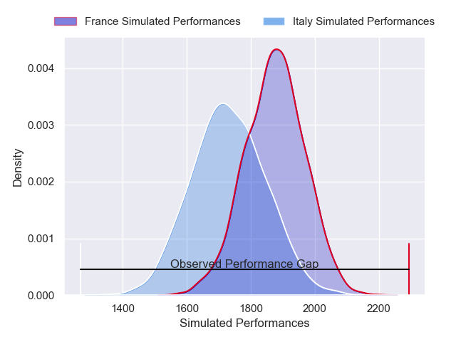
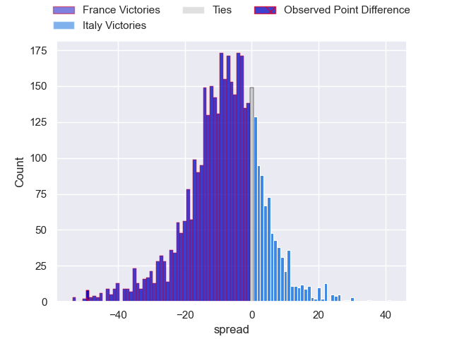
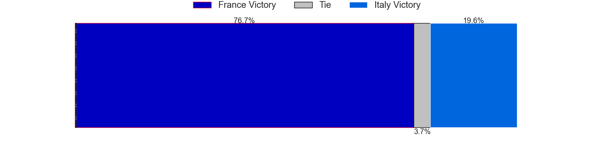
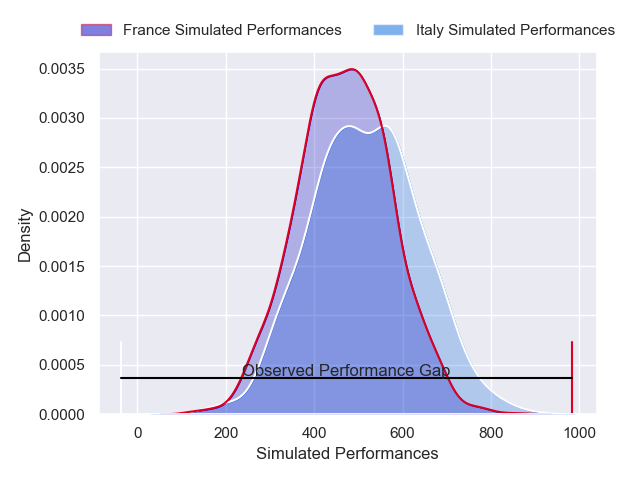
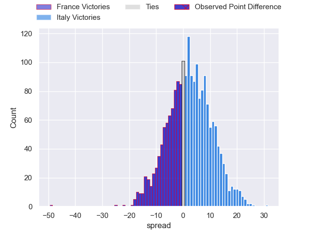
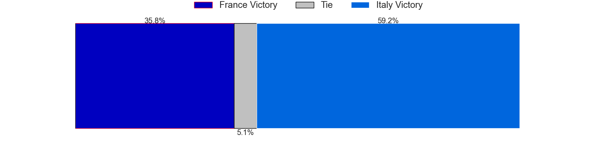

---  
layout: page  
title: France at Italy; 73-24  
date: 2025-02-23 18:00:00 -0500  
categories: "Six Nations Championship 2025" match review  
---
# France at Italy; 73-24

# Club Level Predictions

The first set of predictions treats a club as the smallest object, as the club develops its members, organizes a gameplan, and deploys its players as needed for each match. This club model has a prediction of 0.317, which translates to predicting France to win by 6.9.

Our Over/Under is 43.5 - and combined with the spread above, we have a predicted scoreline of 25 to 18

Each club has a rating and a rating deviation (similar to a Glicko rating), and expected performances can be generated. This allows for simulated matches and spreads like the ones below.
## Projected Performances - Club Model

## Projected Spreads - Club Model

## Projected Results - Club Model

# Player Level Predictions

Treating teams instead as an entity made up of the currently active players, I have ratings for each player in an altogether different system. These can be combined to form team ratings once teamsheets are announced, weighting starters a bit higher than the reserves. After the match is played, players can be weighted by their minutes on the field, allowing for an accurate measure of the team's composition. With these compiled team ratings, we can make predictions, measure inaccuracy, and update the individual player ratings.
## Prediction without Player Minutes: France by 0.7

France by 6.0 on a neutral pitch

## Projected Performances - Player Model

## Projected Spreads - Player Model

## Projected Results - Player Model

|   Away Minutes | Away Player          |   Away Percentile |   Number |   Home Percentile | Home Player        |   Home Minutes |
|---------------:|:---------------------|------------------:|---------:|------------------:|:-------------------|---------------:|
|             31 | Jean-Baptiste Gros   |             98.61 |        1 |             33.61 | Danilo Fischetti   |             80 |
|             33 | Peato Mauvaka        |             94.04 |        2 |             76.15 | Gianmarco Lucchesi |             80 |
|             21 | Uini Atonio          |             98.53 |        3 |             92.56 | Simone Ferrari     |             80 |
|             12 | Thibaud Flament      |             92.55 |        4 |             56.08 | Niccolo Cannone    |             17 |
|             49 | Mickael Guillard     |             70.41 |        5 |             93.87 | Federico Ruzza     |             55 |
|             60 | Francois Cros        |             96.43 |        6 |             77.84 | Sebastian Negri    |             80 |
|             20 | Paul Boudehent       |              6.76 |        7 |             94.08 | Michele Lamaro     |             49 |
|             60 | Gregory Alldritt     |             99.39 |        8 |             95.13 | Lorenzo Cannone    |             80 |
|             80 | Antoine Dupont       |            100    |        9 |             56.45 | Martin Page-Relo   |             62 |
|             14 | Thomas Ramos         |             95.59 |       10 |             73.32 | Paolo Garbisi      |             55 |
|             31 | Louis Bielle-Biarrey |             78.97 |       11 |              6.52 | Simone Gesi        |             34 |
|             31 | Yoram Moefana        |             90.46 |       12 |             91.78 | Tommaso Menoncello |             63 |
|             31 | Pierre-Louis Barassi |             85.79 |       13 |             92.18 | Juan Ignacio Brex  |             49 |
|             20 | Theo Attissogbe      |             28.65 |       14 |             97.89 | Ange Capuozzo      |             49 |
|              8 | Theo Attissogbe      |             28.65 |       14 |             97.89 | Ange Capuozzo      |             49 |
|             80 | Leo Barre            |             54    |       15 |             60.99 | Tommaso Allan      |             31 |
|             20 | Julien Marchand      |             98.98 |       16 |             96.76 | Giacomo Nicotera   |             66 |
|             14 | Cyril Baille         |             97.96 |       17 |             55.76 | Mirco Spagnolo     |             80 |
|             20 | Dorian Aldegheri     |             94.69 |       18 |             47.83 | Giosue Zilocchi    |             31 |
|             80 | Romain Taofifenua    |             28.18 |       19 |             19.07 | Riccardo Favretto  |             68 |
|             20 | Alexandre Roumat     |             95.57 |       20 |             64.79 | Manuel Zuliani     |             80 |
|             80 | Oscar Jegou          |             69.86 |       21 |             76.88 | Ross Vintcent      |             49 |
|             80 | Anthony Jelonch      |             99.8  |       22 |             60.59 | Alessandro Garbisi |             80 |
|             47 | Maxime Lucu          |             99.31 |       23 |             30.03 | Jacopo Trulla      |             34 |

