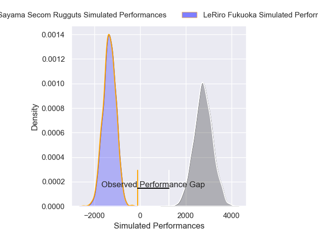
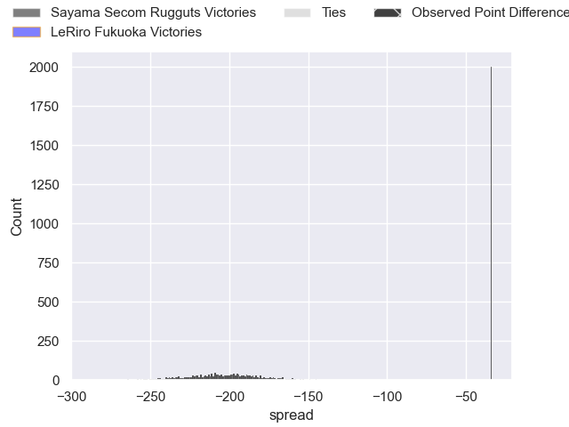
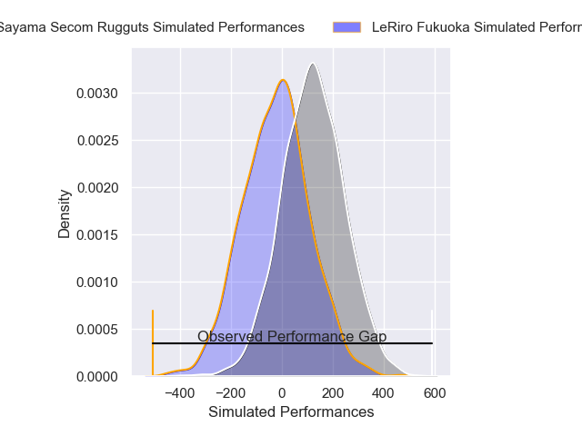
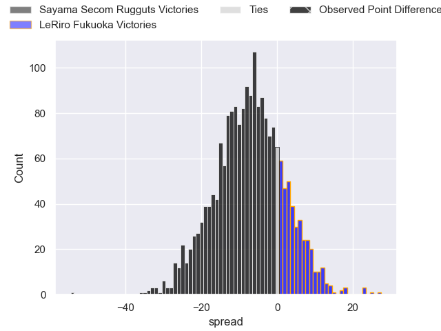

---  
layout: page  
title: Sayama Secom Rugguts at LeRiro Fukuoka; 57-3  
date: 2025-02-23 18:00:00 -0500  
categories: "Japan Rugby League One D3 24/25" match review  
---
# Sayama Secom Rugguts at LeRiro Fukuoka; 57-3

# Club Level Predictions

The first set of predictions treats a club as the smallest object, as the club develops its members, organizes a gameplan, and deploys its players as needed for each match. This club model has a prediction of 0.0, which translates to predicting Sayama Secom Rugguts to win by 205.1.

Our Over/Under is 44.5 - and combined with the spread above, we have a predicted scoreline of 125 to -80

Each club has a rating and a rating deviation (similar to a Glicko rating), and expected performances can be generated. This allows for simulated matches and spreads like the ones below.
## Projected Performances - Club Model

## Projected Spreads - Club Model

## Projected Results - Club Model

# Player Level Predictions

Treating teams instead as an entity made up of the currently active players, I have ratings for each player in an altogether different system. These can be combined to form team ratings once teamsheets are announced, weighting starters a bit higher than the reserves. After the match is played, players can be weighted by their minutes on the field, allowing for an accurate measure of the team's composition. With these compiled team ratings, we can make predictions, measure inaccuracy, and update the individual player ratings.
## Prediction without Player Minutes: Sayama Secom Rugguts by 11.1

Sayama Secom Rugguts by 13.3 on a neutral pitch

## Projected Performances - Player Model

## Projected Spreads - Player Model

## Projected Results - Player Model

|   Away Minutes | Away Player       |   Away Percentile |   Number |   Home Percentile | Home Player         |   Home Minutes |
|---------------:|:------------------|------------------:|---------:|------------------:|:--------------------|---------------:|
|             69 | Toshiki Sato      |             74.24 |        1 |             12.44 | Keita Kimura        |             25 |
|             20 | Shota Okuno       |             72.07 |        2 |              2.68 | Taiyou Minami       |             52 |
|             13 | Motoki Kaneko     |             64.37 |        3 |             20.87 | Rintarou Noda       |             80 |
|             11 | Itsuki Fujii      |             60.4  |        4 |              3.4  | Keita Terada        |             80 |
|             28 | Troy Callander    |             85.26 |        5 |             11.44 | Finau Makavaha      |             80 |
|             20 | Paker Ash         |             17.67 |        6 |             10.4  | Kennta Ueda         |             53 |
|             80 | Kento Mizutani    |             54.16 |        7 |             30.81 | Chikamasa Yana      |             73 |
|             53 | Whetu Douglas     |             74.02 |        8 |              5.08 | Kouta Nishimura     |             80 |
|             63 | Kanaru Takahashi  |             49.91 |        9 |             41.48 | Hisanori Mimata     |             17 |
|              7 | Shota Kutsuna     |             51.27 |       10 |              9.49 | Shotaro Matsuo      |             80 |
|             73 | Fisipuna Tuiaki   |             24.63 |       11 |             18.29 | Tsuyoshi Hasegawa   |             73 |
|             11 | TJ Faiane         |             96.74 |       12 |             21.82 | Rinto Kagawa        |             80 |
|             14 | Haruya Nakasu     |             30.6  |       13 |             13.03 | Masakazu Yatsumonji |             67 |
|             80 | Yushi Okuda       |             60.94 |       14 |              4.6  | Amanaki Lisala      |             27 |
|              3 | Chase Tiatia      |             67.07 |       15 |             21.34 | Hibiki Nakazawa     |             53 |
|             69 | Ayumu Sawada      |            nan    |       16 |            nan    | Syuuta Takami       |             25 |
|             80 | Shigeto Yamashita |            nan    |       17 |             12.64 | Issei Shige         |             52 |
|             80 | Yuto Takano       |            nan    |       18 |            nan    | Iosefatu Mareko     |             80 |
|             80 | Kentaro Ueno      |             65.65 |       19 |              9.71 | Tomoki Nobeta       |             69 |
|              7 | Tatsuki Tanina    |             73.24 |       20 |              3.88 | Karne Hesketh       |             27 |
|             80 | Yosuke Okuma      |            nan    |       21 |            nan    | Atsuro Nakamura     |             60 |
|             66 | Eito Tsutsumi     |            nan    |       22 |              5.23 | Kentaro Kamata      |             53 |
|             80 | Shoki Morimoto    |            nan    |       23 |            nan    | Syuuhei Harada      |             55 |

