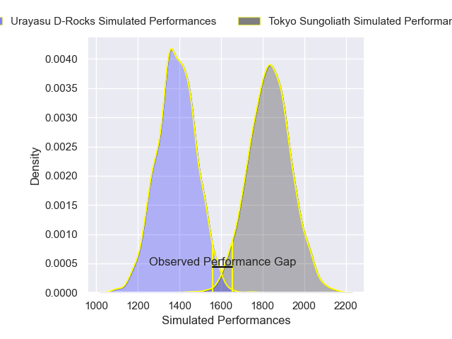
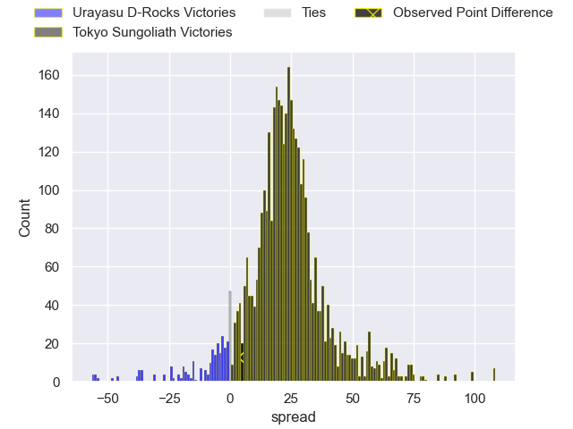
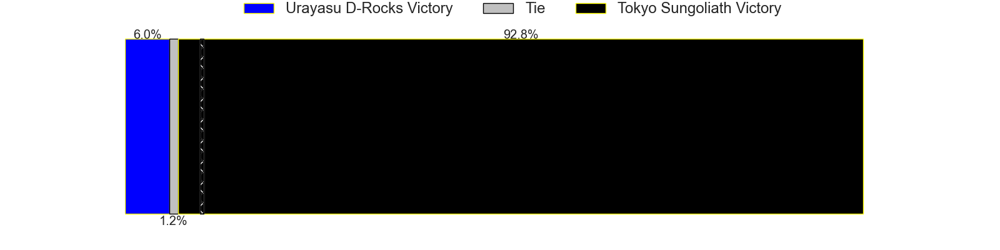
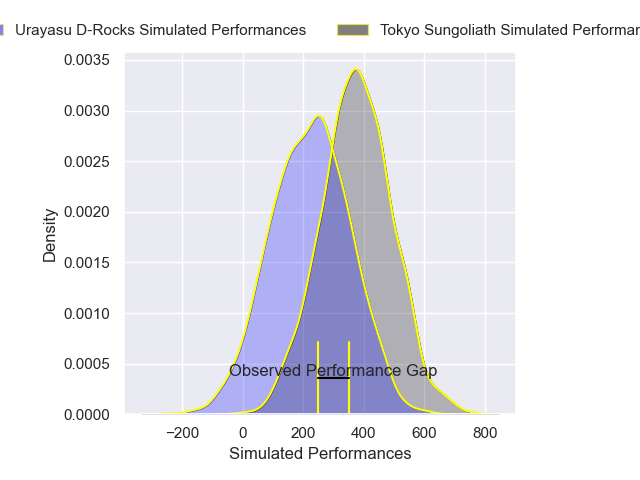
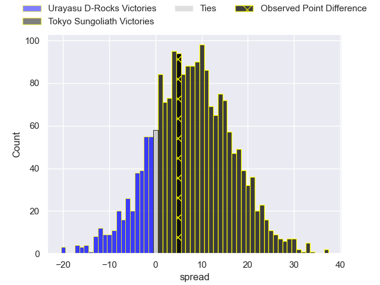
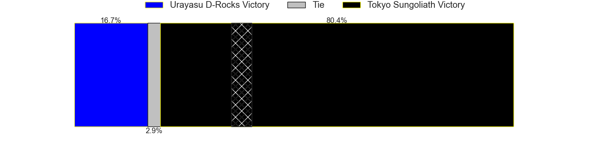

---  
layout: page  
title: Urayasu D-Rocks at Tokyo Sungoliath; 35-40  
date: 2025-02-23 18:00:00 -0500  
categories: "Japan Rugby League One 24/25" match review  
---
# Urayasu D-Rocks at Tokyo Sungoliath; 35-40

# Club Level Predictions

The first set of predictions treats a club as the smallest object, as the club develops its members, organizes a gameplan, and deploys its players as needed for each match. This club model has a prediction of 0.923, which translates to predicting Tokyo Sungoliath to win by 22.5.

Our Over/Under is 67.5 - and combined with the spread above, we have a predicted scoreline of 23 to 45

Each club has a rating and a rating deviation (similar to a Glicko rating), and expected performances can be generated. This allows for simulated matches and spreads like the ones below.
## Projected Performances - Club Model

## Projected Spreads - Club Model

## Projected Results - Club Model

# Player Level Predictions

Treating teams instead as an entity made up of the currently active players, I have ratings for each player in an altogether different system. These can be combined to form team ratings once teamsheets are announced, weighting starters a bit higher than the reserves. After the match is played, players can be weighted by their minutes on the field, allowing for an accurate measure of the team's composition. With these compiled team ratings, we can make predictions, measure inaccuracy, and update the individual player ratings.
## Prediction without Player Minutes: Tokyo Sungoliath by 8.6

Tokyo Sungoliath by 3.7 on a neutral pitch

## Projected Performances - Player Model

## Projected Spreads - Player Model

## Projected Results - Player Model

|   Away Minutes | Away Player         |   Away Percentile |   Number |   Home Percentile | Home Player         |   Home Minutes |
|---------------:|:--------------------|------------------:|---------:|------------------:|:--------------------|---------------:|
|             80 | Hidetomo Nabeshima  |              9.55 |        1 |             44.86 | Kenta Kobayashi     |             80 |
|             40 | Ryuji Fujimura      |             15.55 |        2 |             63.04 | Kienori Go          |             80 |
|             80 | Kim Ryom            |             77.45 |        3 |             90.45 | Shinnosuke Kakinaga |             80 |
|             80 | Wimpie van der Walt |             84.69 |        4 |             94.14 | Sam Jeffries        |             80 |
|             27 | Lourens Erasmus     |             75.61 |        5 |             98.02 | Harry Hockings      |             80 |
|             50 | Tom Parsons         |             71.64 |        6 |             75.61 | Kanji Shimokawa     |             14 |
|             14 | Daishi Kojima       |             47.35 |        7 |             99.05 | Sam Cane            |             80 |
|             80 | Tone Tukufuka       |             95.9  |        8 |             79.88 | Ryuga Hashimoto     |             23 |
|             20 | Ren Iinuma          |             75.22 |        9 |             55.08 | Yutaka Nagare       |             21 |
|             80 | Otere Black         |             64.98 |       10 |             77    | Mikiya Takamoto     |             59 |
|             14 | Caleb Cavubati      |             22.52 |       11 |             70.04 | Hideto Niguma       |             80 |
|             80 | Samu Kerevi         |             94.08 |       12 |             31.29 | Shogo Nakano        |             27 |
|             47 | Shane Gates         |             18.95 |       13 |             78.28 | Taiga Ozaki         |             33 |
|             80 | Soma Matsumoto      |             52.94 |       14 |             90.81 | Seiya Ozaki         |             13 |
|             60 | Luteru Laulala      |             68.09 |       15 |             43.5  | Ryosuke Kawase      |             17 |
|              7 | Shuhei Takeuchi     |              6.98 |       16 |             21.74 | Tatsuya Miyazaki    |             17 |
|             21 | Hendrik Tui         |             31.29 |       17 |             86.12 | Yukio Morikawa      |             80 |
|             80 | Brody MacAskill     |             93.01 |       18 |             21.74 | Trevor Hosea        |             73 |
|             66 | Tetta Shigemitsu    |             21.83 |       19 |             41.09 | Kotaro Hosoki       |             20 |
|             60 | Sekonaia Pole       |            nan    |       20 |            nan    | Takaaki Nakazuru    |              7 |
|             60 | Shokei Kin          |            nan    |       21 |             25.8  | Kai Yamamoto        |             59 |
|             57 | Norifumi Hashimoto  |              1.72 |       22 |            nan    | Max Hughes          |             66 |
|             55 | Takuhei Yasuda      |             82.52 |       23 |            nan    | Keisuke Moriya      |             59 |

