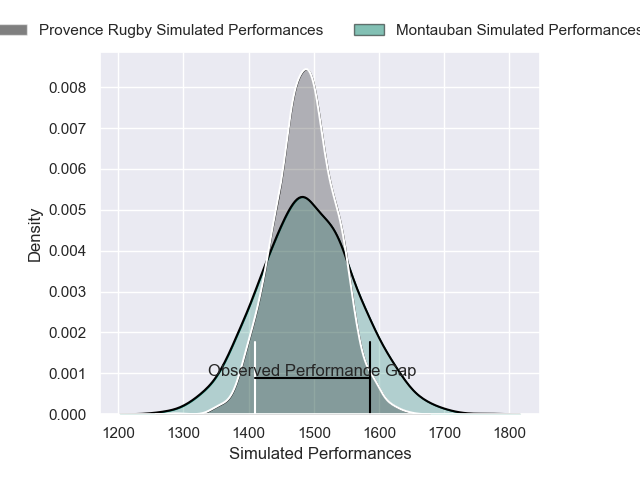
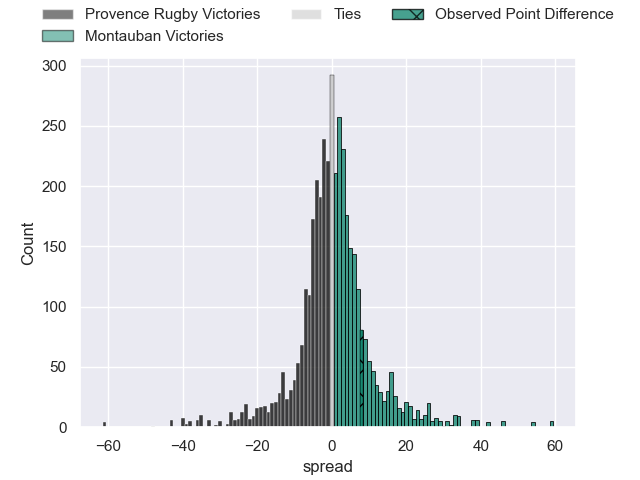
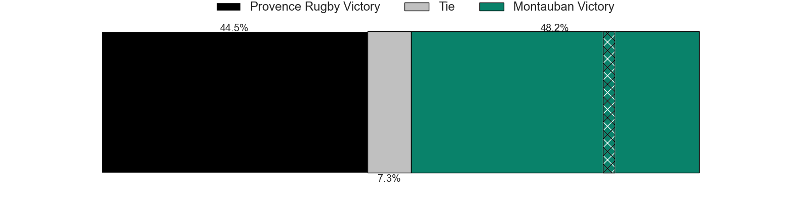
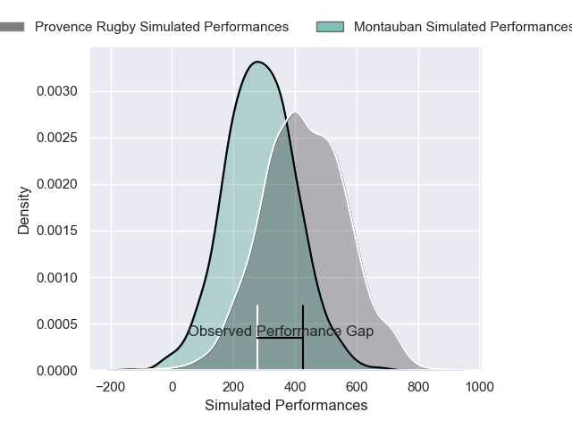
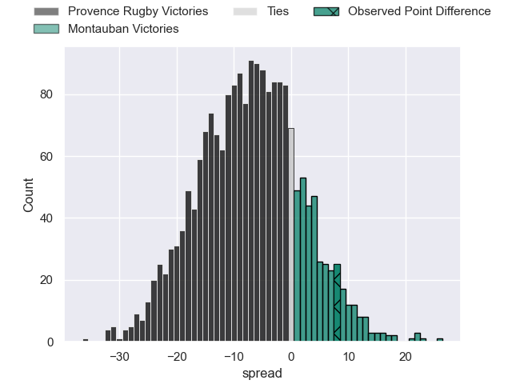
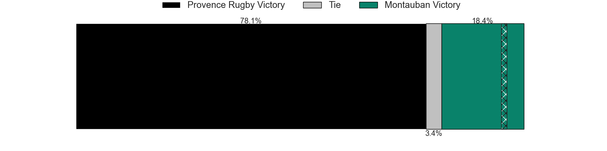

---  
layout: page  
title: Provence Rugby at Montauban; 28-36  
date: 2025-02-27 18:00:00 -0500  
categories: "Pro D2 24/25" match review  
---
# Provence Rugby at Montauban; 28-36

# Club Level Predictions

The first set of predictions treats a club as the smallest object, as the club develops its members, organizes a gameplan, and deploys its players as needed for each match. This club model has a prediction of 0.507, which translates to predicting Montauban to win by 0.2.

Our Over/Under is 49.5 - and combined with the spread above, we have a predicted scoreline of 24 to 25

Each club has a rating and a rating deviation (similar to a Glicko rating), and expected performances can be generated. This allows for simulated matches and spreads like the ones below.
## Projected Performances - Club Model

## Projected Spreads - Club Model

## Projected Results - Club Model

# Player Level Predictions

Treating teams instead as an entity made up of the currently active players, I have ratings for each player in an altogether different system. These can be combined to form team ratings once teamsheets are announced, weighting starters a bit higher than the reserves. After the match is played, players can be weighted by their minutes on the field, allowing for an accurate measure of the team's composition. With these compiled team ratings, we can make predictions, measure inaccuracy, and update the individual player ratings.
## Prediction without Player Minutes: Provence Rugby by 6.0

Provence Rugby by 16.9 on a neutral pitch

## Projected Performances - Player Model

## Projected Spreads - Player Model

## Projected Results - Player Model

|   Away Minutes | Away Player              |   Away Percentile |   Number |   Home Percentile | Home Player       |   Home Minutes |
|---------------:|:-------------------------|------------------:|---------:|------------------:|:------------------|---------------:|
|             57 | Hayden Thompson-Stringer |             92.22 |        1 |             59.32 | Leo Aouf          |             80 |
|             80 | Hayden Thompson-Stringer |             92.22 |        1 |             59.32 | Leo Aouf          |             80 |
|             34 | Hayden Thompson-Stringer |             92.22 |        1 |             59.32 | Leo Aouf          |             80 |
|             31 | Kapeli Pifeleti          |              5.97 |        2 |             10.95 | Kevin Firmin      |             17 |
|             66 | Enrique Pieretto         |             29.74 |        3 |             75.77 | Facundo Pomponio  |             80 |
|             31 | Josh Tyrell              |             69.98 |        4 |              7.74 | Tjuee Uanivi      |             20 |
|             25 | Izack Rodda              |             80.11 |        5 |             69.6  | Noa Kanika        |             80 |
|             59 | Andres Zafra Tarazona    |              0.85 |        6 |              2.73 | Frédéric Quercy   |             21 |
|             23 | Charly Gambini           |             83.08 |        7 |             72.74 | Kyllian Ringuet   |             25 |
|             81 | Teimana Harrison         |             63.45 |        8 |             80.32 | Sikhumbuzo Notshe |             33 |
|             81 | Joris Cazenave           |             77.07 |        9 |             41.9  | Hugo Zabalza      |             37 |
|             49 | Jules Plisson            |             67.37 |       10 |             86.95 | Jérôme Bosviel    |             80 |
|             49 | Nadir Bouhedjeur         |             88.98 |       11 |             40.68 | Josua Vici        |             80 |
|             10 | Jimmy Gopperth           |             93.21 |       12 |             78.62 | Simon Renda       |             49 |
|             32 | George North             |             98.7  |       13 |             59.44 | JT Jackson        |             49 |
|             32 | Paul Cellio Zwiler       |             38.14 |       14 |             75.61 | Yvan Reilhac      |             49 |
|             40 | Mathias Colombet         |             52.65 |       15 |              2.65 | Segundo Tuculet   |             49 |
|             81 | Joseph Laget             |             37.98 |       16 |             84.08 | Baptiste Mouchous |             46 |
|             81 | Paul Mallez              |             85.9  |       17 |              2.77 | Victor Moreaux    |             69 |
|             47 | Thomas Vernet            |             80.71 |       18 |             76.18 | Tietie Tuimauga   |             80 |
|             81 | Arthur Coville           |             30.34 |       19 |             45.85 | Maxime Espeut     |             80 |
|             41 | Adrien Lapegue-Lafaye    |             22.5  |       20 |             75.34 | Joe Powell        |             11 |
|             55 | Jules Soulan             |             74.53 |       21 |             77.06 | Clément Bitz      |             80 |
|             34 | Baptiste Belhadj         |             70.28 |       22 |            nan    | nan               |            nan |
|             63 | Alessio Contigliani      |            nan    |       23 |            nan    | nan               |            nan |

