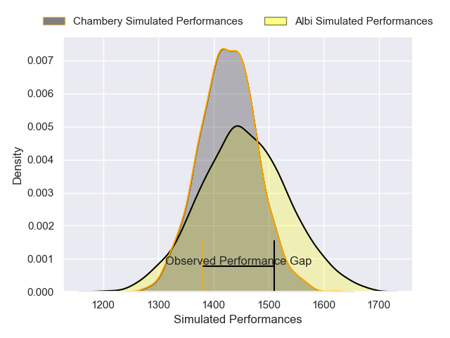
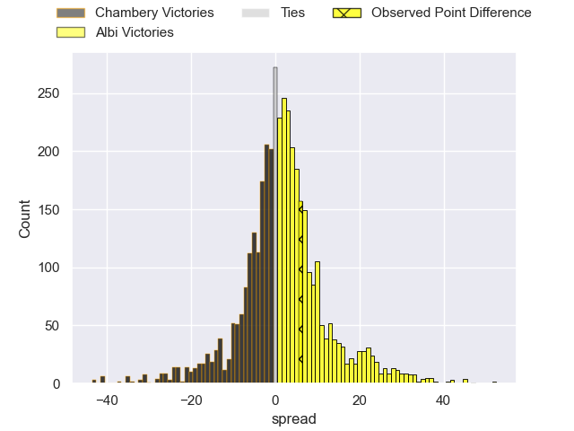
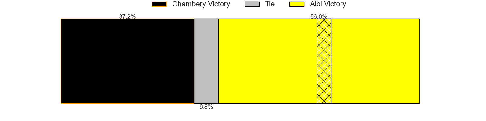
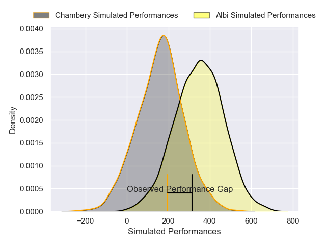
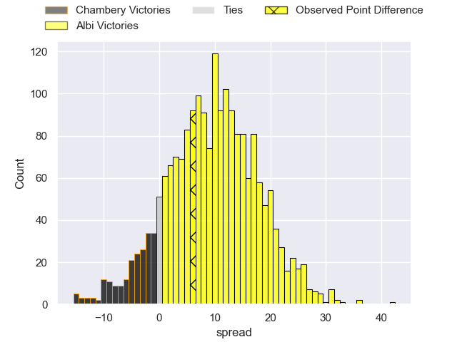
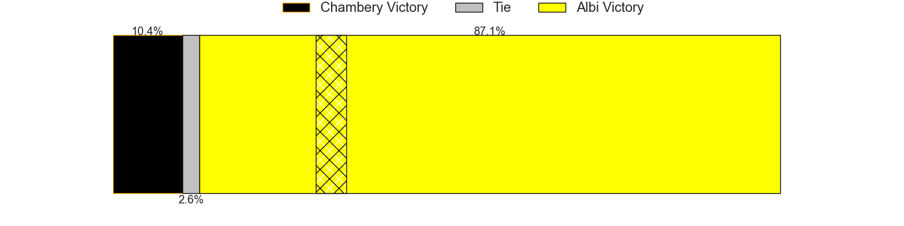

---  
layout: page  
title: Chambery at Albi; 16-22  
date: 2025-02-28 18:00:00 -0500  
categories: "Nationale 24/25" match review  
---
# Chambery at Albi; 16-22

# Club Level Predictions

The first set of predictions treats a club as the smallest object, as the club develops its members, organizes a gameplan, and deploys its players as needed for each match. This club model has a prediction of 0.544, which translates to predicting Albi to win by 1.5.

Our Over/Under is 32.5 - and combined with the spread above, we have a predicted scoreline of 15 to 17

Each club has a rating and a rating deviation (similar to a Glicko rating), and expected performances can be generated. This allows for simulated matches and spreads like the ones below.
## Projected Performances - Club Model

## Projected Spreads - Club Model

## Projected Results - Club Model

# Player Level Predictions

Treating teams instead as an entity made up of the currently active players, I have ratings for each player in an altogether different system. These can be combined to form team ratings once teamsheets are announced, weighting starters a bit higher than the reserves. After the match is played, players can be weighted by their minutes on the field, allowing for an accurate measure of the team's composition. With these compiled team ratings, we can make predictions, measure inaccuracy, and update the individual player ratings.
## Prediction without Player Minutes: Albi by 8.6

Chambery by 2.9 on a neutral pitch

## Projected Performances - Player Model

## Projected Spreads - Player Model

## Projected Results - Player Model

|   Away Minutes | Away Player          |   Away Percentile |   Number |   Home Percentile | Home Player            |   Home Minutes |
|---------------:|:---------------------|------------------:|---------:|------------------:|:-----------------------|---------------:|
|             80 | Enzo Segui           |             60.96 |        1 |             32.08 | Antoine Soave          |              0 |
|             80 | Julien Pierdomenico  |             64.32 |        2 |             43.89 | Dimitri Chauvet        |             23 |
|             26 | Osman Dimen          |             31.52 |        3 |             88.24 | Maks van Dyk           |             80 |
|             52 | Taniela Matakaiongo  |             67.01 |        4 |             47.5  | Theo Mercadier         |             82 |
|             57 | Fabien Witz          |             74.46 |        5 |             47.6  | Jonathan Kpoku         |             82 |
|             27 | Pierre-Nicolas Dance |             70.86 |        6 |             53.17 | Robin Dione            |             82 |
|             25 | Colin Lebian         |             81.01 |        7 |             10.43 | Mattéo Coustalat       |             56 |
|             10 | Tui Uru              |             83.51 |        8 |             31.34 | Guillem Calmon         |             32 |
|             16 | Aubin Eymeri         |             57.19 |        9 |             71.92 | Gilen Queheille        |             40 |
|             22 | Arwel Robson         |             51.24 |       10 |             17.84 | Victor Pisano          |             60 |
|             51 | Arthur Nennig        |             90.47 |       11 |             41.81 | Kamilieni Raivono      |             58 |
|             67 | Mickael Blanc        |             28.4  |       12 |             10.21 | Leo Treilles           |             80 |
|             26 | Emmanuel Vaitulukina |             79.88 |       13 |             29.83 | Victorien Jacomme      |             62 |
|             48 | Paul Altier          |             91.58 |       14 |             62.72 | Simon Hartmann         |             64 |
|             50 | Enzo Marzocca        |             56.31 |       15 |             36.67 | Téo Dospital           |             48 |
|             80 | Lasha Tabidze        |             87.84 |       16 |             92.85 | Nasoni Naqiri Kunavore |             27 |
|             30 | Nugzar Somkhishvili  |             87.04 |       17 |             32.56 | Esteban Talalua        |             82 |
|             54 | Quentin Beaudaux     |             68.17 |       18 |             25.8  | Arthur Castant         |             46 |
|             80 | Maewen Sao           |             55.77 |       19 |             82.53 | Théo Vidal             |             80 |
|             48 | Thibault Moreno      |             64.11 |       20 |             20.72 | Lucas Pindor           |             12 |
|             80 | Mateo Guerret        |             51.54 |       21 |             73.8  | Vincent Mutel          |             23 |
|             80 | Antoine Ferreira     |             54.28 |       22 |             79.89 | Ianis Ponsole          |             58 |
|             28 | Baptiste Collet      |            nan    |       23 |            nan    | nan                    |            nan |

