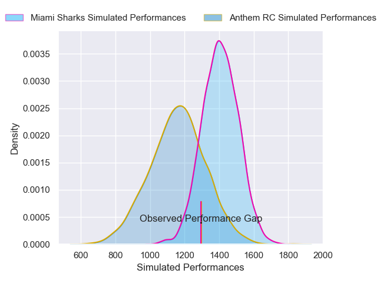
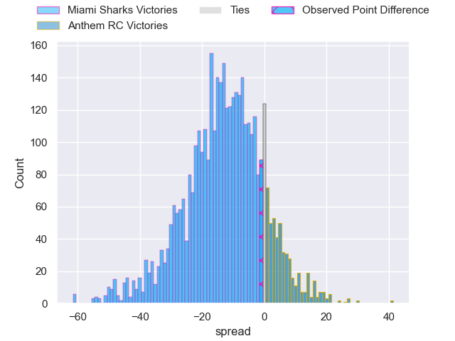
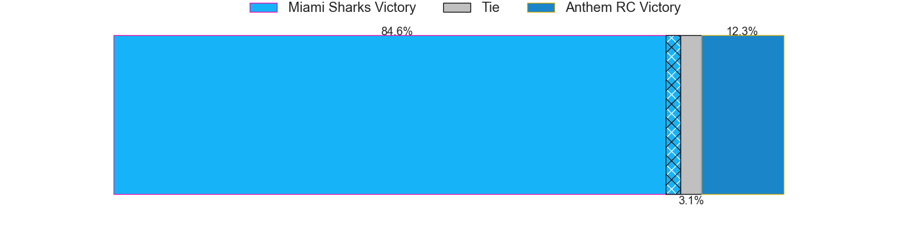
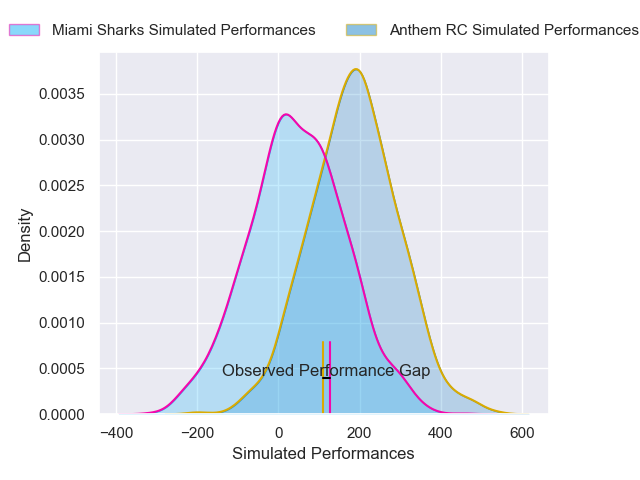
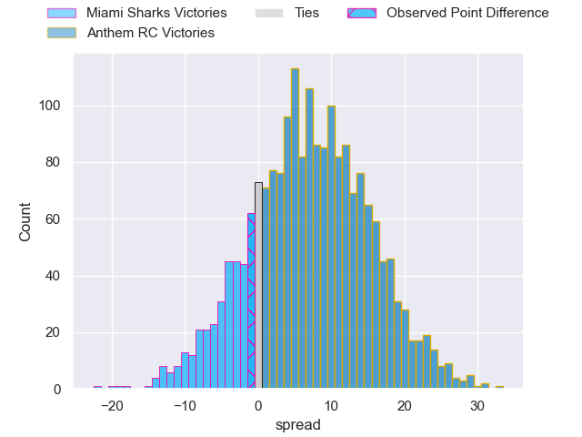
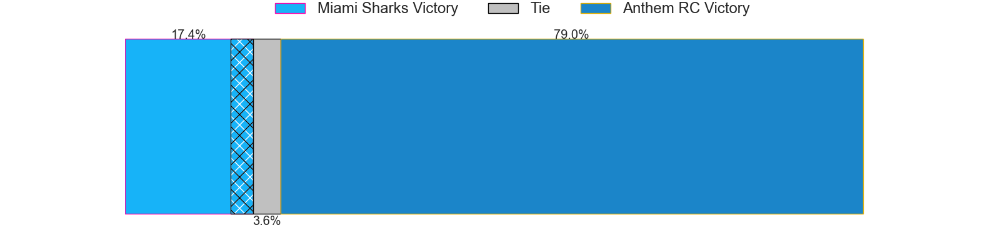

---  
layout: page  
title: Miami Sharks at Anthem RC; 32-31  
date: 2025-02-28 18:00:00 -0500  
categories: "Major League Rugby 2025" match review  
---
# Miami Sharks at Anthem RC; 32-31

# Club Level Predictions

The first set of predictions treats a club as the smallest object, as the club develops its members, organizes a gameplan, and deploys its players as needed for each match. This club model has a prediction of 0.201, which translates to predicting Miami Sharks to win by 12.7.

Our Over/Under is 51.5 - and combined with the spread above, we have a predicted scoreline of 32 to 19

Each club has a rating and a rating deviation (similar to a Glicko rating), and expected performances can be generated. This allows for simulated matches and spreads like the ones below.
## Projected Performances - Club Model

## Projected Spreads - Club Model

## Projected Results - Club Model

# Player Level Predictions

Treating teams instead as an entity made up of the currently active players, I have ratings for each player in an altogether different system. These can be combined to form team ratings once teamsheets are announced, weighting starters a bit higher than the reserves. After the match is played, players can be weighted by their minutes on the field, allowing for an accurate measure of the team's composition. With these compiled team ratings, we can make predictions, measure inaccuracy, and update the individual player ratings.
## Prediction without Player Minutes: Anthem RC by 7.8

Anthem RC by 5.6 on a neutral pitch

## Projected Performances - Player Model

## Projected Spreads - Player Model

## Projected Results - Player Model

|   Away Minutes | Away Player         |   Away Percentile |   Number |   Home Percentile | Home Player              |   Home Minutes |
|---------------:|:--------------------|------------------:|---------:|------------------:|:-------------------------|---------------:|
|             46 | Ma'ake Muti         |             55.62 |        1 |              6.76 | Jake Turnbull            |             30 |
|             16 | Kirby Myhill        |             15.8  |        2 |             30.08 | Connor Robinson          |             49 |
|             24 | Tau Koloamatangi    |              3.83 |        3 |             55.54 | Alex Maughan             |             31 |
|             26 | Mauro Rebussone     |             38.17 |        4 |             31.2  | Viliami Vuli             |             28 |
|             27 | Federico Gutierrez  |             52.96 |        5 |             24.43 | Mikey Grandy             |             55 |
|             29 | Manuel Ardao        |             63.64 |        6 |             19.78 | Sam Golla                |             80 |
|             28 | Benja Bonassoa      |             39.83 |        7 |             23.9  | Makeen Alikhan           |             55 |
|             28 | Marques Fuala'au    |             47.6  |        8 |             19.62 | Dylan Fortune            |             80 |
|             10 | Tomas Inciarte      |             16.58 |        9 |             20.24 | Carlo De Nysschen        |             16 |
|              2 | Martin Elias        |             42.53 |       10 |             29.89 | Karl Keane               |              3 |
|             80 | Tomas Cubilla       |             78.49 |       11 |             19.87 | Jason Tidwell            |             21 |
|             50 | Guiseppe du Toit    |              7.03 |       12 |             19.78 | Junior Gafa              |             11 |
|             80 | Matias Orlando      |              5.92 |       13 |             25.2  | Erich Storti             |             82 |
|             80 | Marcos Young        |             57.98 |       14 |             82.86 | Conner Mooneyham         |             82 |
|             35 | Santiago Videla     |             18.44 |       15 |             20.49 | Line Latu                |             40 |
|             58 | Sean McNulty        |            nan    |       16 |             28.4  | Ethan Howard             |             80 |
|             80 | Jonas Petrakopoulos |            nan    |       17 |            nan    | Dan Hanson               |             58 |
|             71 | Alex Tucci          |            nan    |       18 |             77.44 | Joe Apikotoa             |             80 |
|             71 | Chase Schor Haskin  |            nan    |       19 |            nan    | Alejandro Martinez Tapia |             80 |
|             82 | Tomas Bekerman      |            nan    |       20 |            nan    | Michael Ma'afu           |             55 |
|             61 | Damien Morley       |            nan    |       21 |            nan    | Ishma-Eel Safodien       |             64 |
|             81 | Shane O'Leary       |              9.63 |       22 |            nan    | Watson Filikitonga       |             35 |
|             47 | Lautaro Soto-Ansay  |            nan    |       23 |            nan    | Ernest Freeman           |             11 |

