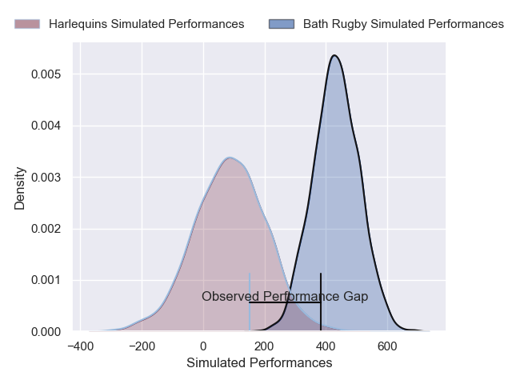
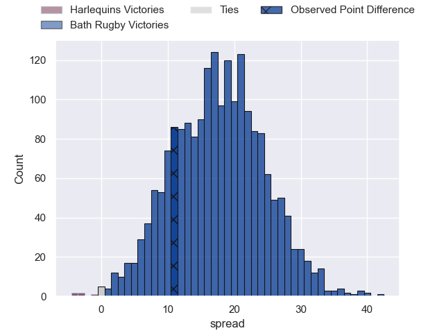

---  
layout: page  
title: Harlequins at Bath Rugby; 28-39  
date: 2025-02-28 18:00:00 -0500  
categories: "Premiership Rugby Cup 24/25" match review  
---
# Harlequins at Bath Rugby; 28-39

# Club Level Predictions

The first set of predictions treats a club as the smallest object, as the club develops its members, organizes a gameplan, and deploys its players as needed for each match. This club model has a prediction of 0.723, which translates to predicting Bath Rugby to win by 8.5.

Our Over/Under is 51.5 - and combined with the spread above, we have a predicted scoreline of 21 to 30

Each club has a rating and a rating deviation (similar to a Glicko rating), and expected performances can be generated. This allows for simulated matches and spreads like the ones below.
## Projected Performances - Club Model

## Projected Spreads - Club Model

## Projected Results - Club Model

# Player Level Predictions

Treating teams instead as an entity made up of the currently active players, I have ratings for each player in an altogether different system. These can be combined to form team ratings once teamsheets are announced, weighting starters a bit higher than the reserves. After the match is played, players can be weighted by their minutes on the field, allowing for an accurate measure of the team's composition. With these compiled team ratings, we can make predictions, measure inaccuracy, and update the individual player ratings.
## Prediction without Player Minutes: Bath Rugby by 10.5

Harlequins by 3.5 on a neutral pitch

## Projected Performances - Player Model

## Projected Spreads - Player Model

## Projected Results - Player Model

|   Away Minutes | Away Player      |   Away Percentile |   Number |   Home Percentile | Home Player      |   Home Minutes |
|---------------:|:-----------------|------------------:|---------:|------------------:|:-----------------|---------------:|
|             80 | Jordan Els       |             40.11 |        1 |            nan    | nan              |            nan |
|             80 | Sam Riley        |             83.75 |        2 |            nan    | nan              |            nan |
|             40 | Titi Lamositele  |             16.13 |        3 |            nan    | nan              |            nan |
|             80 | Irne Herbst      |             16.63 |        4 |            nan    | nan              |            nan |
|              7 | Joe Launchbury   |             95.03 |        5 |            nan    | nan              |            nan |
|             72 | George Hammond   |             49.44 |        6 |            nan    | nan              |            nan |
|             10 | Will Evans       |             73.5  |        7 |            nan    | nan              |            nan |
|             80 | Lucas Schmid     |             47.59 |        8 |            nan    | nan              |            nan |
|             74 | Jake Murray      |             47.24 |        9 |            nan    | nan              |            nan |
|             40 | Jarrod Evans     |             59.79 |       10 |            nan    | nan              |            nan |
|             57 | Cameron Anderson |             73.45 |       11 |            nan    | nan              |            nan |
|             64 | Ben Waghorn      |             49.95 |       12 |            nan    | nan              |            nan |
|              3 | Will Joseph      |             83.12 |       13 |            nan    | nan              |            nan |
|             22 | Rodrigo Isgro    |             62.34 |       14 |            nan    | nan              |            nan |
|              3 | Tyrone Green     |             19.8  |       15 |             53.06 | Tom de Glanville |             44 |
|             40 | Jack Walker      |             10.78 |       16 |             97.84 | Tom Dunn         |             26 |
|             14 | Simon Kerrod     |             33.06 |       17 |             98.22 | Beno Obano       |             80 |
|             23 | Will Hobson      |            nan    |       18 |             99.84 | Thomas du Toit   |             12 |
|             80 | Jonny Green      |             38.34 |       19 |            nan    | Tom Cowan        |             36 |
|             40 | Tom Lawday       |            nan    |       20 |             11.75 | Guy Pepper       |             57 |
|             80 | Jonny Law        |             32.59 |       21 |             85.69 | Louis Schreuder  |             23 |
|             44 | Jamie Benson     |             36.21 |       22 |             97.18 | Joe Cokanasiga   |             80 |
|            nan | nan              |            nan    |       23 |             50    | Jaco Coetzee     |             80 |

