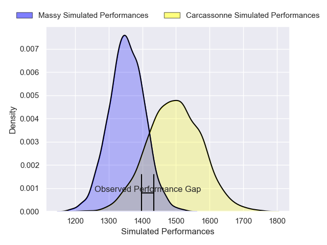
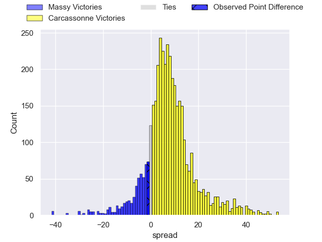
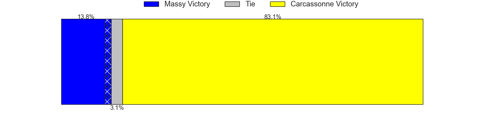
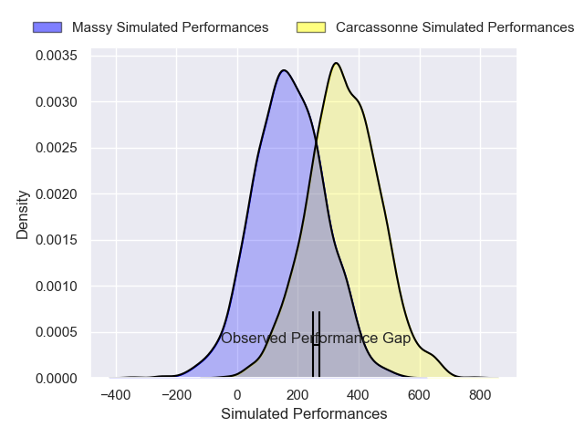
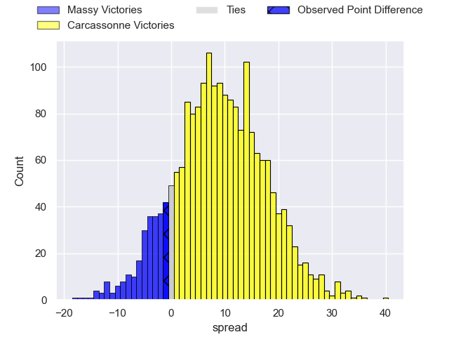
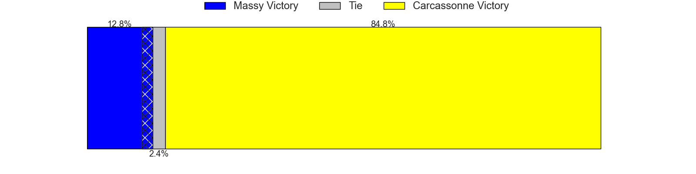

---  
layout: page  
title: Massy at Carcassonne; 20-19  
date: 2025-02-28 18:00:00 -0500  
categories: "Nationale 24/25" match review  
---
# Massy at Carcassonne; 20-19

# Club Level Predictions

The first set of predictions treats a club as the smallest object, as the club develops its members, organizes a gameplan, and deploys its players as needed for each match. This club model has a prediction of 0.691, which translates to predicting Carcassonne to win by 7.1.

Our Over/Under is 36.5 - and combined with the spread above, we have a predicted scoreline of 15 to 22

Each club has a rating and a rating deviation (similar to a Glicko rating), and expected performances can be generated. This allows for simulated matches and spreads like the ones below.
## Projected Performances - Club Model

## Projected Spreads - Club Model

## Projected Results - Club Model

# Player Level Predictions

Treating teams instead as an entity made up of the currently active players, I have ratings for each player in an altogether different system. These can be combined to form team ratings once teamsheets are announced, weighting starters a bit higher than the reserves. After the match is played, players can be weighted by their minutes on the field, allowing for an accurate measure of the team's composition. With these compiled team ratings, we can make predictions, measure inaccuracy, and update the individual player ratings.
## Prediction without Player Minutes: Carcassonne by 9.9

Carcassonne by 0.8 on a neutral pitch

## Projected Performances - Player Model

## Projected Spreads - Player Model

## Projected Results - Player Model

|   Away Minutes | Away Player            |   Away Percentile |   Number |   Home Percentile | Home Player           |   Home Minutes |
|---------------:|:-----------------------|------------------:|---------:|------------------:|:----------------------|---------------:|
|             29 | Robin Poipy            |             46.4  |        1 |             73.84 | Yan Arnold            |             82 |
|             80 | Adrien Sonzogni        |             76.21 |        2 |             51.09 | Raphael Carbou        |             36 |
|             60 | Nicolas Ferrer         |             80.8  |        3 |             69.6  | Siua Halanukonuka     |             80 |
|             59 | Hilan Delbois Fontaine |             73.89 |        4 |             14.61 | Romain Manchia        |             79 |
|             25 | Saba Pesvianidze       |             81.53 |        5 |             12.06 | Marius Iftimiciuc     |             82 |
|             56 | Tony Tissot            |             67.13 |        6 |             71.14 | Gary Graham           |              0 |
|             80 | Giani Gamba            |             64.25 |        7 |             85.94 | Etienne Herjean       |             82 |
|             51 | Simon Cowley           |             67.63 |        8 |             46.8  | Ferdinand Dreno       |             31 |
|             16 | Lucas Rubio            |             52.74 |        9 |             35.96 | Yvan David            |             82 |
|             16 | Antonin Vidalenc       |             49.38 |       10 |             36.93 | Johnny McPhillips     |             80 |
|             34 | Alex Preira            |             90.29 |       11 |             89.92 | Clement Egiziano      |             80 |
|             80 | Luca Mignot            |             83.45 |       12 |             14.4  | Jordan Puletua        |             80 |
|             28 | Anthony Favier         |             52.91 |       13 |             47.7  | Mathys Barka          |             48 |
|             21 | Giorgi Gogoladze       |             13.69 |       14 |             18.69 | Naim Ben Alla         |             26 |
|             26 | Alexandre Borie        |             27.25 |       15 |             86.37 | Maxime Gianet         |             80 |
|             28 | Siegfried Fisi'ihoi    |             53.52 |       16 |             44.96 | Florent Lorenzon      |             61 |
|             54 | Pierre Trassoudaine    |             91.12 |       17 |            nan    | Baptiste Moreno       |             64 |
|             80 | Tijde Visser           |             61.28 |       18 |             84.56 | Fabien Lorenzon       |             31 |
|             26 | Nelson Lothaire        |            nan    |       19 |             79.64 | Romain Guyot          |             25 |
|             80 | Noa Rolnin             |            nan    |       20 |             30.73 | Corentin Bousquet     |             19 |
|             82 | Julien Blanc           |             73.97 |       21 |             21.23 | Tomas Munilla lo Duca |             29 |
|             80 | Ilian El Yahyaoui      |             61.15 |       22 |             44.49 | Nils Chalies          |             29 |
|             52 | Lowen Michel Trumeau   |            nan    |       23 |             55.5  | Paul Gadea            |             29 |

