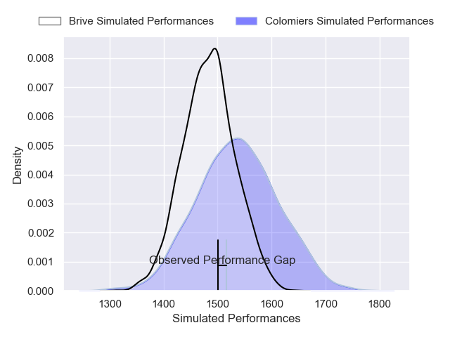
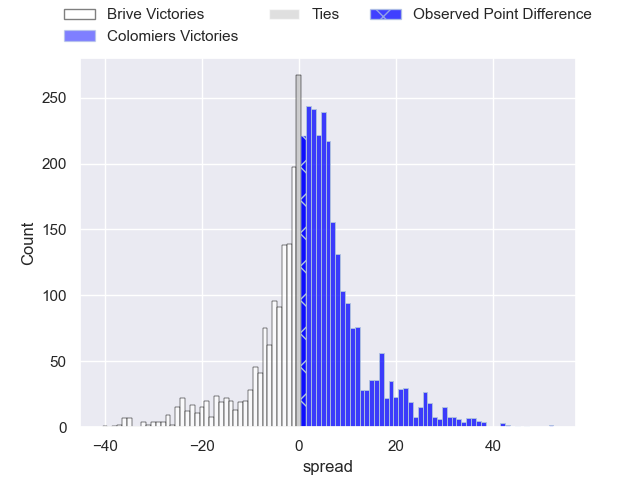
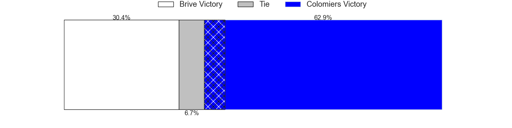
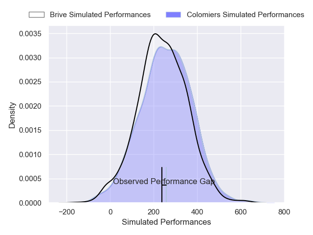
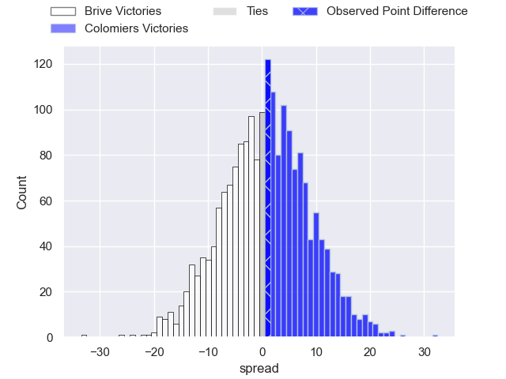

---  
layout: page  
title: Brive at Colomiers; 19-20  
date: 2025-02-28 18:00:00 -0500  
categories: "Pro D2 24/25" match review  
---
# Brive at Colomiers; 19-20

# Club Level Predictions

The first set of predictions treats a club as the smallest object, as the club develops its members, organizes a gameplan, and deploys its players as needed for each match. This club model has a prediction of 0.57, which translates to predicting Colomiers to win by 2.5.

Our Over/Under is 42.5 - and combined with the spread above, we have a predicted scoreline of 20 to 22

Each club has a rating and a rating deviation (similar to a Glicko rating), and expected performances can be generated. This allows for simulated matches and spreads like the ones below.
## Projected Performances - Club Model

## Projected Spreads - Club Model

## Projected Results - Club Model

# Player Level Predictions

Treating teams instead as an entity made up of the currently active players, I have ratings for each player in an altogether different system. These can be combined to form team ratings once teamsheets are announced, weighting starters a bit higher than the reserves. After the match is played, players can be weighted by their minutes on the field, allowing for an accurate measure of the team's composition. With these compiled team ratings, we can make predictions, measure inaccuracy, and update the individual player ratings.
## Prediction without Player Minutes: Brive by 0.4

Brive by 12.7 on a neutral pitch

## Projected Performances - Player Model

## Projected Spreads - Player Model

## Projected Results - Player Model

|   Away Minutes | Away Player               |   Away Percentile |   Number |   Home Percentile | Home Player         |   Home Minutes |
|---------------:|:--------------------------|------------------:|---------:|------------------:|:--------------------|---------------:|
|             80 | Vakh Abdaladze            |             87.92 |        1 |             10.64 | Elias El Ansari     |             80 |
|             80 | Benjamin Boudou           |             78.22 |        2 |             65.33 | Pablo Dimcheff      |             80 |
|             25 | Marcel van der Merwe      |             17.68 |        3 |             52.72 | Marco Fepulea'i     |             64 |
|             58 | Asier Usarraga            |             91.71 |        4 |             49.86 | Jean Thomas         |             80 |
|             80 | Tevita Ratuva             |             50.24 |        5 |             40.62 | Janse Roux          |             80 |
|             44 | Geoffrey Malaterre        |             79.98 |        6 |              6.42 | Anthony Coletta     |             80 |
|             44 | Courtney Lawes            |             97.67 |        7 |             74.3  | Aldric Lescure      |             65 |
|             33 | Retief Marais             |             88.04 |        8 |             20.62 | Caleb Timu          |             25 |
|             32 | Mathis Ferté              |             60.62 |        9 |             41.44 | Mathis Galthié      |             25 |
|             32 | Curwin Bosch              |             85.27 |       10 |             32.16 | Ugo Pacome          |             31 |
|             36 | Erwan Dridi               |             92.78 |       11 |             95.1  | Rodrigo Marta       |             25 |
|             23 | Paul Pimienta             |             24.51 |       12 |             22.88 | Ray Nu'u            |             58 |
|             59 | Matias Moroni             |             97.34 |       13 |             10.11 | Martin Dulon        |             22 |
|             80 | Asaeli Tuivuaka           |             87.42 |       14 |              9.99 | Martin Alonso Munoz |             22 |
|             48 | Stuart Olding             |             92.79 |       15 |             65.73 | Vincent Pinto       |             80 |
|             61 | Timilai Rokoduru          |             56.89 |       16 |              9.59 | Sadek Deghmache     |             31 |
|             15 | Simon-Pierre Chauvac      |              8.32 |       17 |              4.36 | Theo Lachaud        |             61 |
|             80 | Samuel Maximin            |             61.36 |       18 |             30.48 | Michael Simutoga    |             73 |
|             15 | Konstantin Mikautadze     |              5.56 |       19 |             57.36 | Hugo Pirlet         |             47 |
|             80 | Francisco Coria Marchetti |             58.4  |       20 |              8.29 | Jack Whetton        |             80 |
|             16 | Lucas da Silva            |             28.64 |       21 |              1.4  | Valentin Saurs      |             48 |
|             29 | Hugo Verdu                |              8.39 |       22 |             18.34 | Jeremy Bechu        |             57 |

