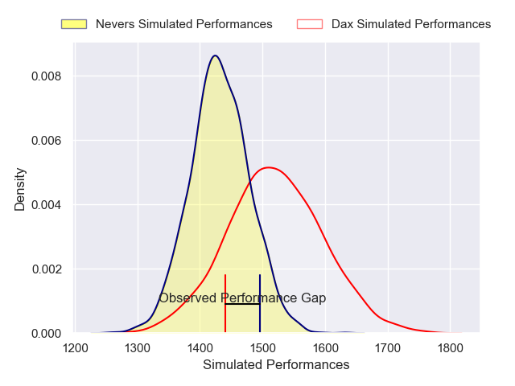
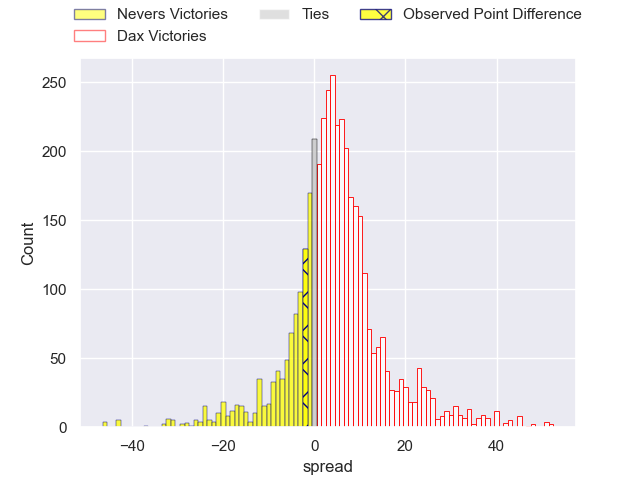
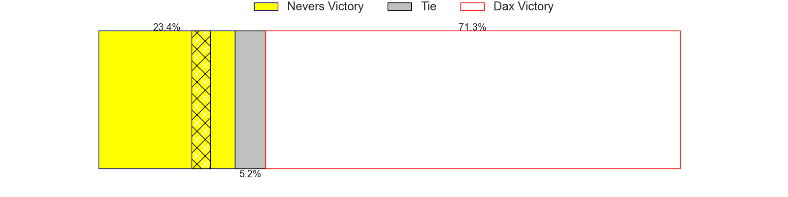
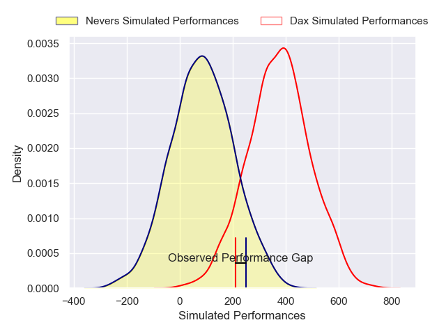
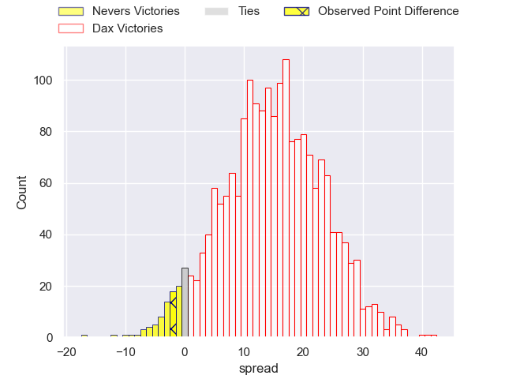
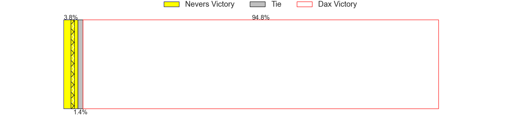

---  
layout: page  
title: Nevers at Dax; 19-17  
date: 2025-02-28 18:00:00 -0500  
categories: "Pro D2 24/25" match review  
---
# Nevers at Dax; 19-17

# Club Level Predictions

The first set of predictions treats a club as the smallest object, as the club develops its members, organizes a gameplan, and deploys its players as needed for each match. This club model has a prediction of 0.621, which translates to predicting Dax to win by 4.3.

Our Over/Under is 56.5 - and combined with the spread above, we have a predicted scoreline of 26 to 30

Each club has a rating and a rating deviation (similar to a Glicko rating), and expected performances can be generated. This allows for simulated matches and spreads like the ones below.
## Projected Performances - Club Model

## Projected Spreads - Club Model

## Projected Results - Club Model

# Player Level Predictions

Treating teams instead as an entity made up of the currently active players, I have ratings for each player in an altogether different system. These can be combined to form team ratings once teamsheets are announced, weighting starters a bit higher than the reserves. After the match is played, players can be weighted by their minutes on the field, allowing for an accurate measure of the team's composition. With these compiled team ratings, we can make predictions, measure inaccuracy, and update the individual player ratings.
## Prediction without Player Minutes: Dax by 14.9

Dax by 2.9 on a neutral pitch

## Projected Performances - Player Model

## Projected Spreads - Player Model

## Projected Results - Player Model

|   Away Minutes | Away Player                 |   Away Percentile |   Number |   Home Percentile | Home Player          |   Home Minutes |
|---------------:|:----------------------------|------------------:|---------:|------------------:|:---------------------|---------------:|
|             52 | Louis Chanet                |             63.19 |        1 |             55.21 | Dino Casadei         |             61 |
|             80 | Efi Ma'afu                  |             33.45 |        2 |             69.24 | Kito Falatea         |             48 |
|             54 | Lasha Pkhakadze             |             41.45 |        3 |             32.9  | David Lolohea        |             48 |
|             26 | Charlie Francoz             |              4.48 |        4 |             20.61 | Alexandre Manukula   |             48 |
|             54 | Chris Gabriel               |             21.37 |        5 |              7.25 | Jean-Baptiste Singer |             22 |
|             54 | Julien Kazubek              |             74.7  |        6 |             36.18 | Arnaud Aletti        |             80 |
|             17 | Rati Zazadze                |             51.83 |        7 |             20.24 | Théo Tremeau         |             80 |
|             21 | Jason-Colin Fraser          |             88.31 |        8 |             57.62 | Paul Arnaud Ausset   |             80 |
|             80 | Simon Tarel                 |             22.69 |        9 |             82.9  | Paul Ravier          |             49 |
|             63 | Yohan Le Bourhis            |             82.11 |       10 |             21.05 | Romuald Séguy        |             80 |
|             80 | Arthur Mathiron             |             16.13 |       11 |             25.07 | Diego Miranda        |             80 |
|             61 | Alifereti Loaloa            |             68.37 |       12 |              6.53 | Benjamin Puntous     |             53 |
|             56 | Atunaisa Taulanga Vaka Manu |             40.86 |       13 |             84.14 | Hugo Fourquet        |             65 |
|             80 | Johan Georg Wasserman       |             66.82 |       14 |             47.58 | Viliame Tutuvili     |             25 |
|              0 | Dylan Jaminet               |             45.7  |       15 |             71.11 | Guillaume Bouche     |             25 |
|             80 | Leonard Paris               |             75.2  |       16 |             32.99 | Théo Duprat          |             58 |
|             29 | Ugo Vignolles               |             41.51 |       17 |             63.7  | Sylvère Reteau       |             22 |
|              0 | Hugo Bouyssou               |              2.09 |       18 |             49.68 | Hugo Cerisier        |             55 |
|             16 | Ilia Kaikatsishvili         |             52.28 |       19 |             51.26 | Paul Laperne         |             22 |
|             82 | Stefan Buruiana             |             75.13 |       20 |             32.98 | Thibaud Dréan        |             58 |
|              0 | Hugues Bastide              |             88.85 |       21 |             61.17 | Genesis Mamea Lemalu |             80 |
|             36 | Kamaliele Tufele            |             64.01 |       22 |              2.52 | Nephi Leatigaga      |             80 |
|             10 | Wesley Lindor               |            nan    |       23 |             35.69 | Étienne Loiret       |             40 |

