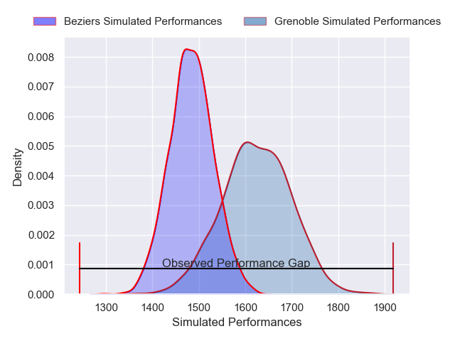
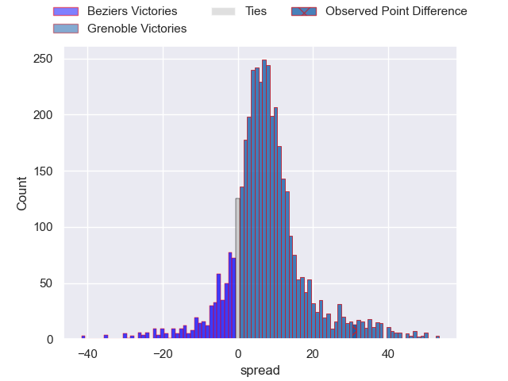
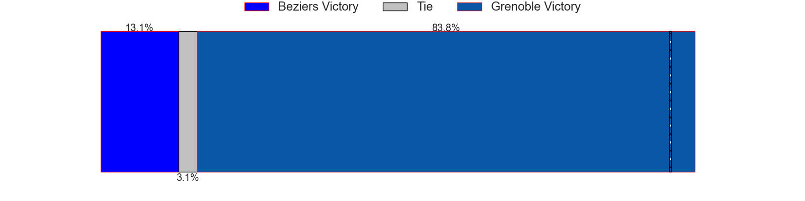
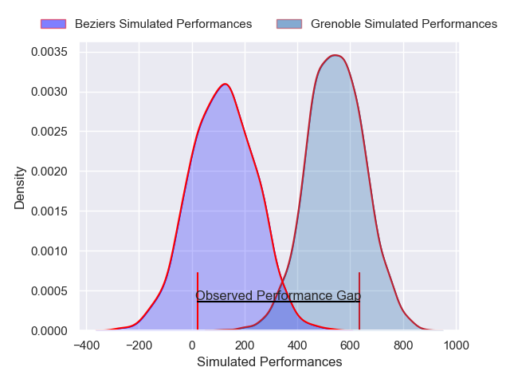
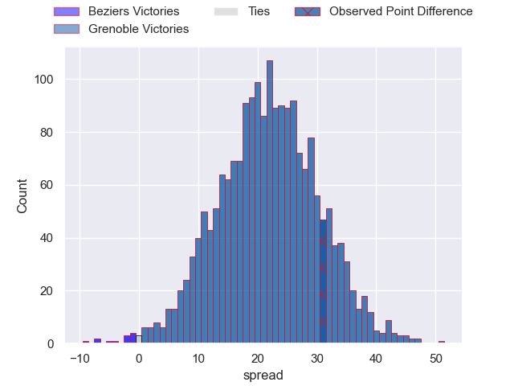
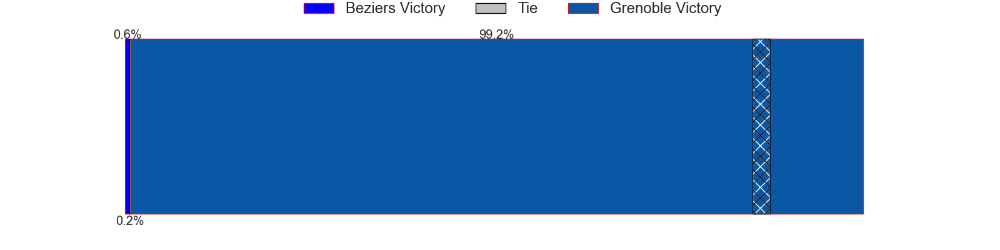

---  
layout: page  
title: Beziers at Grenoble; 14-45  
date: 2025-02-28 18:00:00 -0500  
categories: "Pro D2 24/25" match review  
---
# Beziers at Grenoble; 14-45

# Club Level Predictions

The first set of predictions treats a club as the smallest object, as the club develops its members, organizes a gameplan, and deploys its players as needed for each match. This club model has a prediction of 0.685, which translates to predicting Grenoble to win by 6.8.

Our Over/Under is 55.5 - and combined with the spread above, we have a predicted scoreline of 24 to 31

Each club has a rating and a rating deviation (similar to a Glicko rating), and expected performances can be generated. This allows for simulated matches and spreads like the ones below.
## Projected Performances - Club Model

## Projected Spreads - Club Model

## Projected Results - Club Model

# Player Level Predictions

Treating teams instead as an entity made up of the currently active players, I have ratings for each player in an altogether different system. These can be combined to form team ratings once teamsheets are announced, weighting starters a bit higher than the reserves. After the match is played, players can be weighted by their minutes on the field, allowing for an accurate measure of the team's composition. With these compiled team ratings, we can make predictions, measure inaccuracy, and update the individual player ratings.
## Prediction without Player Minutes: Grenoble by 24.2

Grenoble by 11.2 on a neutral pitch

## Projected Performances - Player Model

## Projected Spreads - Player Model

## Projected Results - Player Model

|   Away Minutes | Away Player             |   Away Percentile |   Number |   Home Percentile | Home Player        |   Home Minutes |
|---------------:|:------------------------|------------------:|---------:|------------------:|:-------------------|---------------:|
|             51 | Yahnis El Maslouhi      |             39.84 |        1 |             90.88 | Zack Gauthier      |             22 |
|             57 | Yvann Lalevee           |             79.73 |        2 |             91.29 | Bastien Soury      |             42 |
|             64 | John Henry Fincham      |             66.88 |        3 |             68    | Johannes Jonker    |             20 |
|             51 | Baptiste Abescat-Leroy  |             54.1  |        4 |             61.92 | Thomas Lainault    |             30 |
|             25 | Petero Taviraki Mailulu |             41.56 |        5 |             73.14 | Pio Muarua         |             31 |
|             80 | Thomas Canaleta         |             39.39 |        6 |             90.88 | Antonin Berruyer   |             12 |
|             76 | Tanguy Jaillon          |             42.74 |        7 |             81.56 | Victor Guillaumond |              4 |
|             21 | Antoine Payrastre       |             40.62 |        8 |             92.78 | Hanru Sirgel       |             81 |
|             12 | Damien Añon             |             19.52 |        9 |             91.78 | Eric Escande       |             24 |
|             30 | Victor Dreuille         |             13.49 |       10 |             93.57 | Sam Davies         |             59 |
|             81 | Aminiasi Tuimaba        |             77.52 |       11 |             87.51 | Wilfried Hulleu    |             56 |
|             81 | Taleta Tupuola          |             42.39 |       12 |             78.75 | Romain Trouilloud  |             16 |
|             59 | Theo Vassallo           |             41.88 |       13 |             74.26 | Romain Fusier      |             81 |
|             81 | Kylian Bert             |             44.13 |       14 |             78.72 | Gerswin Mouton     |             81 |
|             77 | Harry Glynn             |             30.26 |       15 |             99    | Julien Farnoux     |             81 |
|             81 | Julien Rasamoelina      |            nan    |       16 |             52.5  | Brandon Nansen     |             24 |
|             56 | Yanis Boulassel         |             18.09 |       17 |             91.32 | Yan Lestrade       |             24 |
|             24 | Clément Samper          |            nan    |       18 |             84.96 | Tommy Raynaud      |             69 |
|             80 | Camille Vallee          |            nan    |       19 |             55.48 | Barnabe Couilloud  |             61 |
|             39 | Timeo Labat             |            nan    |       20 |             93.44 | Giorgi Pertaia     |             64 |
|            nan | nan                     |            nan    |       21 |             84.45 | Thomas Ployet      |             81 |
|            nan | nan                     |            nan    |       22 |             90.66 | Max Clement        |             59 |
|            nan | nan                     |            nan    |       23 |            nan    | Sascha Mistrulli   |             59 |

