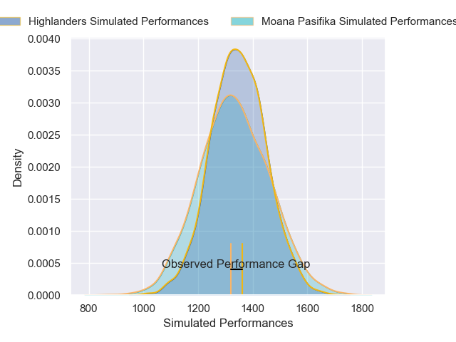
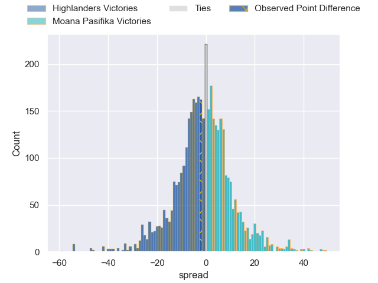
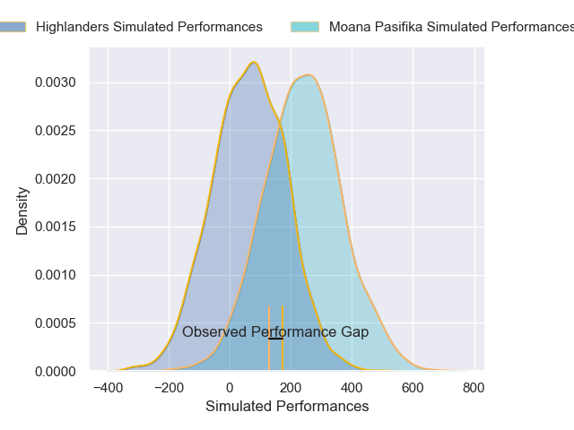
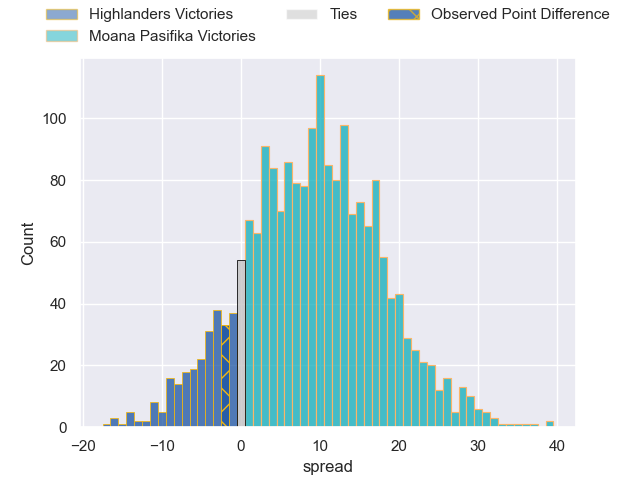
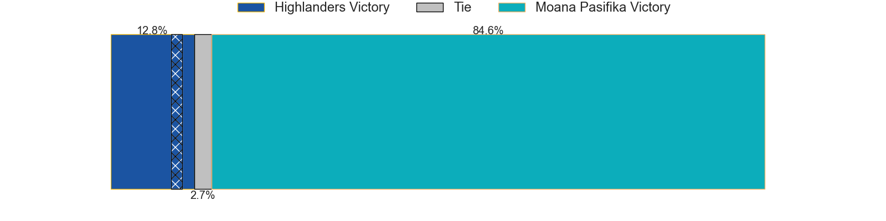

---  
layout: page  
title: Highlanders at Moana Pasifika; 31-29  
date: 2025-02-28 18:00:00 -0500  
categories: "Super Rugby Pacific 2025" match review  
---
# Highlanders at Moana Pasifika; 31-29

# Club Level Predictions

The first set of predictions treats a club as the smallest object, as the club develops its members, organizes a gameplan, and deploys its players as needed for each match. This club model has a prediction of 0.481, which translates to predicting Highlanders to win by 0.7.

Our Over/Under is 59.5 - and combined with the spread above, we have a predicted scoreline of 30 to 30

Each club has a rating and a rating deviation (similar to a Glicko rating), and expected performances can be generated. This allows for simulated matches and spreads like the ones below.
## Projected Performances - Club Model

## Projected Spreads - Club Model

## Projected Results - Club Model

# Player Level Predictions

Treating teams instead as an entity made up of the currently active players, I have ratings for each player in an altogether different system. These can be combined to form team ratings once teamsheets are announced, weighting starters a bit higher than the reserves. After the match is played, players can be weighted by their minutes on the field, allowing for an accurate measure of the team's composition. With these compiled team ratings, we can make predictions, measure inaccuracy, and update the individual player ratings.
## Prediction without Player Minutes: Moana Pasifika by 6.7

Moana Pasifika by 4.1 on a neutral pitch

## Projected Performances - Player Model

## Projected Spreads - Player Model

## Projected Results - Player Model

|   Away Minutes | Away Player          |   Away Percentile |   Number |   Home Percentile | Home Player           |   Home Minutes |
|---------------:|:---------------------|------------------:|---------:|------------------:|:----------------------|---------------:|
|             32 | Josh Bartlett        |             65.36 |        1 |             45.68 | James Lay             |             50 |
|             20 | Soane Vikena         |             82.91 |        2 |             15.08 | Mills Sanerivi        |             50 |
|             15 | Sefo Kautai          |             16    |        3 |             34.24 | Sione Mafile'o        |             50 |
|             66 | Fabian Holland       |             79.36 |        4 |             83.03 | Tom Savage            |             50 |
|             81 | Mitchell Dunshea     |             92.27 |        5 |              6.97 | Allan Craig           |             50 |
|             81 | Sean Withy           |             16.2  |        6 |             66.01 | Miracle Faiilagi      |             81 |
|             81 | Veveni Lasaqa        |             18.81 |        7 |             98.88 | Ardie Savea           |             50 |
|             29 | Nikora Broughton     |             53.4  |        8 |             39.38 | Semisi Tupou Ta'eiloa |             53 |
|             81 | Nathan Hastie        |             67.47 |        9 |             52.23 | Jonathan Taumateine   |             50 |
|             32 | Taine Robinson       |             57.88 |       10 |              4.36 | Jackson Garden-Bachop |             50 |
|             26 | Caleb Tangitau       |             52.45 |       11 |             68.92 | Kyren Taumoefolau     |             50 |
|             20 | Timoci Tavatavanawai |             83.15 |       12 |              5.21 | Danny Toala           |             52 |
|             26 | Tanielu Tele'a       |              9.91 |       13 |             85.9  | Pepesana Patafilo     |             61 |
|              2 | Michael Manson       |              4.07 |       14 |             84.37 | Solomon Alaimalo      |             49 |
|             81 | Sam Gilbert          |             59.92 |       15 |             16.23 | William Havili        |             61 |
|             81 | Jack Taylor          |             19.43 |       16 |             75.54 | Sama Malolo           |             73 |
|             29 | Ethan de Groot       |             26.8  |       17 |             17.52 | Tito Tuipulotu        |             70 |
|             55 | Saula Ma'u           |             10    |       18 |              4.4  | Chris Apoua           |             50 |
|             41 | Will Stodart         |             49.39 |       19 |             39.87 | Sam Slade             |             55 |
|             49 | TK Howden            |              0.56 |       20 |             38.55 | Ola Tauelangi         |             81 |
|             56 | James Arscott        |             10.62 |       21 |             54.79 | Melani Matavao        |             47 |
|             50 | Cameron Millar       |             67.01 |       22 |             91.08 | Patrick Pellegrini    |             81 |
|             50 | Cameron Millar       |             67.01 |       22 |             91.08 | Patrick Pellegrini    |             34 |
|             49 | Jake Te Hiwi         |             40.35 |       23 |             20.02 | Tevita Ofa            |             81 |

