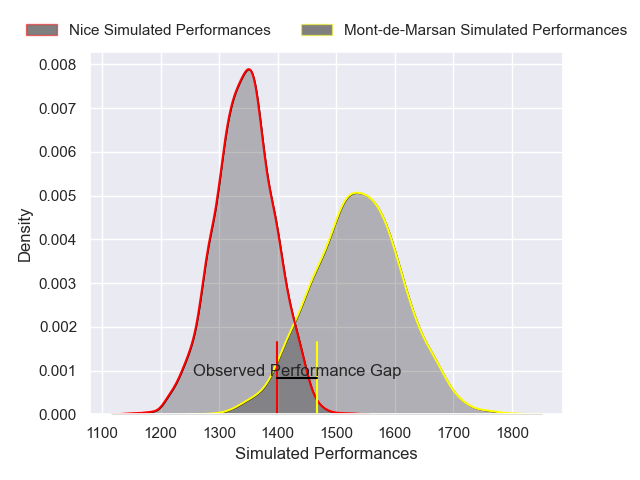
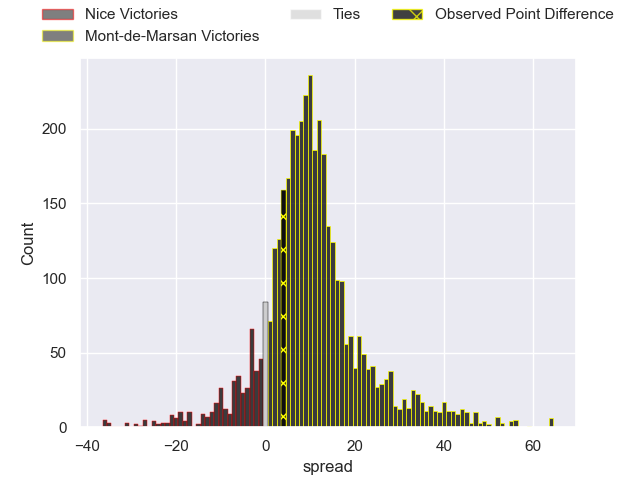
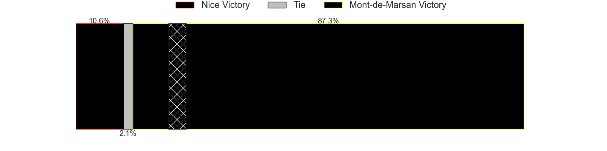
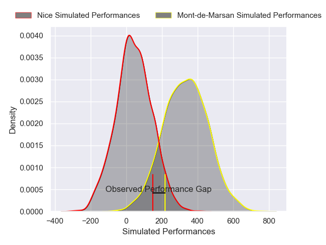
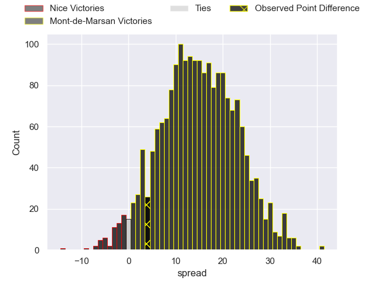
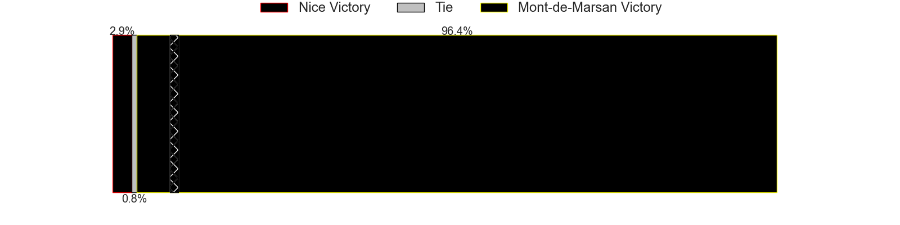

---  
layout: page  
title: Nice at Mont-de-Marsan; 22-26  
date: 2025-02-28 18:00:00 -0500  
categories: "Pro D2 24/25" match review  
---
# Nice at Mont-de-Marsan; 22-26

# Club Level Predictions

The first set of predictions treats a club as the smallest object, as the club develops its members, organizes a gameplan, and deploys its players as needed for each match. This club model has a prediction of 0.746, which translates to predicting Mont-de-Marsan to win by 9.5.

Our Over/Under is 56.5 - and combined with the spread above, we have a predicted scoreline of 23 to 33

Each club has a rating and a rating deviation (similar to a Glicko rating), and expected performances can be generated. This allows for simulated matches and spreads like the ones below.
## Projected Performances - Club Model

## Projected Spreads - Club Model

## Projected Results - Club Model

# Player Level Predictions

Treating teams instead as an entity made up of the currently active players, I have ratings for each player in an altogether different system. These can be combined to form team ratings once teamsheets are announced, weighting starters a bit higher than the reserves. After the match is played, players can be weighted by their minutes on the field, allowing for an accurate measure of the team's composition. With these compiled team ratings, we can make predictions, measure inaccuracy, and update the individual player ratings.
## Prediction without Player Minutes: Mont-de-Marsan by 12.8

Nice by 0.1 on a neutral pitch

## Projected Performances - Player Model

## Projected Spreads - Player Model

## Projected Results - Player Model

|   Away Minutes | Away Player        |   Away Percentile |   Number |   Home Percentile | Home Player           |   Home Minutes |
|---------------:|:-------------------|------------------:|---------:|------------------:|:----------------------|---------------:|
|             65 | Julien Beaufils    |             42.51 |        1 |             38.52 | Luka Goginava         |             48 |
|             34 | Pierre Strippoli   |             18.49 |        2 |             18.82 | Florian Dufour        |             44 |
|             80 | Kevin Yameogo      |             13.27 |        3 |             18.57 | Anthony Alves         |             80 |
|             48 | Clément Chartier   |             29.68 |        4 |              4.87 | Harrison Mataele      |             80 |
|             65 | Martin Freytes     |             68.42 |        5 |              9.83 | Aston Fortuin         |             80 |
|             32 | Hugo Sarrasin      |             12.18 |        6 |              8.9  | Waël Ponpon           |             36 |
|             34 | Louis Suaud        |             91.75 |        7 |             14.15 | Nicolas Garrault      |             80 |
|             80 | Kylian Laurans     |             21.5  |        8 |             94.36 | Ioane Iashagashvili   |             26 |
|             44 | Jules Gimbert      |              2.62 |        9 |             33.33 | Christophe Loustalot  |             58 |
|             46 | Tanguy Ménoret     |             47.37 |       10 |             58.11 | Patricio Fernandez    |             51 |
|             12 | Flavio Asquini     |             47.13 |       11 |             88.24 | Pierre Sayerse        |             80 |
|             26 | Christa Powell     |              1.31 |       12 |             70.58 | Nacani Wakaya         |             48 |
|             31 | Nathan Courtade    |             61.45 |       13 |             38.65 | Baptiste Grulovic     |             48 |
|             15 | Christian Erasmus  |             82.32 |       14 |             85.96 | Mosese Dawai          |             80 |
|             31 | Simon Delas        |             50.2  |       15 |             28.07 | Yoann Laousse Azpiazu |             16 |
|             34 | Baptiste Lafond    |              7.83 |       16 |             39.16 | Luka Begic            |             80 |
|             18 | Facundo Gigena     |              6.51 |       17 |             83.32 | Raphaël Robic         |             80 |
|              7 | Luvuyo Pupuma      |             12.62 |       18 |              6.68 | Myles Edwards         |             80 |
|             32 | Bastien Berenguel  |              2.53 |       19 |            nan    | Baptiste Canut        |             19 |
|             33 | Sione Anga'aelangi |             85.21 |       20 |             79.58 | Willie du Plessis     |             32 |
|             62 | Adrien Vigne       |            nan    |       21 |             29.64 | Thomas Bultel         |             32 |
|             80 | Matéo Jeune Joly   |             25.13 |       22 |            nan    | Aurélien Lafforgue    |             16 |
|            nan | nan                |            nan    |       23 |             67.67 | Mattéo Lalanne        |             80 |

