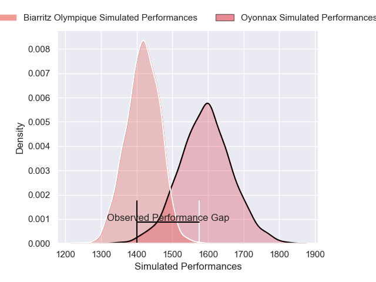
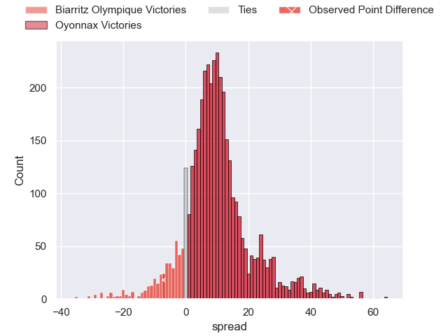
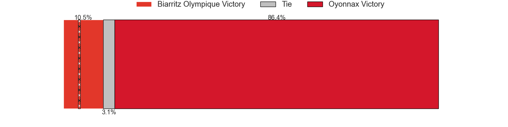
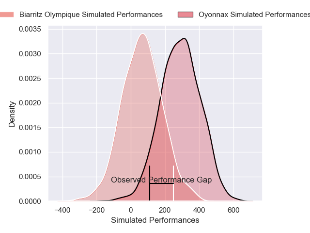
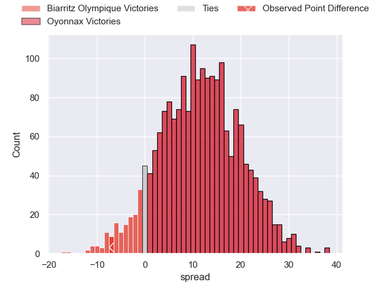
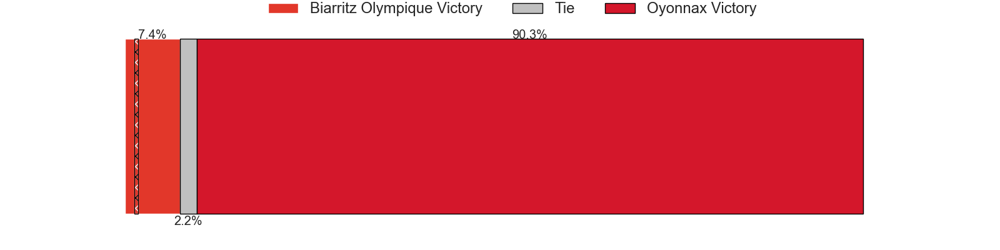

---  
layout: page  
title: Biarritz Olympique at Oyonnax; 36-29  
date: 2025-02-28 18:00:00 -0500  
categories: "Pro D2 24/25" match review  
---
# Biarritz Olympique at Oyonnax; 36-29

# Club Level Predictions

The first set of predictions treats a club as the smallest object, as the club develops its members, organizes a gameplan, and deploys its players as needed for each match. This club model has a prediction of 0.731, which translates to predicting Oyonnax to win by 8.8.

Our Over/Under is 57.5 - and combined with the spread above, we have a predicted scoreline of 24 to 33

Each club has a rating and a rating deviation (similar to a Glicko rating), and expected performances can be generated. This allows for simulated matches and spreads like the ones below.
## Projected Performances - Club Model

## Projected Spreads - Club Model

## Projected Results - Club Model

# Player Level Predictions

Treating teams instead as an entity made up of the currently active players, I have ratings for each player in an altogether different system. These can be combined to form team ratings once teamsheets are announced, weighting starters a bit higher than the reserves. After the match is played, players can be weighted by their minutes on the field, allowing for an accurate measure of the team's composition. With these compiled team ratings, we can make predictions, measure inaccuracy, and update the individual player ratings.
## Prediction without Player Minutes: Oyonnax by 11.2

Biarritz Olympique by 1.7 on a neutral pitch

## Projected Performances - Player Model

## Projected Spreads - Player Model

## Projected Results - Player Model

|   Away Minutes | Away Player         |   Away Percentile |   Number |   Home Percentile | Home Player        |   Home Minutes |
|---------------:|:--------------------|------------------:|---------:|------------------:|:-------------------|---------------:|
|             48 | François Mur        |             47.39 |        1 |              2.77 | Adrien Bordenave   |             80 |
|             62 | Brendan Lebrun      |             86.72 |        2 |             89.75 | Peniami Narisia    |             16 |
|             21 | Nikoloz Narmania    |             77.2  |        3 |             30.05 | Paulo Tafili       |             59 |
|              5 | Adrian Motoc        |              0.86 |        4 |             31.39 | Ewan Johnson       |             52 |
|             16 | Eliande Sanderson   |             17.46 |        5 |             20.71 | Hugo Fabregue      |             16 |
|             80 | Yoni Tuataane       |             69.26 |        6 |             10.31 | Kevin Lebreton     |             48 |
|             40 | Ekain Imaz Agirre   |             36.55 |        7 |              4.12 | Hugo Hermet        |             80 |
|             80 | Nafi Ma'afu         |             31.94 |        8 |              1.46 | Loic Godener       |             58 |
|             80 | Kerman Aurrekoetxea |             62.65 |        9 |             90.4  | Jonathan Ruru      |             32 |
|             27 | Thomas Dolhagaray   |             21.89 |       10 |              1.89 | Justin Bouraux     |             45 |
|             21 | Steeve Barry        |              3.56 |       11 |             38.38 | Karim Qadiri       |             46 |
|             19 | Yohan Tapie         |             42.67 |       12 |              6.02 | Lucas Mensa        |             49 |
|             18 | Francois Vergnaud   |              3.51 |       13 |             28.21 | Afusipa Taumoepeau |             80 |
|             80 | Bastien Guillemin   |             41.66 |       14 |              1.46 | Gavin Stark        |             80 |
|             54 | Kylian Jaminet      |             85.66 |       15 |             11.07 | Martin Bogado      |             46 |
|             54 | Levi Douglas        |             25.76 |       16 |             65.55 | Thibault Berthaud  |             80 |
|             45 | Anoa Laurent        |            nan    |       17 |             17.14 | Benjamin Geledan   |             45 |
|             80 | Zakaria El Fakir    |              0.49 |       18 |             95.52 | Oli Kebble         |             58 |
|             80 | Clement Martinez    |             14.45 |       19 |             82.57 | Wandrille Picault  |             80 |
|             36 | Aitor Hourcade      |              1.62 |       20 |            nan    | Victor Lebas       |             61 |
|             70 | Alexandre Plantier  |             32.25 |       21 |             81.47 | Chris Smith        |             51 |
|             40 | Carlo Mignot        |             60.04 |       22 |              2.97 | Cameron Wright     |             26 |
|             32 | Edgar Retiere       |             26.11 |       23 |              3.71 | Edward Sawailau    |             56 |

