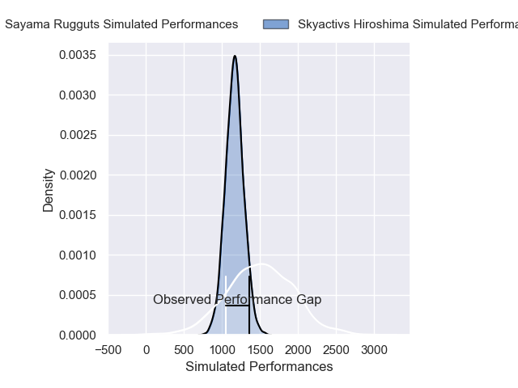
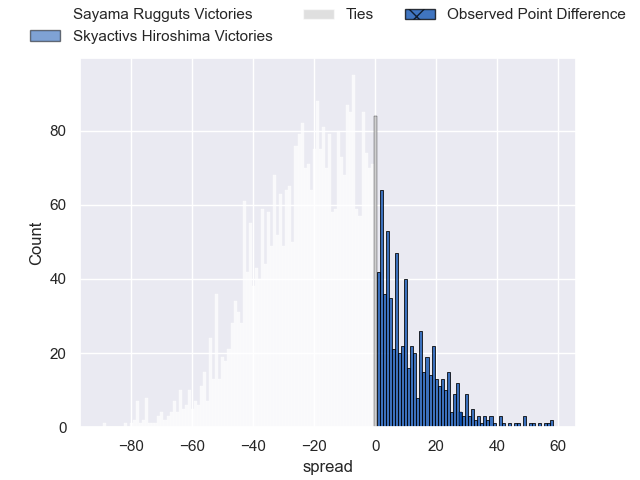
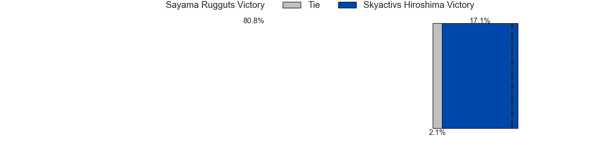
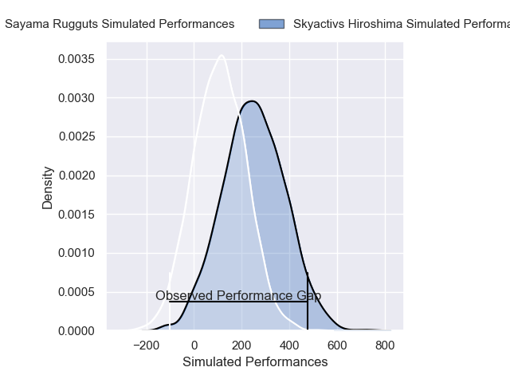
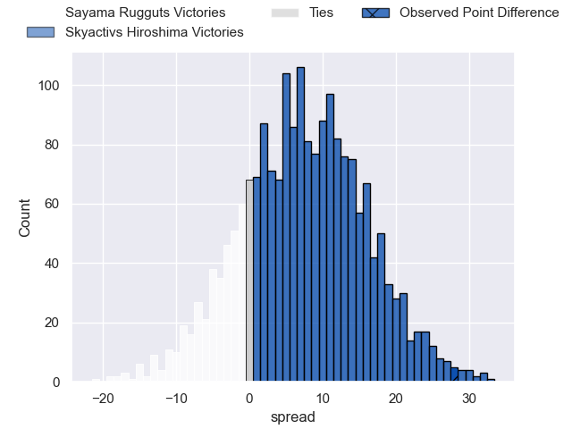
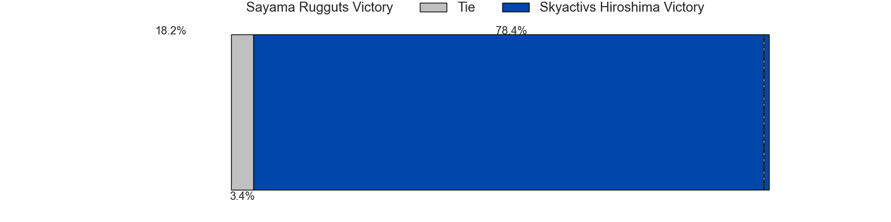

---  
layout: page  
title: Sayama Rugguts at Skyactivs Hiroshima; 17-45  
date: 2025-02-28 18:00:00 -0500  
categories: "Japan Rugby League One D3 24/25" match review  
---
# Sayama Rugguts at Skyactivs Hiroshima; 17-45

# Club Level Predictions

The first set of predictions treats a club as the smallest object, as the club develops its members, organizes a gameplan, and deploys its players as needed for each match. This club model has a prediction of 0.244, which translates to predicting Sayama Rugguts to win by 16.9.

Our Over/Under is 49.5 - and combined with the spread above, we have a predicted scoreline of 33 to 16

Each club has a rating and a rating deviation (similar to a Glicko rating), and expected performances can be generated. This allows for simulated matches and spreads like the ones below.
## Projected Performances - Club Model

## Projected Spreads - Club Model

## Projected Results - Club Model

# Player Level Predictions

Treating teams instead as an entity made up of the currently active players, I have ratings for each player in an altogether different system. These can be combined to form team ratings once teamsheets are announced, weighting starters a bit higher than the reserves. After the match is played, players can be weighted by their minutes on the field, allowing for an accurate measure of the team's composition. With these compiled team ratings, we can make predictions, measure inaccuracy, and update the individual player ratings.
## Prediction without Player Minutes: Skyactivs Hiroshima by 5.3

Skyactivs Hiroshima by 2.7 on a neutral pitch

## Projected Performances - Player Model

## Projected Spreads - Player Model

## Projected Results - Player Model

|   Away Minutes | Away Player       |   Away Percentile |   Number |   Home Percentile | Home Player        |   Home Minutes |
|---------------:|:------------------|------------------:|---------:|------------------:|:-------------------|---------------:|
|             80 | Kentaro Ueno      |             57.7  |        1 |             63.57 | Koshi Kato         |             80 |
|             58 | Shota Okuno       |             37.65 |        2 |             79.6  | Yusuke Kitabayashi |             80 |
|             79 | Naoto Shirakawa   |             30.06 |        3 |             63.57 | Tomoya Otake       |             80 |
|             80 | Whetu Douglas     |             40.63 |        4 |             82.22 | Yutaro Tanaka      |             48 |
|             29 | Troy Callander    |             48.28 |        5 |             83.17 | Andrew Davidson    |             55 |
|             29 | Kento Mizutani    |             49.91 |        6 |             77.07 | Jackson Pugh       |             61 |
|              8 | Koki Iida         |             43.89 |        7 |             68.7  | Tomoki Ashida      |             45 |
|              6 | Ash Parker        |             44.58 |        8 |             55.62 | Tevin Ferris       |             80 |
|             40 | Rikuya Takashima  |             36.72 |        9 |             49.48 | Taiyo Fukuyama     |             29 |
|             51 | Shota Kutsuna     |             54.32 |       10 |             47.37 | Issen Kano         |             29 |
|             51 | Ayumu Sawada      |             44.92 |       11 |             56.78 | Kohei Kamei        |             45 |
|             51 | Haruya Nakasu     |             58.84 |       12 |             81.42 | Jacob Abel         |             80 |
|             45 | Tuiaki Fisipuna   |             48.45 |       13 |             52.85 | Clynton Knox       |             45 |
|             35 | Yushi Okuda       |             59.13 |       14 |             61.96 | Yuto Nakamura      |             80 |
|             45 | Chase Tiatia      |             81.63 |       15 |             49.39 | Ginjiro Sakiguchi  |             35 |
|             35 | Tatsuki Tanina    |            nan    |       16 |            nan    | Tomohiro Takeda    |             80 |
|             19 | Toshiki Sato      |             53.57 |       17 |             82.17 | Haruki Umemoto     |             19 |
|             30 | Yuto Takano       |            nan    |       18 |             67.02 | Tadatsugu Kanayama |             28 |
|             80 | Itsuki Fujii      |             50.76 |       19 |            nan    | Yoshinobu Nishino  |             80 |
|             57 | Shigeto Yamashita |            nan    |       20 |             78.85 | Iori Suzuki        |             80 |
|             33 | Kanaru Takahashi  |             65.86 |       21 |             73.79 | Kotaro Tatsuno     |             80 |
|             25 | Shoki Morimoto    |            nan    |       22 |             58.53 | Hitaka Inoue       |             69 |
|             80 | Yudai Ishii       |            nan    |       23 |            nan    | Kaito Sasaoka      |             80 |

