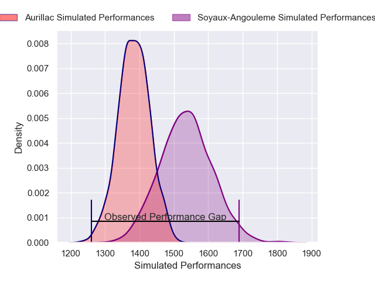
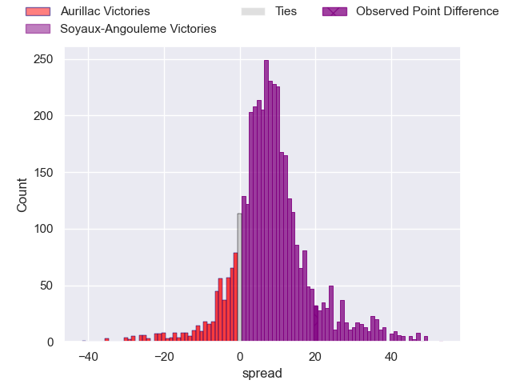
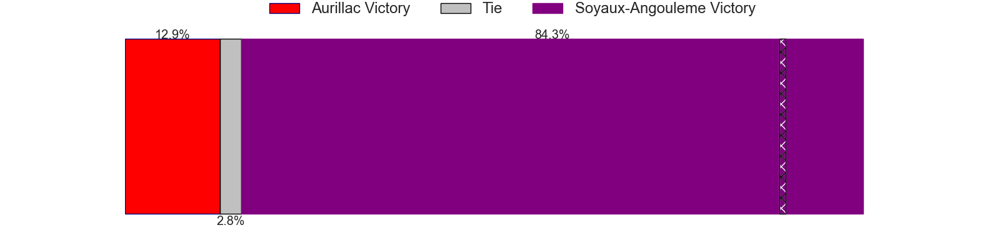
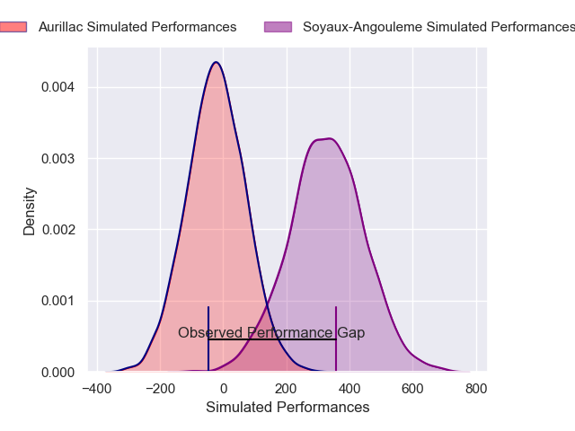
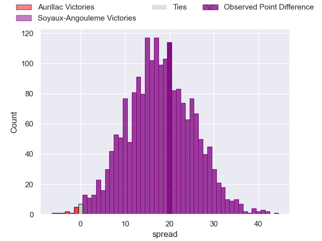
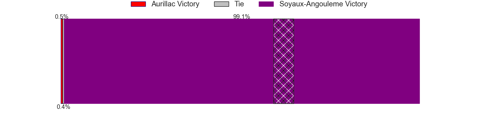

---  
layout: page  
title: Aurillac at Soyaux-Angouleme; 20-40  
date: 2025-02-28 18:00:00 -0500  
categories: "Pro D2 24/25" match review  
---
# Aurillac at Soyaux-Angouleme; 20-40

# Club Level Predictions

The first set of predictions treats a club as the smallest object, as the club develops its members, organizes a gameplan, and deploys its players as needed for each match. This club model has a prediction of 0.703, which translates to predicting Soyaux-Angouleme to win by 7.6.

Our Over/Under is 56.5 - and combined with the spread above, we have a predicted scoreline of 24 to 32

Each club has a rating and a rating deviation (similar to a Glicko rating), and expected performances can be generated. This allows for simulated matches and spreads like the ones below.
## Projected Performances - Club Model

## Projected Spreads - Club Model

## Projected Results - Club Model

# Player Level Predictions

Treating teams instead as an entity made up of the currently active players, I have ratings for each player in an altogether different system. These can be combined to form team ratings once teamsheets are announced, weighting starters a bit higher than the reserves. After the match is played, players can be weighted by their minutes on the field, allowing for an accurate measure of the team's composition. With these compiled team ratings, we can make predictions, measure inaccuracy, and update the individual player ratings.
## Prediction without Player Minutes: Soyaux-Angouleme by 16.7

Soyaux-Angouleme by 11.2 on a neutral pitch

## Projected Performances - Player Model

## Projected Spreads - Player Model

## Projected Results - Player Model

|   Away Minutes | Away Player              |   Away Percentile |   Number |   Home Percentile | Home Player        |   Home Minutes |
|---------------:|:-------------------------|------------------:|---------:|------------------:|:-------------------|---------------:|
|             19 | Robert Rodgers           |              7.6  |        1 |             97.6  | Sami Zouhair       |             80 |
|             48 | Basa Khonelidze          |             57.45 |        2 |             92.29 | Rayne Barka        |             31 |
|             16 | Giorgi Kartvelishvili    |              2.4  |        3 |             12.72 | Yassine Boutemane  |             54 |
|             30 | Skip Jongejan            |             46.84 |        4 |             65.88 | Maxence Lemardelet |             80 |
|             80 | Abongile Nonkontwana     |              0.47 |        5 |             91.42 | Sikeli Nabou       |             80 |
|             24 | Théo Cambon              |             13.59 |        6 |              6.52 | Gautier Gibouin    |             21 |
|             22 | Lucas Oudard             |             17.04 |        7 |             40.6  | Hubert Texier      |             40 |
|             55 | Aleksandre Burduli       |             29.9  |        8 |             14.43 | Samuel Nollet      |             16 |
|             34 | Leo Salvan               |             38.87 |        9 |             74.32 | Manu Saubusse      |             82 |
|             26 | Ugo Seunes               |             61.41 |       10 |             58.09 | Corentin Glenat    |             64 |
|             49 | Elijah Niko              |             24.61 |       11 |             36.91 | Nathan Farissier   |             80 |
|             23 | Karsen Talalua           |             20.33 |       12 |             94.89 | George Tilsley     |             80 |
|             19 | Karl Martin              |             49.34 |       13 |             59.75 | François Carlo Mey |             80 |
|             49 | Axel Bevia               |             25.72 |       14 |             77.24 | Jules Dubecq       |             56 |
|             22 | Jake Strachan            |             14.23 |       15 |              8.42 | Massimo Ortolan    |             40 |
|             22 | Irakli Mtchedlidze       |             15.92 |       16 |              3.69 | Motu Matu'u        |             48 |
|             80 | Ronan Loughnane          |              5.7  |       17 |             63.36 | Omar Dahir         |             48 |
|             10 | Hugo Huurman             |             46.65 |       18 |             34.64 | Georgy Balakarev   |             51 |
|             16 | Valentin Welsch          |             66.08 |       19 |             87.99 | Germain Burgaud    |             80 |
|             16 | Mehdi Slamani            |             23.85 |       20 |            nan    | Léo Labarthe       |             61 |
|             30 | Lucas Delort             |            nan    |       21 |             26.39 | Alexander Masibaka |             22 |
|             80 | Hugo Bastard             |             68.13 |       22 |              4.7  | Arthur Proult      |             48 |
|             53 | Jean-Luc Alewyn Cilliers |             52.7  |       23 |              4.28 | Adrien Bau         |             16 |

