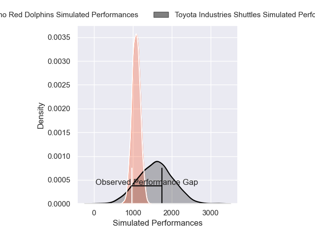
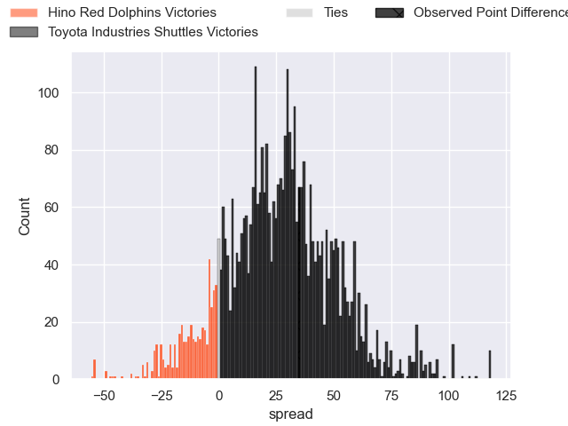
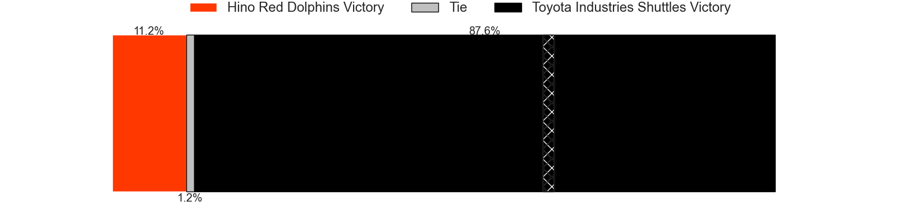

---  
layout: page  
title: Hino Red Dolphins at Toyota Industries Shuttles; 19-54  
date: 2025-02-28 18:00:00 -0500  
categories: "Japan Rugby League One - Division 2 2025" match review  
---
# Hino Red Dolphins at Toyota Industries Shuttles; 19-54

# Club Level Predictions

The first set of predictions treats a club as the smallest object, as the club develops its members, organizes a gameplan, and deploys its players as needed for each match. This club model has a prediction of 0.939, which translates to predicting Toyota Industries Shuttles to win by 25.1.

Our Over/Under is 52.5 - and combined with the spread above, we have a predicted scoreline of 14 to 39

Each club has a rating and a rating deviation (similar to a Glicko rating), and expected performances can be generated. This allows for simulated matches and spreads like the ones below.
## Projected Performances - Club Model

## Projected Spreads - Club Model

## Projected Results - Club Model

