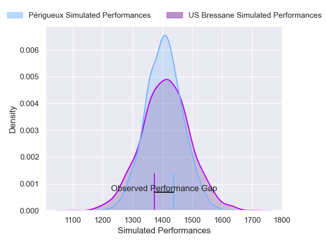
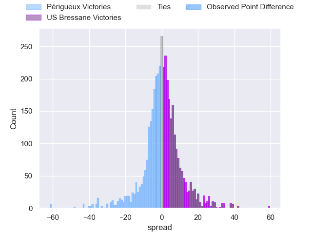
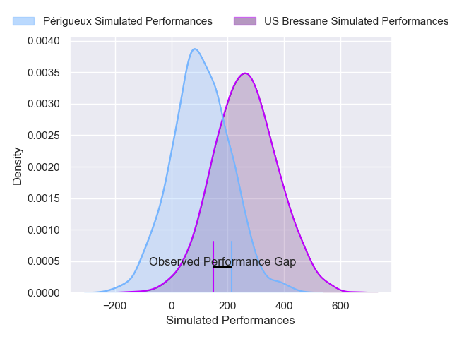
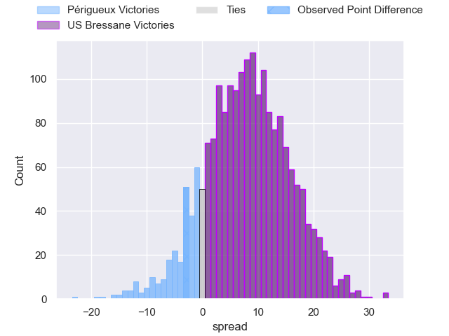
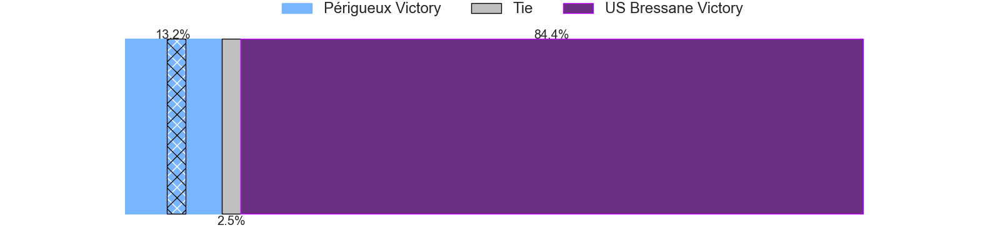

---  
layout: page  
title: Perigueux at US Bressane; 26-23  
date: 2025-02-28 18:00:00 -0500  
categories: "Nationale 24/25" match review  
---
# Perigueux at US Bressane; 26-23

# Club Level Predictions

The first set of predictions treats a club as the smallest object, as the club develops its members, organizes a gameplan, and deploys its players as needed for each match. This club model has a prediction of 0.503, which translates to predicting US Bressane to win by 0.1.

Our Over/Under is 32.5 - and combined with the spread above, we have a predicted scoreline of 16 to 16

Each club has a rating and a rating deviation (similar to a Glicko rating), and expected performances can be generated. This allows for simulated matches and spreads like the ones below.
## Projected Performances - Club Model

## Projected Spreads - Club Model

## Projected Results - Club Model

# Player Level Predictions

Treating teams instead as an entity made up of the currently active players, I have ratings for each player in an altogether different system. These can be combined to form team ratings once teamsheets are announced, weighting starters a bit higher than the reserves. After the match is played, players can be weighted by their minutes on the field, allowing for an accurate measure of the team's composition. With these compiled team ratings, we can make predictions, measure inaccuracy, and update the individual player ratings.
## Prediction without Player Minutes: US Bressane by 5.8

US Bressane by 0.4 on a neutral pitch

## Projected Performances - Player Model

## Projected Spreads - Player Model

## Projected Results - Player Model

|   Away Minutes | Away Player         |   Away Percentile |   Number |   Home Percentile | Home Player        |   Home Minutes |
|---------------:|:--------------------|------------------:|---------:|------------------:|:-------------------|---------------:|
|             54 | Emilien Borges      |             80.62 |        1 |             31.51 | Erich de Jager     |             80 |
|             57 | Lucas Marijon       |             44.87 |        2 |             83.36 | Clement Jullien    |             56 |
|             19 | Anthony Pelmard     |             76.22 |        3 |             19.79 | Vazha Kapanadze    |             80 |
|             22 | Richard Fourcade    |             31.68 |        4 |             22.81 | Thomas Déliance    |             51 |
|             61 | Jaco Willemse       |             20.99 |        5 |              3.72 | Josh Peters        |             31 |
|             64 | Clement Lanen       |             69.35 |        6 |             84.25 | Loic Baradel       |             50 |
|             32 | Hendri Storm        |             53.98 |        7 |             59.04 | Pierre Reynaud     |             40 |
|             16 | Nahum Merigan       |             38.2  |        8 |             74.32 | Wael May           |             35 |
|             14 | Max Green           |             47.29 |        9 |             60.21 | Jeremy Valencot    |             34 |
|             80 | Greg Hutley         |             67.79 |       10 |             20.84 | Nathan Azais       |             51 |
|              8 | Tim Giresse         |             82.22 |       11 |             16.41 | Élie De Fleurian   |             66 |
|             23 | Nicolas Piaton      |             15.96 |       12 |             34.54 | Benjamin Doy       |             15 |
|             25 | Cyril Couturier     |             83.53 |       13 |             17.17 | Alexandre Badet    |             15 |
|             27 | Paul Piveteau       |             17.96 |       14 |             41.57 | Jules Margarit     |             21 |
|             29 | Anderson Neisen     |             41.39 |       15 |             79.92 | Florent Massip     |             67 |
|             58 | Kalaveti Tawake     |             48.86 |       16 |             11.26 | Quentin Witt       |             32 |
|             80 | Raphaël Vieilledent |             67.46 |       17 |             84.34 | Lucas Lyons        |             80 |
|             80 | Sacha Rosenberg     |            nan    |       18 |             38.82 | Louis Dasalmartini |             80 |
|             19 | Manu Leiataua       |              1.01 |       19 |             37.7  | Jeremie Martin     |             46 |
|              0 | Karl Lambert        |             65.76 |       20 |             63.17 | Grégoire Demangel  |             80 |
|             80 | Dorian Lavernhe     |             66.16 |       21 |             90.74 | Fred Zeilinga      |             25 |
|             22 | Nicolas Faltrept    |             25.65 |       22 |             57.08 | Teo Bordenave      |             80 |
|             28 | Martin Augeix       |             33.71 |       23 |             59.69 | Nicolas Lemaire    |             80 |

