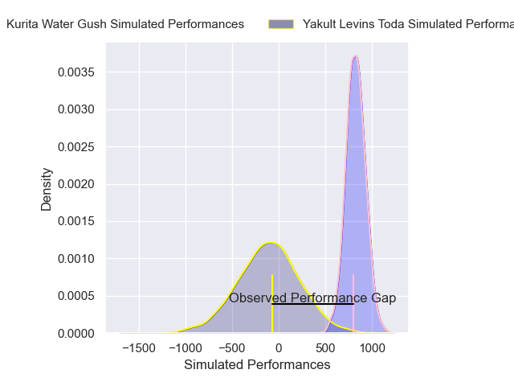
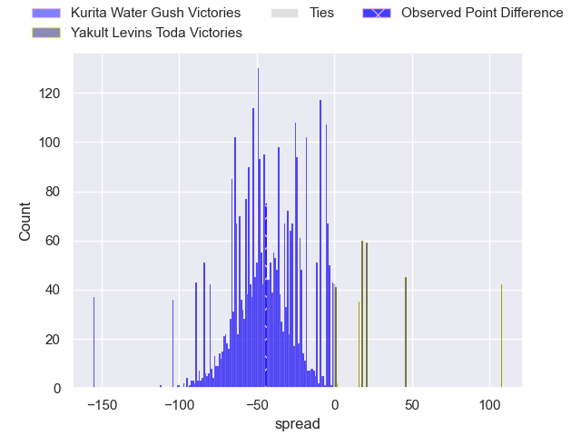
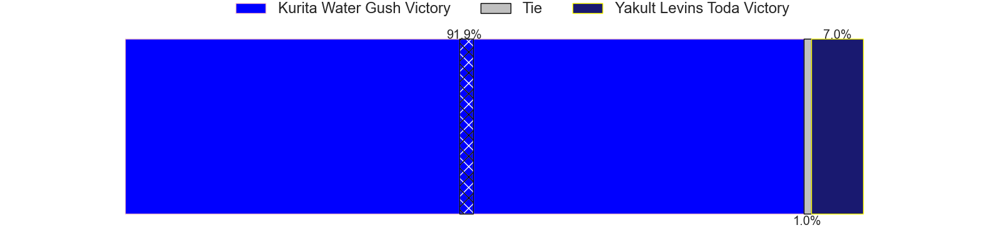
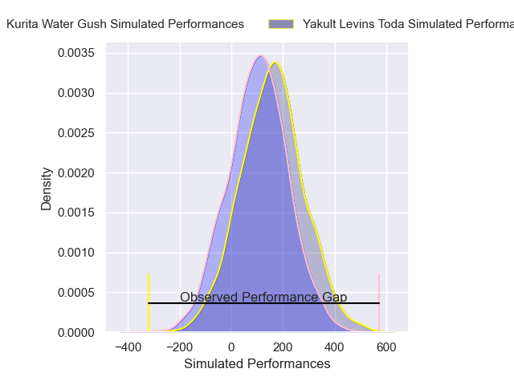
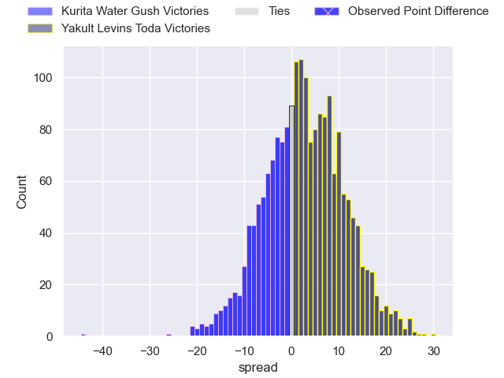
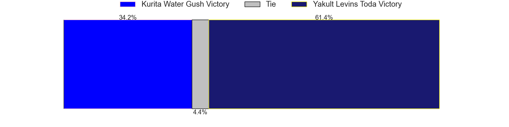

---  
layout: page  
title: Kurita Water Gush at Yakult Levins Toda; 56-12  
date: 2025-02-28 18:00:00 -0500  
categories: "Japan Rugby League One D3 24/25" match review  
---
# Kurita Water Gush at Yakult Levins Toda; 56-12

# Club Level Predictions

The first set of predictions treats a club as the smallest object, as the club develops its members, organizes a gameplan, and deploys its players as needed for each match. This club model has a prediction of 0.006, which translates to predicting Kurita Water Gush to win by 47.1.

Our Over/Under is 60.5 - and combined with the spread above, we have a predicted scoreline of 54 to 7

Each club has a rating and a rating deviation (similar to a Glicko rating), and expected performances can be generated. This allows for simulated matches and spreads like the ones below.
## Projected Performances - Club Model

## Projected Spreads - Club Model

## Projected Results - Club Model

# Player Level Predictions

Treating teams instead as an entity made up of the currently active players, I have ratings for each player in an altogether different system. These can be combined to form team ratings once teamsheets are announced, weighting starters a bit higher than the reserves. After the match is played, players can be weighted by their minutes on the field, allowing for an accurate measure of the team's composition. With these compiled team ratings, we can make predictions, measure inaccuracy, and update the individual player ratings.
## Prediction without Player Minutes: Yakult Levins Toda by 3.1

Yakult Levins Toda by 0.9 on a neutral pitch

## Projected Performances - Player Model

## Projected Spreads - Player Model

## Projected Results - Player Model

|   Away Minutes | Away Player          |   Away Percentile |   Number |   Home Percentile | Home Player          |   Home Minutes |
|---------------:|:---------------------|------------------:|---------:|------------------:|:---------------------|---------------:|
|           55   | Kei Takusagawa       |             68.88 |        1 |             36.14 | Iori Nozaki          |           19   |
|           15   | Kota Hojo            |             52.24 |        2 |             21.56 | Shunsuke Tani        |           63   |
|           80   | Rui Kuriyama         |             75.69 |        3 |             37.93 | Atsushi Furuya       |           15   |
|           80   | Kota Nakamura        |             70.98 |        4 |             28.01 | Masashi Ogawa        |           52   |
|           80   | Daymon Leasuasu      |             70.98 |        5 |             84.23 | James Tucker         |            0   |
|           80   | Harrison Brewer      |             72.42 |        6 |             39.47 | Daisuke Yokoyama     |           15   |
|           80   | Taisei Nakao         |             72.42 |        7 |             38.25 | Kosuke Urabe         |           18   |
|           51   | Teariki Ben-Nicholas |             58.43 |        8 |             21.69 | Jaycob Matiu         |           57   |
|           80   | Ren Shinwada         |             69.66 |        9 |             24.66 | Ippei Oshima         |           61   |
|            1   | Piers Francis        |             55.37 |       10 |             25.47 | Nick Evemy           |           37   |
|           35   | Ryo Hosomoto         |             60.92 |       11 |             24.95 | Shun Sawamura        |           61   |
|           35   | Leo Gordon           |             57.54 |       12 |             19.43 | Antonio Mikaele Tu'U |           80   |
|           23   | So Matsushima        |             53.15 |       13 |             19.43 | Atomu Shirai         |           80   |
|           19   | Kentaro Sugimori     |             55.65 |       14 |             20.53 | Kagechika Ota        |           80   |
|           11.5 | Yuta Sugiyama        |             47.55 |       15 |             22.24 | Masatoshi Doi        |           65   |
|           80   | Jun Kaneko           |            nan    |       16 |            nan    | Fuma Uekata          |           63   |
|            8.5 | Kei Shibuya          |            nan    |       17 |            nan    | Daichi Kono          |           80   |
|           19   | Issa Hosoya          |            nan    |       18 |            nan    | Genki Tokushige      |           80   |
|           37   | Yoji Shiina          |            nan    |       19 |            nan    | Yuto Usuda           |           80   |
|           48   | Tevita Oto           |            nan    |       20 |            nan    | Takumi Handa         |           61   |
|            8.5 | Ryo Omasa            |            nan    |       21 |            nan    | Junpei Tada          |           80   |
|           55   | Takuro Hayashida     |            nan    |       22 |            nan    | Takumi Furukawa      |           11.5 |
|           66   | Katsuki Ishizuka     |            nan    |       23 |            nan    | Hikaru Ishikawa      |           80   |

