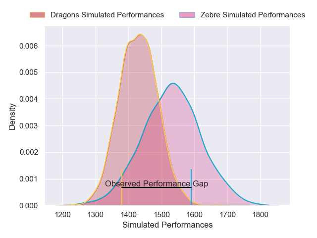
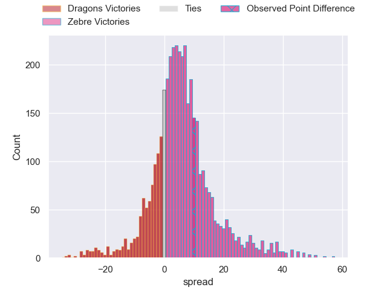
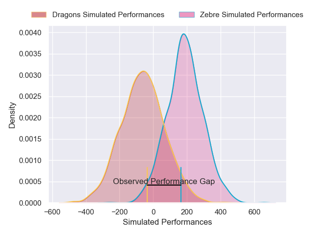
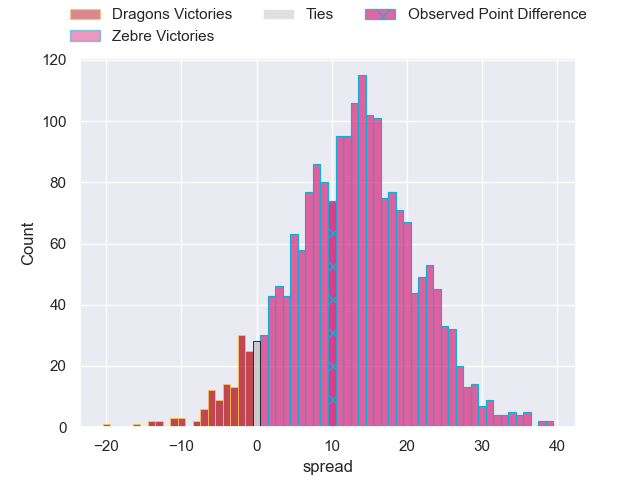

---  
layout: page  
title: Dragons at Zebre; 21-31  
date: 2025-02-28 18:00:00 -0500  
categories: "United Rugby Championship 24/25" match review  
---
# Dragons at Zebre; 21-31

# Club Level Predictions

The first set of predictions treats a club as the smallest object, as the club develops its members, organizes a gameplan, and deploys its players as needed for each match. This club model has a prediction of 0.636, which translates to predicting Zebre to win by 4.9.

Our Over/Under is 50.5 - and combined with the spread above, we have a predicted scoreline of 23 to 28

Each club has a rating and a rating deviation (similar to a Glicko rating), and expected performances can be generated. This allows for simulated matches and spreads like the ones below.
## Projected Performances - Club Model

## Projected Spreads - Club Model

## Projected Results - Club Model

# Player Level Predictions

Treating teams instead as an entity made up of the currently active players, I have ratings for each player in an altogether different system. These can be combined to form team ratings once teamsheets are announced, weighting starters a bit higher than the reserves. After the match is played, players can be weighted by their minutes on the field, allowing for an accurate measure of the team's composition. With these compiled team ratings, we can make predictions, measure inaccuracy, and update the individual player ratings.
## Prediction without Player Minutes: Zebre by 12.8

Zebre by 6.5 on a neutral pitch

## Projected Performances - Player Model

## Projected Spreads - Player Model

## Projected Results - Player Model

|   Away Minutes | Away Player              |   Away Percentile |   Number |   Home Percentile | Home Player            |   Home Minutes |
|---------------:|:-------------------------|------------------:|---------:|------------------:|:-----------------------|---------------:|
|             40 | Dylan Kelleher-Griffiths |             11.07 |        1 |             28.09 | Muhamed Hasa           |             41 |
|             82 | Brodie Coghlan           |             15.13 |        2 |             80.67 | Luca Bigi              |             41 |
|             41 | Chris Coleman            |              7.98 |        3 |              9.85 | Ion Neculai            |             41 |
|             82 | Joseph Davies            |              6.58 |        4 |             58.3  | Rusiate Nasove         |             16 |
|             82 | George Nott              |             11.64 |        5 |              9.92 | Leonard Krumov         |             16 |
|             61 | Ryan Woodman             |              9.84 |        6 |             81.63 | Giacomo Ferrari        |             65 |
|              8 | Taine Basham             |              9.47 |        7 |             36.46 | Bautista Stavile       |             68 |
|             78 | Shane Lewis-Hughes       |              2.71 |        8 |             19.21 | Giovanni Licata        |             57 |
|             25 | Dane Blacker             |              8.38 |        9 |              3.14 | Gonzalo Garcia         |             41 |
|             41 | Will Reed                |             17.89 |       10 |             77.68 | Giacomo Da Re          |             41 |
|             42 | Ashton Hewitt            |             78.12 |       11 |             10.67 | Simone Gesi            |             41 |
|             37 | Aneurin Owen             |             53.61 |       12 |             68.78 | Damiano Mazza          |             29 |
|             57 | Joe Westwood             |             35.04 |       13 |             19.68 | Fetuli Paea            |             16 |
|             30 | Rio Dyer                 |              4.83 |       14 |             75.93 | Scott Gregory          |             43 |
|             39 | Huw Anderson             |              4.71 |       15 |             91.6  | Geronimo Prisciantelli |             45 |
|             82 | James Benjamin           |             12.61 |       16 |             54.79 | Tommaso Di Bartolomeo  |             52 |
|             82 | Owain James              |            nan    |       17 |             66.53 | Luca Rizzoli           |             82 |
|             82 | Paula Latu               |            nan    |       18 |             54.32 | Juan Pitinari          |             82 |
|             82 | Steven Cummins           |            nan    |       19 |             91.13 | Matteo Canali          |             82 |
|             82 | Barny Langton            |            nan    |       20 |             53.89 | Davide Ruggeri         |             14 |
|             74 | Che Hope                 |            nan    |       21 |              8.2  | Alessandro Fusco       |             41 |
|             41 | Harri Ford               |            nan    |       22 |              2.95 | Giovanni Montemauri    |             78 |
|             41 | Scott Williams           |            nan    |       23 |             26.62 | Jacopo Trulla          |             82 |

