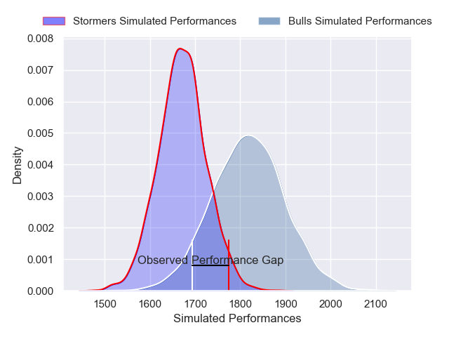
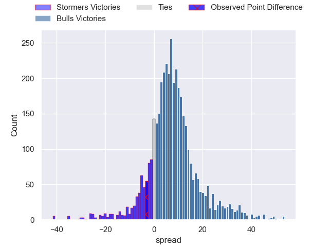
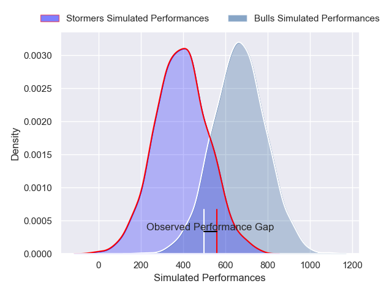
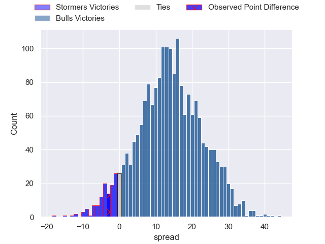

---  
layout: page  
title: Stormers at Bulls; 19-16  
date: 2025-03-01 18:00:00 -0500  
categories: "United Rugby Championship 24/25" match review  
---
# Stormers at Bulls; 19-16

# Club Level Predictions

The first set of predictions treats a club as the smallest object, as the club develops its members, organizes a gameplan, and deploys its players as needed for each match. This club model has a prediction of 0.698, which translates to predicting Bulls to win by 7.4.

Our Over/Under is 54.5 - and combined with the spread above, we have a predicted scoreline of 23 to 31

Each club has a rating and a rating deviation (similar to a Glicko rating), and expected performances can be generated. This allows for simulated matches and spreads like the ones below.
## Projected Performances - Club Model

## Projected Spreads - Club Model

## Projected Results - Club Model

# Player Level Predictions

Treating teams instead as an entity made up of the currently active players, I have ratings for each player in an altogether different system. These can be combined to form team ratings once teamsheets are announced, weighting starters a bit higher than the reserves. After the match is played, players can be weighted by their minutes on the field, allowing for an accurate measure of the team's composition. With these compiled team ratings, we can make predictions, measure inaccuracy, and update the individual player ratings.
## Prediction without Player Minutes: Bulls by 18.8

Bulls by 10.4 on a neutral pitch

## Projected Performances - Player Model

## Projected Spreads - Player Model

## Projected Results - Player Model

|   Away Minutes | Away Player        |   Away Percentile |   Number |   Home Percentile | Home Player         |   Home Minutes |
|---------------:|:-------------------|------------------:|---------:|------------------:|:--------------------|---------------:|
|             61 | Alistair Vermaak   |             88.96 |        1 |             89.28 | Gerhard Steenekamp  |             61 |
|             58 | Joseph Dweba       |             77.22 |        2 |             93.47 | Johan Grobbelaar    |             51 |
|             53 | Neethling Fouche   |             89.36 |        3 |             99.52 | Wilco Louw          |             61 |
|             66 | Salmaan Moerat     |             85.11 |        4 |             94.53 | Cobus Wiese         |             45 |
|             80 | Ruben van Heerden  |             92.74 |        5 |             10.37 | JF van Heerden      |             80 |
|             58 | Deon Fourie        |             96    |        6 |             87.43 | Marco van Staden    |             39 |
|             65 | Ben-Jason Dixon    |             76.07 |        7 |             69.18 | Reinhardt Ludwig    |             80 |
|             80 | Evan Roos          |             89.69 |        8 |             97.32 | Nizaam Carr         |             80 |
|             40 | Stefan Ungerer     |             36.3  |        9 |             91.27 | Embrose Papier      |             65 |
|             80 | Jurie Matthee      |             57.26 |       10 |             94.4  | Willie le Roux      |             80 |
|             80 | Leolin Zas         |             90.93 |       11 |             99.44 | Canan Moodie        |              6 |
|             80 | Daniel du Plessis  |             94.38 |       12 |             77.73 | David Kriel         |             80 |
|             69 | Wandisile Simelane |             74.97 |       13 |             88.46 | Stedman Gans        |             80 |
|             80 | Ben Loader         |             93.71 |       14 |             92.14 | Sebastian de Klerk  |             80 |
|             80 | Warrick Gelant     |             99.2  |       15 |             90.78 | Devon Williams      |             74 |
|             22 | Andre-Hugo Venter  |             76.05 |       16 |             96.65 | Akker van der Merwe |             29 |
|             19 | Brok Harris        |             99.92 |       17 |             39.04 | Jan-Hendrik Wessels |             19 |
|             27 | Frans Malherbe     |             76.72 |       18 |             14.08 | Francois Klopper    |             19 |
|             14 | Gary Porter        |             20.45 |       19 |              3.86 | Ruan Vermaak        |             41 |
|             15 | Marcel Theunissen  |             43.3  |       20 |             30.72 | Mpilo Gumede        |              0 |
|             15 | Marcel Theunissen  |             43.3  |       20 |             30.72 | Mpilo Gumede        |             80 |
|             22 | Willie Engelbrecht |             78.86 |       21 |             93.15 | Zak Burger          |             15 |
|             40 | Paul de Wet        |             82.36 |       22 |             11.2  | Keagan Johannes     |              6 |
|             11 | Jonathan Roche     |             55.06 |       23 |             97.78 | Sergeal Petersen    |             74 |

