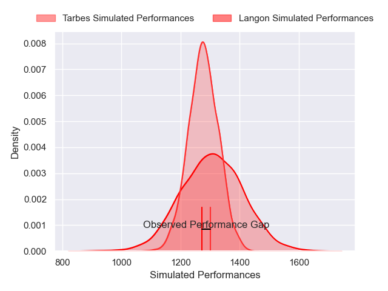
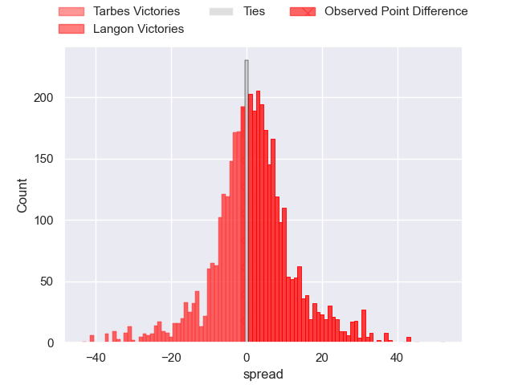
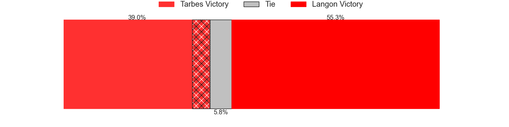
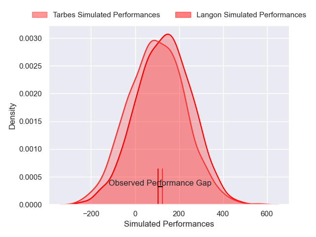
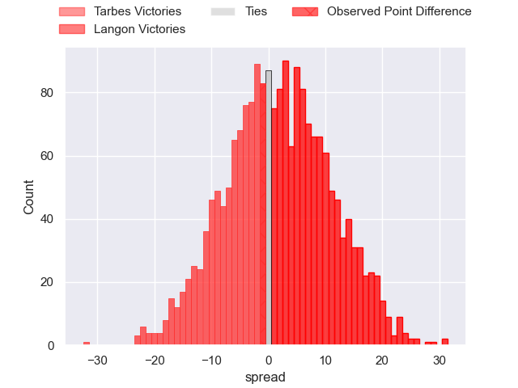

---  
layout: page  
title: Tarbes at Langon; 23-22  
date: 2025-03-01 18:00:00 -0500  
categories: "Nationale 24/25" match review  
---
# Tarbes at Langon; 23-22

# Club Level Predictions

The first set of predictions treats a club as the smallest object, as the club develops its members, organizes a gameplan, and deploys its players as needed for each match. This club model has a prediction of 0.539, which translates to predicting Langon to win by 1.4.

Our Over/Under is 40.5 - and combined with the spread above, we have a predicted scoreline of 19 to 21

Each club has a rating and a rating deviation (similar to a Glicko rating), and expected performances can be generated. This allows for simulated matches and spreads like the ones below.
## Projected Performances - Club Model

## Projected Spreads - Club Model

## Projected Results - Club Model

# Player Level Predictions

Treating teams instead as an entity made up of the currently active players, I have ratings for each player in an altogether different system. These can be combined to form team ratings once teamsheets are announced, weighting starters a bit higher than the reserves. After the match is played, players can be weighted by their minutes on the field, allowing for an accurate measure of the team's composition. With these compiled team ratings, we can make predictions, measure inaccuracy, and update the individual player ratings.
## Prediction without Player Minutes: Tarbes by 0.8

Tarbes by 3.2 on a neutral pitch

## Projected Performances - Player Model

## Projected Spreads - Player Model

## Projected Results - Player Model

|   Away Minutes | Away Player         |   Away Percentile |   Number |   Home Percentile | Home Player              |   Home Minutes |
|---------------:|:--------------------|------------------:|---------:|------------------:|:-------------------------|---------------:|
|           80   | Ximun Bessonart     |             13.84 |        1 |             25.52 | Lucas Hernandez          |             80 |
|           54   | Florian Lamothe     |             16.58 |        2 |             60.64 | Maxime Lancon            |             40 |
|           80   | Luka Vea            |             55.92 |        3 |              3.84 | Maxime Gau               |             30 |
|           30   | Léo Saint-Guilhem   |             56.08 |        4 |             19.6  | Thomas Geffré            |             18 |
|           80   | Mathieu Soufflet    |             68.43 |        5 |             17.62 | Isikili Seva Davetawalu  |             52 |
|           30.5 | Alexis Armary       |             95.34 |        6 |             55.49 | Thomas Bishop            |             30 |
|           80   | Jean Guicherd       |             68.06 |        7 |             53.26 | Jules Depoortere         |             72 |
|           80   | Joeli Matalaweru    |             57.53 |        8 |             49.9  | Thomas Mendy             |             59 |
|           60   | Mickael Thébault    |             78.94 |        9 |             57.88 | Paul Castera             |             80 |
|           53   | Alexandre Perez     |             20.12 |       10 |             25.31 | Baptiste Castanier       |             40 |
|           62   | Clement Latorre     |             43.29 |       11 |             59.3  | Thomas Wallraf           |             80 |
|           26   | Savenaca Rawaca     |             16.75 |       12 |             41.06 | Aurelien Tamagnan        |             80 |
|            8   | Hugo Cellier        |             55.98 |       13 |             34.63 | Yul Charrier             |             80 |
|            0   | Amona Artaud        |             46.25 |       14 |             12.3  | Quentin Lefort           |             59 |
|           80   | Joris Pialot        |             24.25 |       15 |             48.9  | Nathan Gagnac            |             80 |
|           51   | Maile Mamao         |              8.07 |       16 |             47.43 | Baptiste Tisne Cardeneau |             66 |
|           11   | Clément Gaubert     |            nan    |       17 |             15.68 | Ratu Nailoma Vatubua     |             80 |
|           13   | Jonathan Duffau     |              9.81 |       18 |             19.93 | Clement Renaud           |             70 |
|           80   | Vincent Dolier      |             61.31 |       19 |             83.63 | Sionasa Vunisa           |             51 |
|            8   | Thomas Millet       |             17.47 |       20 |             18.25 | Simon Zubizarreta        |             80 |
|           80   | Léo Estaque         |             19.79 |       21 |             56.78 | Julien Graffouillère     |             80 |
|           72   | Irakli Mirtskhulava |             80.16 |       22 |             19.83 | Ludovic Sempé            |             18 |

