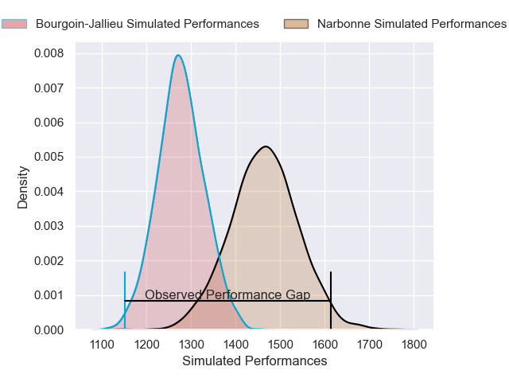
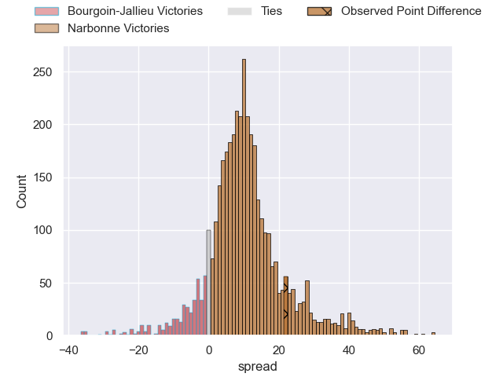
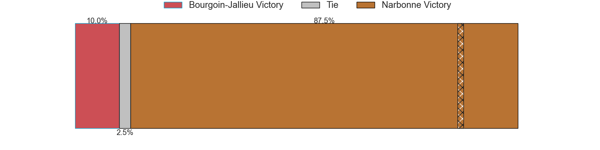
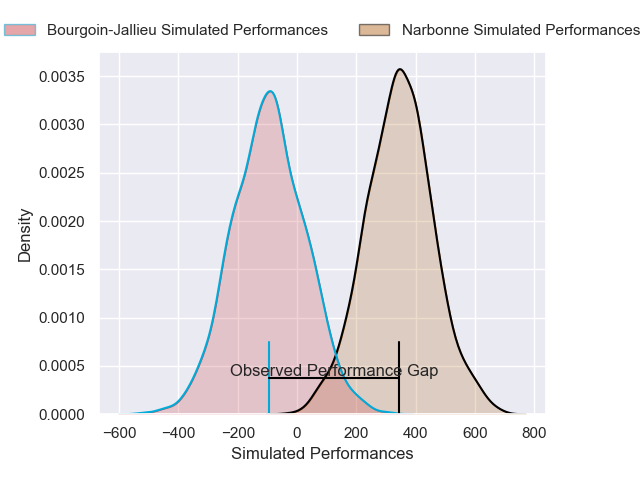
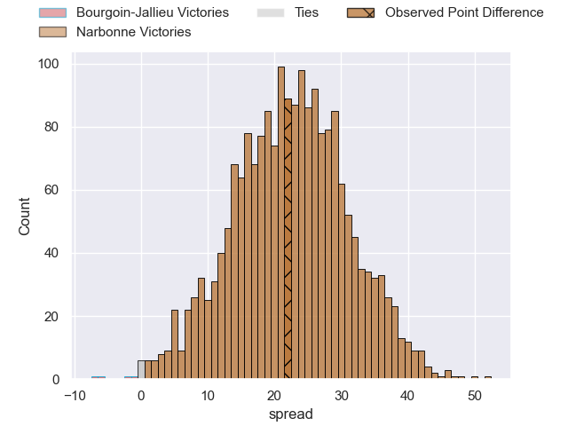
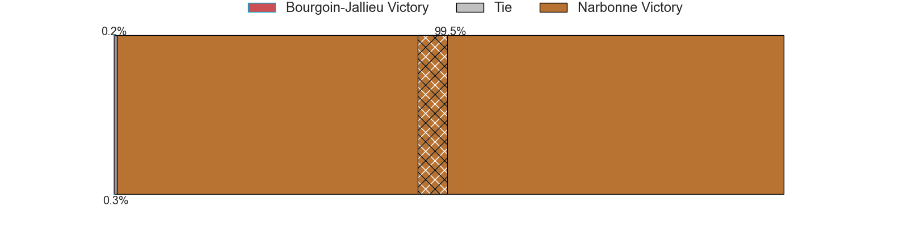

---  
layout: page  
title: Bourgoin-Jallieu at Narbonne; 12-34  
date: 2025-03-01 18:00:00 -0500  
categories: "Nationale 24/25" match review  
---
# Bourgoin-Jallieu at Narbonne; 12-34

# Club Level Predictions

The first set of predictions treats a club as the smallest object, as the club develops its members, organizes a gameplan, and deploys its players as needed for each match. This club model has a prediction of 0.747, which translates to predicting Narbonne to win by 9.5.

Our Over/Under is 53.5 - and combined with the spread above, we have a predicted scoreline of 22 to 31

Each club has a rating and a rating deviation (similar to a Glicko rating), and expected performances can be generated. This allows for simulated matches and spreads like the ones below.
## Projected Performances - Club Model

## Projected Spreads - Club Model

## Projected Results - Club Model

# Player Level Predictions

Treating teams instead as an entity made up of the currently active players, I have ratings for each player in an altogether different system. These can be combined to form team ratings once teamsheets are announced, weighting starters a bit higher than the reserves. After the match is played, players can be weighted by their minutes on the field, allowing for an accurate measure of the team's composition. With these compiled team ratings, we can make predictions, measure inaccuracy, and update the individual player ratings.
## Prediction without Player Minutes: Narbonne by 21.4

Narbonne by 8.4 on a neutral pitch

## Projected Performances - Player Model

## Projected Spreads - Player Model

## Projected Results - Player Model

|   Away Minutes | Away Player              |   Away Percentile |   Number |   Home Percentile | Home Player               |   Home Minutes |
|---------------:|:-------------------------|------------------:|---------:|------------------:|:--------------------------|---------------:|
|             13 | Rémy Gaborit             |             23.68 |        1 |             20.48 | Gregory Fichten           |             65 |
|             40 | Maxime Castant           |             27.64 |        2 |              7.71 | Clément Esteriola         |             34 |
|             23 | Dimitri Tchapnga         |             38.96 |        3 |             17.44 | Chris Talakai             |             25 |
|             80 | Robin Gascou             |             13.01 |        4 |              2.54 | Leva Fifita               |             26 |
|             80 | Léandre Cotte            |              1.04 |        5 |             66.16 | Marius Antonescu          |             80 |
|             15 | Kevin Rivoire            |             54.47 |        6 |             40.04 | Arthur Christienne        |             12 |
|             80 | Theophile Cotte          |             15.83 |        7 |              8.38 | Paul Belzons              |             80 |
|             54 | Tala Gray                |             38.56 |        8 |             74.85 | Lopeti Timani             |              7 |
|             43 | Liam Rimet               |             30.14 |        9 |              7.02 | Pierrick Nova             |             80 |
|             80 | Clément Garnier          |             40.66 |       10 |              7.26 | Gilles Bosch              |             67 |
|             80 | Adrian Fugit             |             13.6  |       11 |             77.89 | Clément Clavières         |             80 |
|              5 | Aviata Silago            |              1.33 |       12 |             57.51 | Parataiso Silafai-Lea'ana |             40 |
|             55 | Brieuc Plessis-Couillaud |             13.07 |       13 |             98.37 | Peter Betham              |             68 |
|             37 | Paul-Hugo Champ          |              8.88 |       14 |             11.38 | Pierre-Hugo Ducom         |             13 |
|             61 | Antoine Renaud           |              0.8  |       15 |             38.88 | Thibault Santoro          |             80 |
|             54 | Louis Ponton             |            nan    |       16 |             34.85 | Tom Chauvet               |             19 |
|              0 | Bynjamin Rabatel         |             75.88 |       17 |             36.4  | Théo Castinel             |             80 |
|             19 | Kamil Bouregba           |             45.72 |       18 |             64.12 | Grégoire Labit            |             80 |
|             46 | Lucas Dycke              |              1.28 |       19 |             22.76 | Étienne Ducom             |             61 |
|             80 | Tom Danovaro             |             15.98 |       20 |             17.34 | Dennis Visser             |             67 |
|             55 | Oktay Yilmaz             |             49.36 |       21 |             79.4  | Mehdi Boundjema           |             25 |
|             80 | Louis Giamarchi          |             31.16 |       22 |             68.66 | Pablo Barbaste            |             25 |
|             80 | Kevin Chaudouard         |              8.85 |       23 |            nan    | nan                       |            nan |

