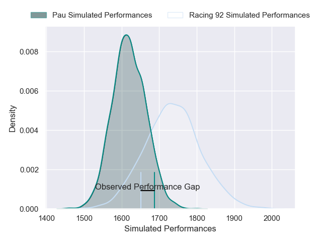
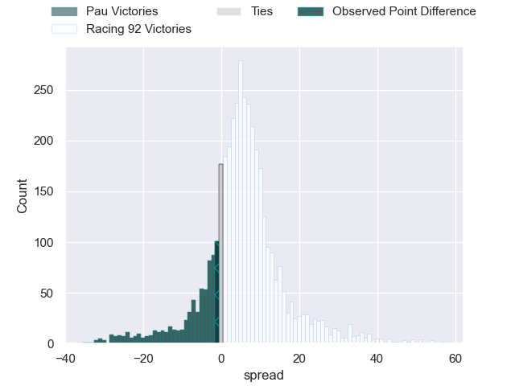
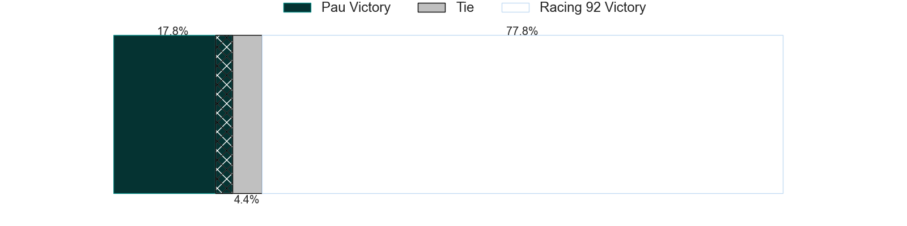
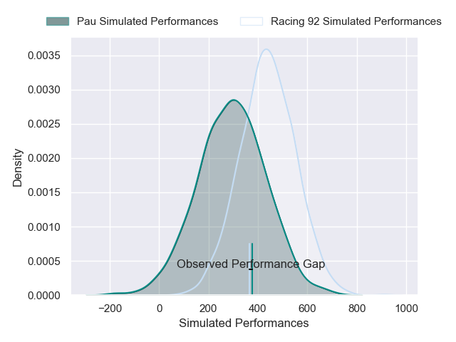
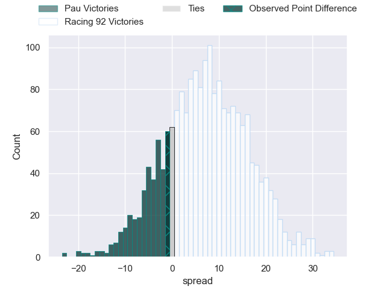

---  
layout: page  
title: Pau at Racing 92; 23-22  
date: 2025-03-01 18:00:00 -0500  
categories: "Top 14 Orange 24/25" match review  
---
# Pau at Racing 92; 23-22

# Club Level Predictions

The first set of predictions treats a club as the smallest object, as the club develops its members, organizes a gameplan, and deploys its players as needed for each match. This club model has a prediction of 0.655, which translates to predicting Racing 92 to win by 5.6.

Our Over/Under is 63.5 - and combined with the spread above, we have a predicted scoreline of 29 to 34

Each club has a rating and a rating deviation (similar to a Glicko rating), and expected performances can be generated. This allows for simulated matches and spreads like the ones below.
## Projected Performances - Club Model

## Projected Spreads - Club Model

## Projected Results - Club Model

# Player Level Predictions

Treating teams instead as an entity made up of the currently active players, I have ratings for each player in an altogether different system. These can be combined to form team ratings once teamsheets are announced, weighting starters a bit higher than the reserves. After the match is played, players can be weighted by their minutes on the field, allowing for an accurate measure of the team's composition. With these compiled team ratings, we can make predictions, measure inaccuracy, and update the individual player ratings.
## Prediction without Player Minutes: Racing 92 by 10.2

Pau by 0.9 on a neutral pitch

## Projected Performances - Player Model

## Projected Spreads - Player Model

## Projected Results - Player Model

|   Away Minutes | Away Player        |   Away Percentile |   Number |   Home Percentile | Home Player         |   Home Minutes |
|---------------:|:-------------------|------------------:|---------:|------------------:|:--------------------|---------------:|
|             49 | Daniel Bibi Biziwu |              6.32 |        1 |             70.58 | Guram Gogichashvili |             45 |
|             57 | Youri Delhommel    |             80.27 |        2 |             67.99 | Diego Escobar       |             45 |
|             56 | Jon Zabala         |             41.82 |        3 |             35.58 | Gia Kharaishvili    |             45 |
|             80 | Hugo Auradou       |             68.74 |        4 |             15.11 | Fabien Sanconnie    |             73 |
|             49 | Thomas Jolmes      |             24    |        5 |             11.38 | Romain Taofifenua   |             51 |
|             80 | Luke Whitelock     |             98.87 |        6 |             63.82 | Maxime Baudonne     |             80 |
|             72 | Loic Credoz        |             17.11 |        7 |             87.12 | Hacjivah Dayimani   |             44 |
|             70 | Carwyn Tuipulotu   |             67.47 |        8 |             85.54 | Jordan Joseph       |             51 |
|             72 | Dan Robson         |             99.31 |        9 |             83.1  | Nolann Le Garrec    |             80 |
|             72 | Joe Simmonds       |             82.95 |       10 |             10.95 | Tristan Tedder      |             72 |
|             80 | Aaron Grandidier   |             66.67 |       11 |              2.82 | Max Spring          |             80 |
|             80 | Fabien Brau Boirie |             81.12 |       12 |             13.19 | Vinaya Habosi       |             80 |
|             80 | Emilien Gailleton  |             75.62 |       13 |             97.1  | Gael Fickou         |             80 |
|             71 | Eliott Roudil      |             54.24 |       14 |             66.38 | Nolann Donguy       |             53 |
|             41 | Theo Attissogbe    |             76.33 |       15 |             90.61 | Sam James           |             61 |
|             80 | Theo Attissogbe    |             76.33 |       15 |             90.61 | Sam James           |             61 |
|             23 | Romain Ruffenach   |             58.37 |       16 |             29.85 | Janick Tarrit       |             35 |
|             31 | Guram Papidze      |             10.62 |       17 |             14.91 | Hassane Kolingar    |             35 |
|             31 | Remi Picquette     |             36.14 |       18 |             83.94 | Boris Palu          |             36 |
|             18 | Joel Kpoku         |             71.33 |       19 |             11.56 | Ibrahim Diallo      |             36 |
|              8 | Thibault Daubagna  |             88.79 |       20 |             61.56 | Shingarai Manyarara |              0 |
|              8 | Axel Desperes      |             90.53 |       21 |             96    | Antoine Gibert      |             27 |
|              9 | Olivier Klemenczak |              3    |       22 |             99    | Henry Chavancy      |             27 |
|             24 | Harry Williams     |             95.79 |       23 |             42.95 | Thomas Laclayat     |             35 |

